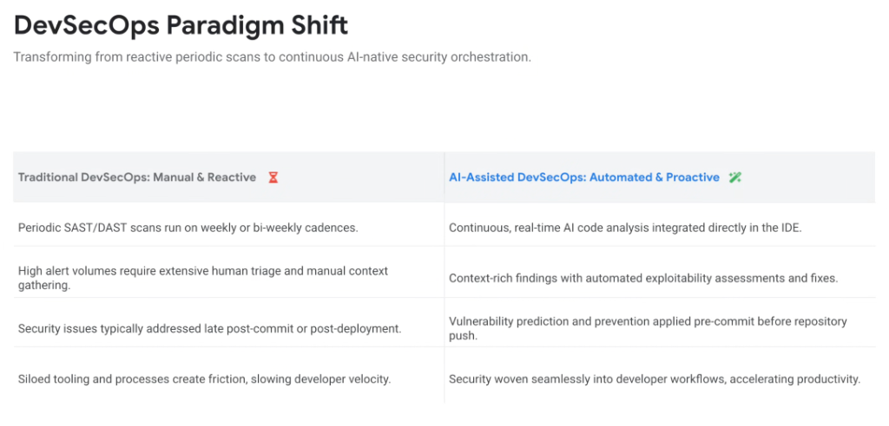
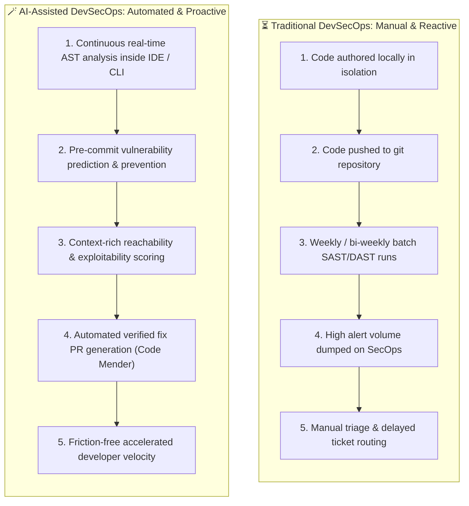

# DevSecOps Paradigm Shift: Continuous AI-Native Security Orchestration

## Overview

The integration of security into modern software delivery is undergoing a profound **paradigm shift**.

Traditional DevSecOps relied on manual, reactive, and late-stage testing gates that slowed down engineering velocity while generating massive alert fatigue. **AI-Assisted DevSecOps** transforms application security into a proactive, automated, and continuous orchestration fabric woven directly into developer tools.

---

## Architectural Evolution: Manual & Reactive vs. Automated & Proactive

---

## Detailed Comparative Analysis

### 1. Cadence & Integration
* **Traditional (Manual & Reactive)**:
  * Periodic SAST/DAST scans run on weekly or bi-weekly cadences, creating multi-day visibility gaps where vulnerabilities persist unmonitored.
* **AI-Assisted (Automated & Proactive)**:
  * Continuous, real-time AI code and prompt analysis integrated directly into the developer's IDE and terminal CLI (`agy`). Flaws are caught as keystrokes are typed.

---

### 2. Alert Volume & Context Scoring
* **Traditional (Manual & Reactive)**:
  * Generates high alert volumes based on coarse syntax pattern matching. Security analysts must spend hours manually gathering context and investigating false positives.
* **AI-Assisted (Automated & Proactive)**:
  * Delivers context-rich findings with automated exploitability and reachability assessments (via the **Wiz Security Graph**), suppressing noise and prioritizing genuine toxic combinations.

---

### 3. Lifecycle Intervention Point
* **Traditional (Manual & Reactive)**:
  * Security issues are addressed late in the delivery pipeline—post-commit, during staging build gates, or post-deployment.
* **AI-Assisted (Automated & Proactive)**:
  * Predictive vulnerability prevention is applied pre-commit *before* code is ever pushed to the shared repository branch.

---

### 4. Developer Velocity & Cultural Friction
* **Traditional (Manual & Reactive)**:
  * Siloed tooling, ticket handoffs, and blocking approvals create operational friction, positioning security as an impediment to shipping features.
* **AI-Assisted (Automated & Proactive)**:
  * Security is woven seamlessly into developer workflows as an ambient AI assistant that suggests verified fixes, turning AppSec into a productivity multiplier.

---

## DevSecOps Paradigm Comparison Matrix

| Dimension | Traditional DevSecOps (Manual &amp; Reactive) | AI-Assisted DevSecOps (Automated &amp; Proactive) | Google Cloud Platform Enabler |
| :--- | :--- | :--- | :--- |
| **Analysis Cadence** | Weekly / bi-weekly batch scans | **Continuous real-time IDE analysis** | Antigravity IDE Companion &amp; CLI |
| **Context &amp; Triage** | High alert volume, manual triage | **Automated exploitability &amp; reachability** | Wiz Security Graph &amp; Cloud Posture |
| **Intervention Point** | Late post-commit / post-deploy | **Pre-commit prediction &amp; prevention** | Pre-commit git hooks &amp; Model Armor |
| **Developer Velocity** | Friction brake, blocked pipelines | **Seamless accelerator &amp; ambient fixer** | **Code Mender** automated patch PRs |
