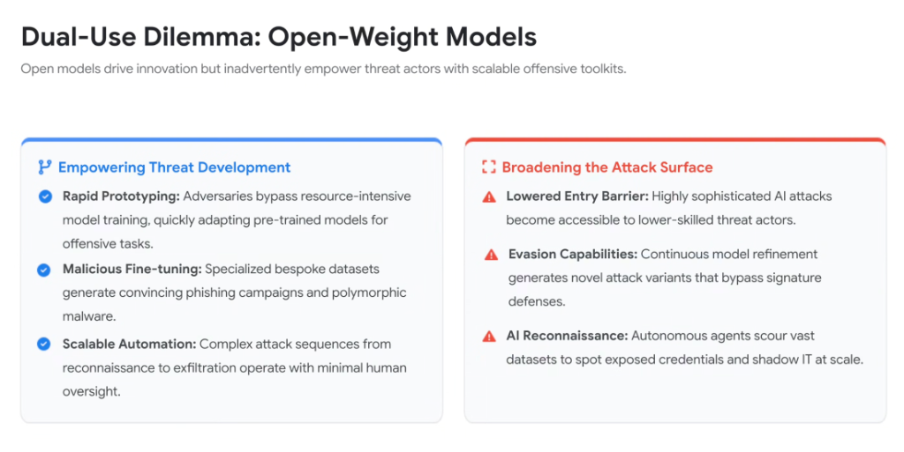
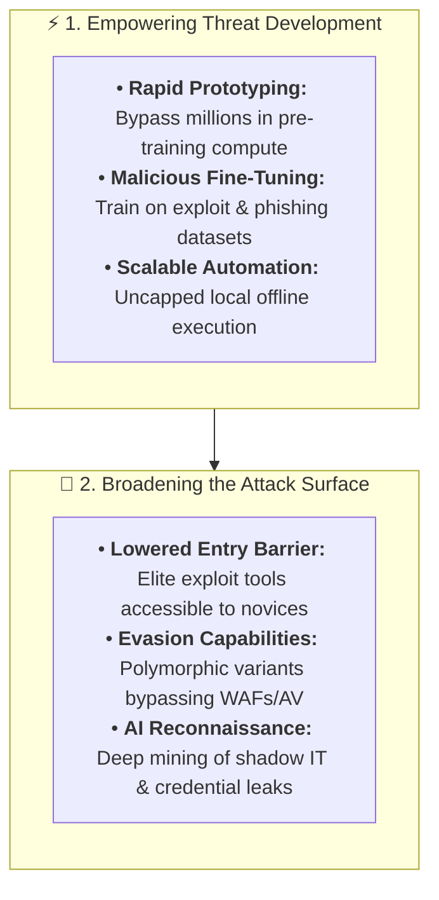

# Dual-Use Dilemma: Open-Weight Models & Offensive Scalability

## Overview

The open-source AI revolution presents a profound **Dual-Use Dilemma**: the exact architectural properties that democratize research and enterprise innovation—freely downloadable model weights, local offline inference, and unconstrained fine-tuning—also empower adversarial actors with unrestricted, scalable offensive toolkits.

When model weights are open, centralized API safety filters and terms-of-service guardrails no longer apply. Adversaries can remove safety alignments, fine-tune models on malware corpora, and deploy autonomous attack engines at local compute costs.

---

## The Dual-Use Threat Vectors

---

## Detailed Analysis of the Dual Threat Vectors

### Vector 1: Empowering Threat Development
* **Rapid Offensive Prototyping**:
  * Threat actors bypass the capital-intensive training phase (millions of GPU hours). They download state-of-the-art open-weight checkpoints and immediately repurpose them for cyber offensive tasks.
* **Malicious Fine-Tuning & Uncensoring**:
  * By applying low-rank adaptation (LoRA) or ablation techniques, adversaries completely strip safety guardrails. Models are fine-tuned on historical zero-day exploit databases, bespoke spear-phishing archives, and evasion techniques.
* **Scalable Offline Automation**:
  * Because inference runs locally or on private GPU clusters, attacks are not subject to API rate limits, audit logging, or provider account suspensions.

---

### Vector 2: Broadening the Attack Surface
* **Democratization of Advanced Exploits (Lowered Barrier)**:
  * Capabilities once restricted to sophisticated Advanced Persistent Threats (APTs) and nation-state actors are now packaged into automated scripts accessible to low-skilled threat actors.
* **Continuous Signature Evasion**:
  * Adversaries run local fine-tuning loops to generate dozens of syntactic variants of an exploit, ensuring that payloads bypass static endpoint detection (EDR) and WAF signatures.
* **Autonomous Reconnaissance at Scale**:
  * Open-weight agents continuously crawl code repositories, public cloud buckets, and data leak dumps, correlating exposed API keys and unmanaged infrastructure faster than human defenders can catalog their assets.

---

## Open-Weight Risk Dimensions vs. Enterprise Defense

| Open-Weight Risk Vector | Adversarial Mechanism | Enterprise Countermeasure |
| :--- | :--- | :--- |
| **Safety Filter Bypass** | Stripping safety alignment via fine-tuning | **Model Armor** inline semantic filtering on internal inputs/outputs. |
| **Malicious PoC Synthesis** | Automated exploit compilation from CVEs | **Code Mender** automated zero-lag patch PR generation. |
| **Polymorphic Malware** | AI-generated syntactic variations | **Behavioral runtime monitoring (Wiz Defend)** rather than static signatures. |
| **Mass Credential Mining**| Ingesting public repos for leaked tokens | **Continuous secret scanning** + automated credential revocation. |
