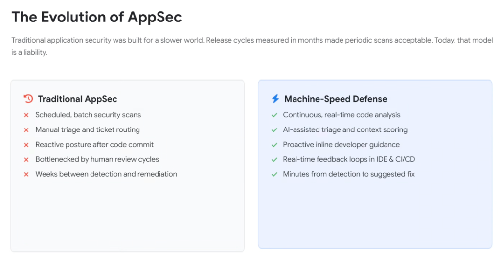
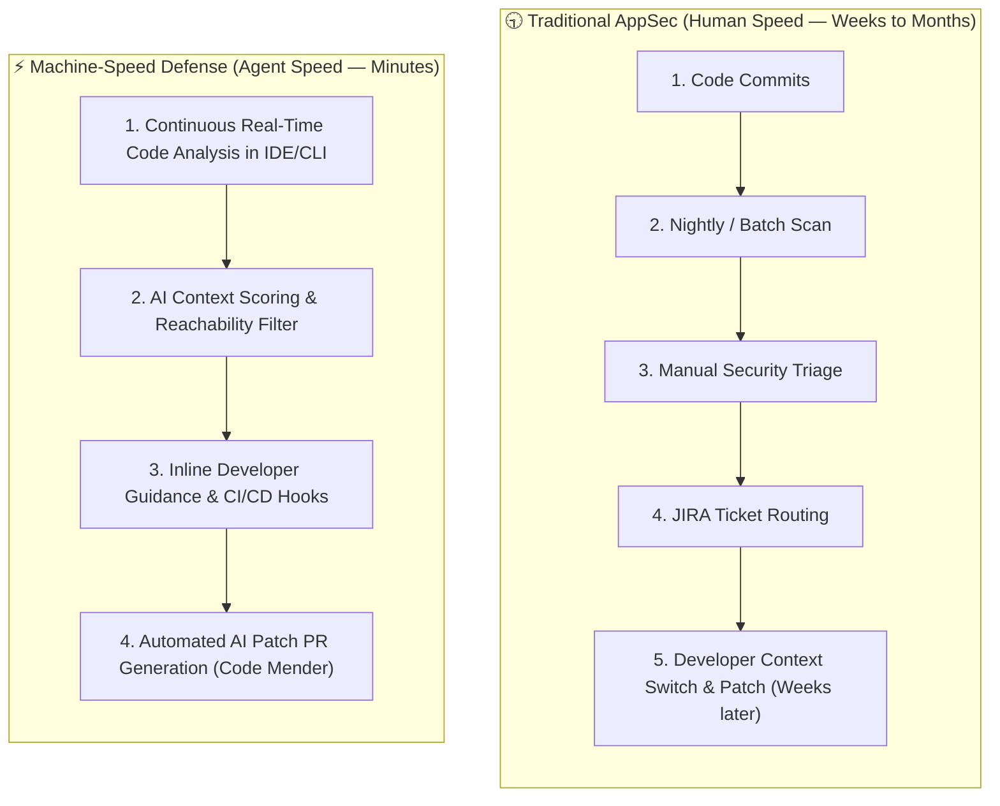

# The Evolution of AppSec: From Traditional Sprints to Machine-Speed Defense

## Overview

Traditional Application Security (**AppSec**) was designed for a fundamentally slower software world. When enterprise release cycles were measured in quarters or months, periodic batch security scans and human ticket routing were viable.

In the age of agentic software development—where autonomous developer agents generate, refactor, and commit code continuously—the traditional AppSec model is no longer just inefficient; **it is an active enterprise liability**.

---

## Architectural Comparison: Legacy Batch vs. Real-Time Machine-Speed

---

## Detailed Comparative Analysis

### 1. Traditional AppSec (The Slow-World Model)
* ✕ **Scheduled, Batch Security Scans**: Static application security testing (SAST) runs on a schedule (nightly/weekly), creating stale visibility gaps.
* ✕ **Manual Triage & Ticket Routing**: SecOps analysts spend hundreds of hours manually deduplicating false positives and assigning bug tickets.
* ✕ **Reactive Post-Commit Posture**: Security checks occur downstream after code has already been merged into staging branches.
* ✕ **Human Review Bottlenecks**: Release approvals stall as security teams attempt to manually audit pull requests.
* ✕ **High Remediation Latency (MTTR)**: Weeks or months elapse between initial vulnerability introduction and production patch deployment.

---

### 2. Machine-Speed Defense (The Agentic Era Model)
* ✓ **Continuous, Real-Time Code Analysis**: Analyzes Abstract Syntax Trees (AST), prompt assets (`AGENTS.md`), and tool descriptors in real time as code is authored.
* ✓ **AI-Assisted Triage & Context Scoring**: Graph correlation engines (like the **Wiz Security Graph**) evaluate reachability, cloud IAM permissions, and network exposure, eliminating alert fatigue.
* ✓ **Proactive Inline Developer Guidance**: Provides instant security hints and safe coding alternatives directly inside the developer's IDE or CLI agent (`agy`).
* ✓ **Real-Time Feedback Loops in IDE & CI/CD**: Integrates deterministic tests, compiler checks, and automated linters directly into the inner development loop.
* ✓ **Rapid Sub-Minute Remediation**: Automatically synthesizes verified, compilation-tested pull requests via **Code Mender**, shrinking remediation time from weeks to minutes.

---

## AppSec Evolution Capability Matrix

| Operational Dimension | Traditional AppSec | Machine-Speed Defense | Google Platform Enabler |
| :--- | :--- | :--- | :--- |
| **Analysis Cadence** | Batch / Scheduled scans | **Continuous, streaming AST analysis** | Antigravity IDE &amp; CLI analyzers |
| **Triage Process** | Manual alert deduplication | **AI-assisted reachability scoring** | Wiz Cloud &amp; Security Graph |
| **Developer Interaction**| Post-merge ticket notifications | **Proactive inline editor guidance** | Antigravity inline companion |
| **CI/CD Integration** | Blocking gatekeeper approvals | **Deterministic feedback loops** | Google Cloud Build &amp; Critique |
| **Time to Remediate (MTTR)**| Weeks to months | **Minutes from detection to fix PR** | **Code Mender** |
