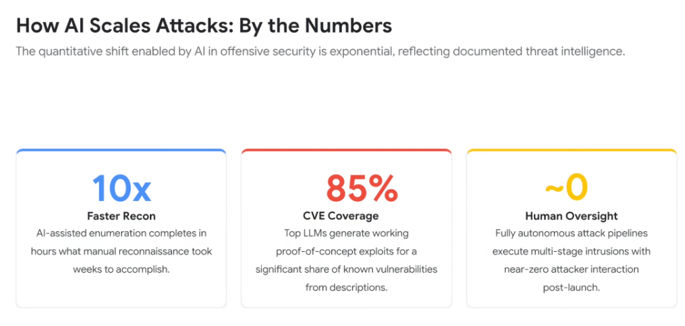
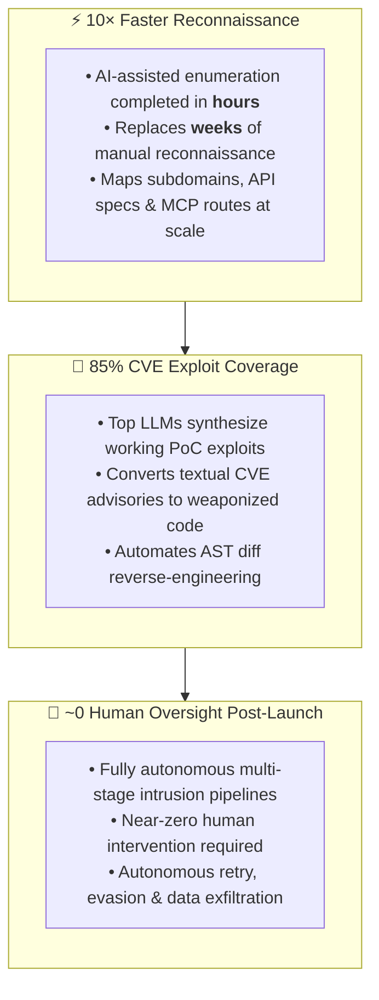

# How AI Scales Attacks: Quantitative Threat Metrics

## Overview

The transformation enabled by generative AI in offensive cybersecurity is not merely incremental—it is an **exponential, quantitative leap** backed by documented enterprise threat intelligence.

Adversaries leverage frontier reasoning and fine-tuned models to achieve massive speedups in reconnaissance, automated exploit generation across the vast majority of published CVEs, and unattended, fully autonomous intrusion pipelines.

---

## Quantitative Threat Multipliers

---

## Detailed Analysis of the 3 Key Attack Metrics

### 1. 10× Faster Reconnaissance (Hours vs. Weeks)
* **The Traditional Process**: Human penetration testers manually query Whois, scan CIDR blocks, enumerate subdomains, scrape web forms, and catalog exposed ports over a multi-week engagement.
* **The AI-Augmented Reality**: Automated agents parse massive attack surfaces, crawl OpenAPI documentation, identify exposed Model Context Protocol (MCP) endpoints (`/tools`), and correlate network topologies in hours.

---

### 2. 85% CVE Exploit Coverage (Autonomous PoC Synthesis)
* **The Traditional Process**: Security teams relied on the "time-to-weaponization" lag—the window of days or weeks between when a CVE is published and when functional exploit code appears in the wild.
* **The AI-Augmented Reality**: Frontier LLMs generate working Proof-of-Concept (PoC) exploit scripts for **85% of known vulnerabilities** directly from natural language vulnerability advisories and commit patch diffs, virtually eliminating the defender's patching window.

---

### 3. ~0 Human Oversight (Unattended Swarm Execution)
* **The Traditional Process**: Cyberattacks required active, keyboard-present human operators making manual decisions at every pivot point.
* **The AI-Augmented Reality**: Autonomous threat pipelines operate with near-zero post-launch oversight. Adversarial agents independently handle error triage, token fuzzing, polymorphic payload mutation, and lateral credential exfiltration.

---

## Quantitative Threat Landscape Summary Matrix

| Metric Dimension | Quantified Value | Operational Reality | Enterprise Defensive Mandate |
| :--- | :---: | :--- | :--- |
| **Recon Velocity** | **10× Faster** | Attack surface enumerated in hours vs. weeks | Continuous, streaming attack surface management. |
| **PoC Synthesis** | **85% Coverage** | Working exploits synthesized directly from CVE text | **Sub-minute automated patching (Code Mender)**. |
| **Operator Overhead**| **~0 Oversight** | Fully unattended autonomous multi-stage execution | Real-time runtime behavioral containment (**Wiz Defend**). |
