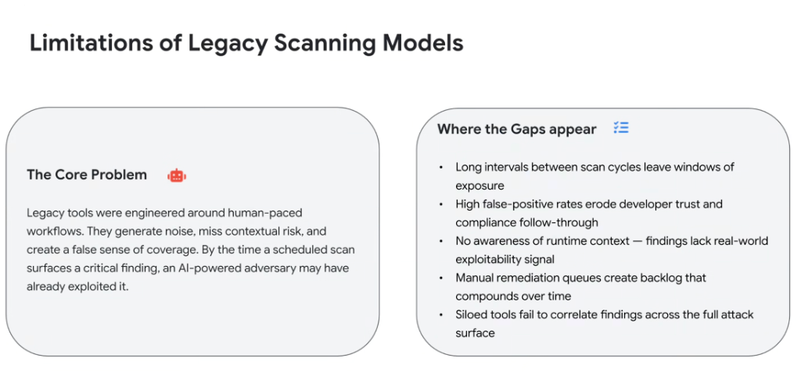
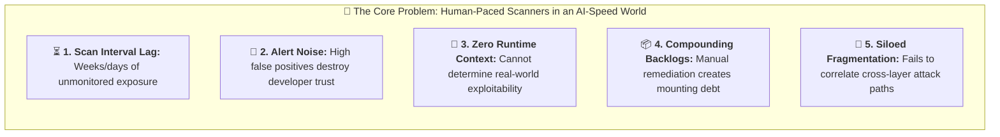

# Limitations of Legacy Scanning Models: Noise, Blind Spots & Exposure Windows

## Overview

Legacy application security scanners (traditional SAST, DAST, and container vulnerability scanners) were architected around human-paced workflows.

In modern engineering environments, these tools create a dangerous **false sense of coverage**. Because they operate in batch cadences without runtime context, by the time a scheduled scan finishes processing and routes a ticket, an AI-powered adversary has already discovered and exploited the vulnerability.

---

## The 5 Structural Gaps of Legacy Scanning

---

## Detailed Breakdown of the 5 Failure Modes

### 1. Long Intervals Between Scan Cycles (The Exposure Window)
* **The Vulnerability**: Nightly or weekly batch scans leave newly merged code and ephemeral container deployments completely unprotected during the hours immediately following deployment.
* **The Agentic Risk**: Autonomous threat actors scan public endpoints continuously. An exposure window of even 30 minutes is more than sufficient for an autonomous Red Agent to compromise unvalidated endpoints.

---

### 2. High False-Positive Rates & Developer Distrust
* **The Vulnerability**: Static scanners rely on coarse regex and syntax heuristics without verifying whether code is reachable or executable.
* **The Impact**: Developers are flooded with hundreds of irrelevant alerts. Over time, engineering teams develop "alert blindness," reflexively dismissing or bypassing security warnings.

---

### 3. Lack of Runtime & Environmental Context
* **The Vulnerability**: Legacy tools inspect source code in isolation from cloud infrastructure, IAM permissions, VPC Service Controls, and network topology.
* **The Impact**: A vulnerability in an unlinked test script is given the same severity score as a vulnerability in an internet-facing production API with administrative database privileges.

---

### 4. Compounding Manual Remediation Backlogs
* **The Vulnerability**: Traditional scanners only generate findings; they do not fix code.
* **The Impact**: Security tickets sit in JIRA backlogs indefinitely because developers lack the time to manually research, author, test, and verify patches for low/medium-priority CVEs.

---

### 5. Siloed Tool Fragmentation
* **The Vulnerability**: Organizations deploy disjointed point solutions—one for static code (SAST), one for container images, one for cloud configuration (CSPM), and one for secrets.
* **The Impact**: None of the tools can see the end-to-end **toxic combination** (e.g. Code flaw + Over-privileged IAM role + Public Vertex AI endpoint).

---

## Legacy Scanner Gaps vs. Modern Machine-Speed Solutions

| Legacy Scanner Limitation | Operational Impact | Machine-Speed Modern Solution |
| :--- | :--- | :--- |
| **Batch Scan Intervals** | Broad exposure windows between runs | **Continuous streaming AST & inline IDE analysis** |
| **High False Positives** | Developer alert fatigue & cynicism | **AI reachability filters & semantic verification** |
| **No Runtime Context** | Inability to prioritize true risk | **Wiz Security Graph & Multi-Cloud IAM mapping** |
| **Manual Backlogs** | Compounding technical security debt | **Autonomous patch PR generation (Code Mender)** |
| **Siloed Point Tools** | Missed multi-step exploit chains | **Unified AI-APP Platform & Multi-Cloud Inventory** |
