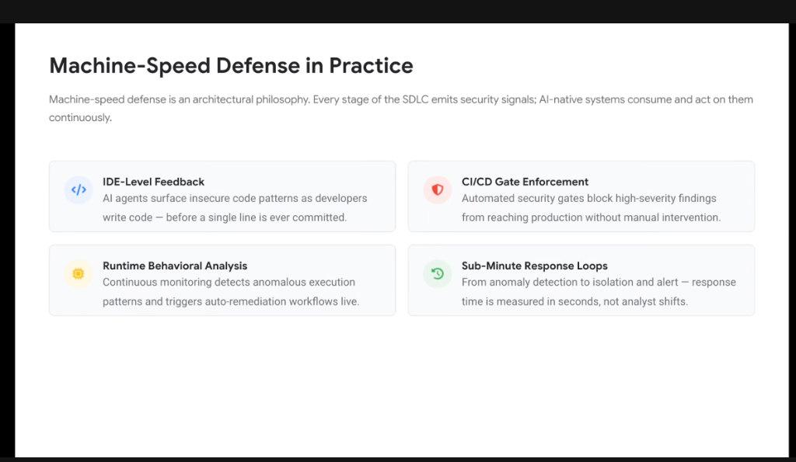
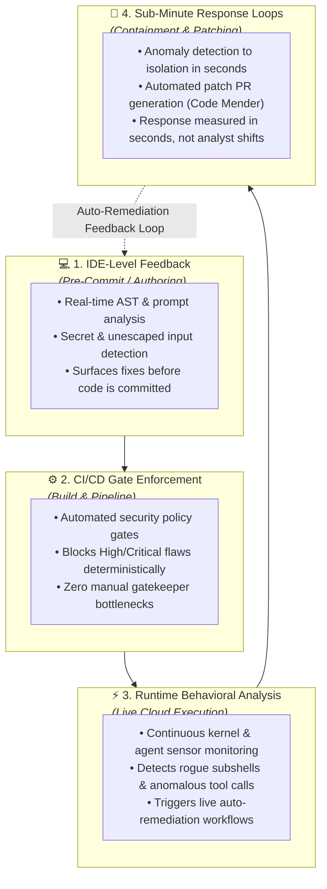

# Machine-Speed Defense in Practice: The 4 SDLC Security Signals

## Overview

**Machine-speed defense** is fundamentally an **architectural philosophy**, not a standalone point tool.

In a modern agentic enterprise, every phase of the Software Development Life Cycle (SDLC)—from local code drafting to production runtime execution—continuously emits structured security signals. AI-native defensive systems ingest, analyze, and act upon these telemetry streams autonomously without waiting for human ticket queues.

---

## Architecture: The Closed-Loop Continuous Defense Pipeline

---

## Detailed Examination of the 4 Operational Pillars

### 1. IDE-Level Feedback (Pre-Commit Proactivity)
* **Operational Scope**: Developer workstations running local IDE extensions (Antigravity 2.0, VS Code, JetBrains) and terminal agents (`agy`).
* **Mechanism**: Streaming AST inspection and semantic token analysis run on every keystroke and local save event.
* **Impact**: Insecure coding patterns (e.g. hardcoded API keys, unescaped SQL strings, unsafe deserialization, insecure MCP tool bindings) are caught and corrected **before a single line is ever committed to git**.

---

### 2. CI/CD Gate Enforcement (Automated Policy-as-Code)
* **Operational Scope**: Google Cloud Build pipelines, GitHub Actions, and Critique code review analyzers.
* **Mechanism**: Deterministic policy engines evaluate incoming pull requests against organizational security baselines (e.g. OWASP Top 10 for Agentic Applications).
* **Impact**: High-severity vulnerabilities and unverified agent code changes are blocked automatically, eliminating the need for human security gatekeeper sign-offs on routine PRs.

---

### 3. Runtime Behavioral Analysis (Continuous Anomaly Detection)
* **Operational Scope**: Live agent workloads executing on Cloud Run, Google Kubernetes Engine (GKE), and Vertex AI endpoints.
* **Mechanism**: Kernel-level runtime sensors (Wiz Defend) and Model Armor inline inspection monitor process execution, socket bindings, and LLM input/output streams.
* **Impact**: Detects rogue agent execution drift—such as unexpected interactive shell spawns (`/bin/sh`), out-of-bounds database dumping, or unauthorized tool calling—and instantly freezes the compromised agent session.

---

### 4. Sub-Minute Response Loops (Seconds-Scale MTTR)
* **Operational Scope**: Real-time event orchestration connecting SecOps telemetry with autonomous remediation engines.
* **Mechanism**: Eventarc triggers and automated patch generators (**Code Mender**) immediately synthesize verified code fixes, revoke compromised credentials, and deploy isolating firewall rules.
* **Impact**: Collapses Mean Time to Detect (MTTD) and Mean Time to Remediate (MTTR) from **8-hour human analyst shifts down to seconds or minutes**.

---

## 4-Pillar Machine-Speed Defense Summary Matrix

| SDLC Stage | Signal Source | Defensive Mechanism | Response Latency | Google Platform Enabler |
| :--- | :--- | :--- | :--- | :--- |
| **1. Authoring** | Developer IDE / CLI | Streaming AST &amp; prompt linting | **< 1 Second** | Antigravity IDE Companion &amp; CLI |
| **2. Build &amp; PR** | CI/CD Pipeline | Policy-as-Code gate enforcement | **< 2 Minutes** | Cloud Build, Critique &amp; Binary Auth |
| **3. Runtime** | Active Workload / OS | Behavioral sensors &amp; Model Armor | **< 5 Seconds** | Wiz Defend, Model Armor, VPC-SC |
| **4. Remediation** | Telemetry Event Bus | Automated fix PR &amp; credential rotation | **< 5 Minutes** | **Code Mender &amp; Eventarc** |
