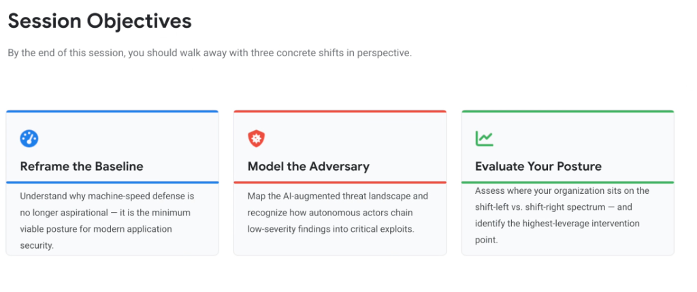
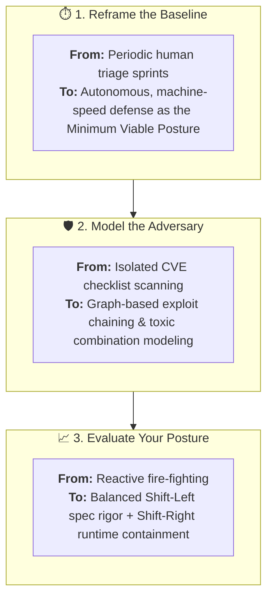

# Session Objectives: The Three Strategic Shifts in Perspective

## Overview

The goal of Day 3 is to equip Google Cloud Customer Engineers, Security Architects, and Technical Leaders with **Three Concrete Shifts in Perspective** required to defend modern enterprise agentic systems:

1. **Reframe the Baseline**: Machine-speed defense is the *minimum viable posture*, not an aspirational goal.
2. **Model the Adversary**: Recognize how autonomous threat actors chain benign/low-severity findings into critical exploits.
3. **Evaluate Your Posture**: Assess the organization across the Shift-Left vs. Shift-Right spectrum to identify high-leverage intervention points.

---

## The Three Strategic Perspective Shifts

---

## Deep Dive into the 3 Perspective Shifts

### 1. Reframe the Baseline: Machine-Speed as Minimum Viable Posture
* **The Paradigm Shift**: In an era where developer agents (`agy`, Claude Code, Codex) generate hundreds of lines of code per minute and autonomous threat actors probe thousands of endpoints concurrently, human-paced security triage is fundamentally inadequate.
* **The Imperative**: Automated AST scanning, graph-based risk correlation, and PR-ready automated remediation (**Code Mender**) are no longer premium enterprise luxuries—they represent the bare minimum operational baseline to maintain code integrity.

---

### 2. Model the Adversary: Autonomous Exploit Chaining
* **The Paradigm Shift**: Traditional security audits fail because they evaluate vulnerabilities in isolation (e.g. marking a missing JWT validation header as "Low Severity").
* **The Reality of Agentic Attackers**: Autonomous attackers (like **Wiz Red Agent**) do not rely on single CVSS 10.0 bugs. Instead, they systematically chain multiple low/medium findings:
  1. Header presence bypass (Low) $\rightarrow$
  2. Unrestricted tool enumeration (Low) $\rightarrow$
  3. Confused deputy prompt injection (Medium) $\rightarrow$
  4. **Complete PII & Financial Database Exfiltration (Critical)**.

---

### 3. Evaluate Your Posture: Balancing Shift-Left & Shift-Right
* **The Paradigm Shift**: Organizations often over-index on purely preventative static scanning (Shift-Left) or purely reactive incident monitoring (Shift-Right).
* **The High-Leverage Intervention Equilibrium**:
  * **Shift-Left Interventions**: Specification-Driven Development (`SPEC.md`), declarative repository guardrails (`AGENTS.md`), and automated AST fix generation before code is merged.
  * **Shift-Right Interventions**: Real-time prompt injection filtering (Google Model Armor), runtime rogue agent behavioral sensors (Wiz Defend), and Dual-Gate Cloud IAM enforcement.

---

## The Three Shifts Strategic Framework Matrix

| Perspective Shift | Legacy Assumption | Modern Agentic Reality | Google Technical Solution |
| :--- | :--- | :--- | :--- |
| **1. Reframe Baseline** | "Security reviews occur before scheduled quarterly releases." | Software moves at machine speed; defense must be autonomous and continuous. | **Code Mender** + Automated CI/CD AST analysis. |
| **2. Model Adversary** | "We only prioritize Critical and High standalone CVEs." | Attackers chain low-severity flaws into critical confused deputy exploits. | **Wiz Security Graph** + Toxic Combination Analysis. |
| **3. Evaluate Posture** | "Static code scans at commit time are sufficient." | Non-deterministic agent runtime behaviors require inline defenses. | **Model Armor** + Dual-Gate IAM + Git Worktrees. |
