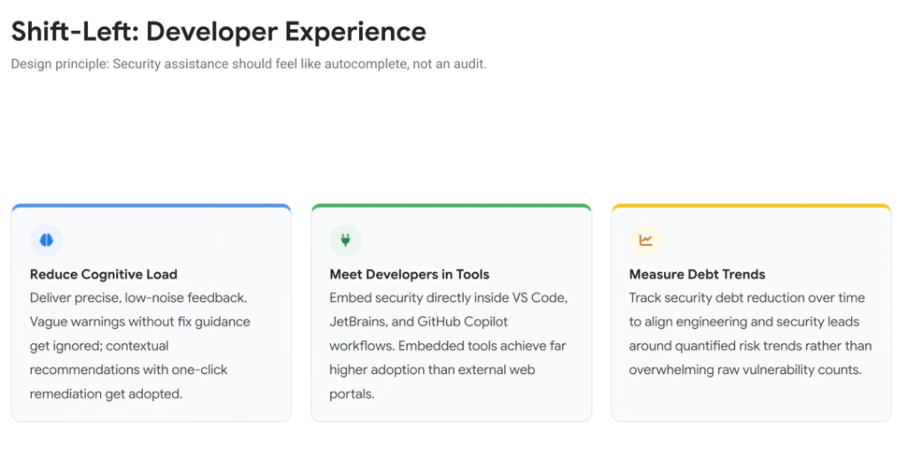
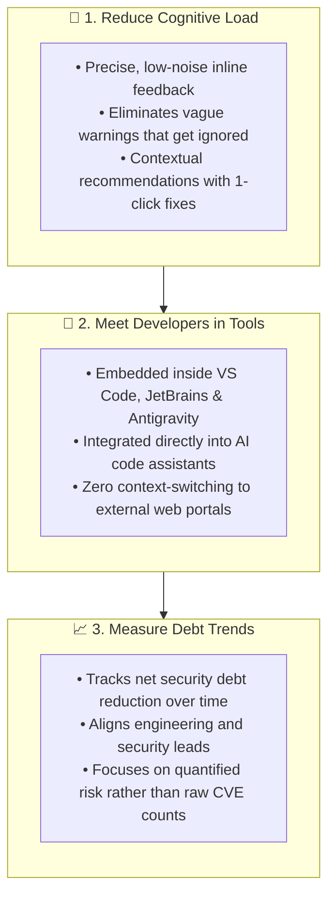

# Shift-Left Developer Experience: Security as Autocomplete, Not an Audit

## Overview

The ultimate determinant of application security success is developer adoption. If security tools interrupt flow state, impose cognitive burden, or act as punitive gatekeepers, developers will find workarounds.

> **Design Principle: "Security assistance should feel like autocomplete, not an audit."**

In the agentic era, security must transition from an external, compliance-driven audit into an ambient, intelligent, and unobtrusive developer capability embedded directly inside the code editor.

---

## The 3 UX Pillars of Modern AppSec

---

## Detailed Examination of the 3 UX Pillars

### 1. Reduce Cognitive Load (From Vague Warnings to 1-Click Fixes)
* **The Failure of Legacy UX**:
  * Traditional SAST scanners print abstract warnings like *"CWE-89: Potential SQL Injection on line 128"*. Without explicit remediation guidance or context, developers cannot afford the cognitive overhead to research and draft safe parameterization.
* **The Autocomplete Paradigm**:
  * AI security co-pilots analyze the AST in real time and present a clean diff directly in the editor. The developer reviews the safe alternative and accepts it with a single keystroke (`Tab` or `Enter`).

---

### 2. Meet Developers in Tools (Native IDE & CLI Embedding)
* **The Failure of External Portals**:
  * Forcing software engineers to leave their IDE, log into an external security dashboard, navigate complex filtering trees, and copy-paste ticket IDs creates severe operational friction. External portals achieve negligible developer engagement.
* **The Ambient IDE Experience**:
  * By embedding security intelligence directly inside VS Code, JetBrains, Antigravity 2.0, and the `agy` CLI, security becomes an ambient feature of the inner development loop.

---

### 3. Measure Debt Trends (Outcome Metrics vs. Raw CVE Counts)
* **The Flaw of Raw Vulnerability Counts**:
  * Tracking thousands of unprioritized CVEs creates panic and paralyses development without providing actionable guidance on true organizational risk.
* **Trajectory-Based Risk Measurement**:
  * Engineering and security leadership align around **velocity-adjusted risk trends**:
    * Mean Time to Remediate (MTTR) shrinking from weeks to minutes.
    * Percentage of security issues resolved pre-commit via 1-click fixes.
    * Net vulnerability debt burned down sprint-over-sprint.

---

## Developer Experience (DX) Evolution Matrix

| Dimension | Legacy Security Audit UX | Modern "Autocomplete" Security UX | Google Platform Enabler |
| :--- | :--- | :--- | :--- |
| **Interaction Model** | Disruptive modal dialogs &amp; blocking gates | **Ambient, inline editor suggestions** | Antigravity IDE Companion &amp; CLI |
| **Actionability** | Vague warning text without code remedies | **Drop-in 1-click compilable patches** | **Code Mender** automated AST patches |
| **Tool Location** | External web portals &amp; JIRA queues | **Native VS Code, JetBrains &amp; terminal** | Antigravity extensions &amp; Git hooks |
| **Success Metric** | Raw CVE counts &amp; audit checklists | **Net debt reduction &amp; fix velocity** | Wiz Security Graph &amp; Cloud Metrics |
