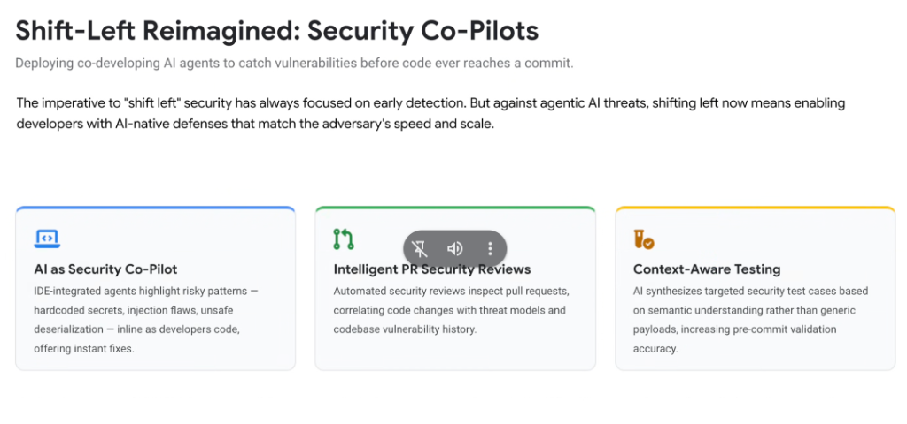
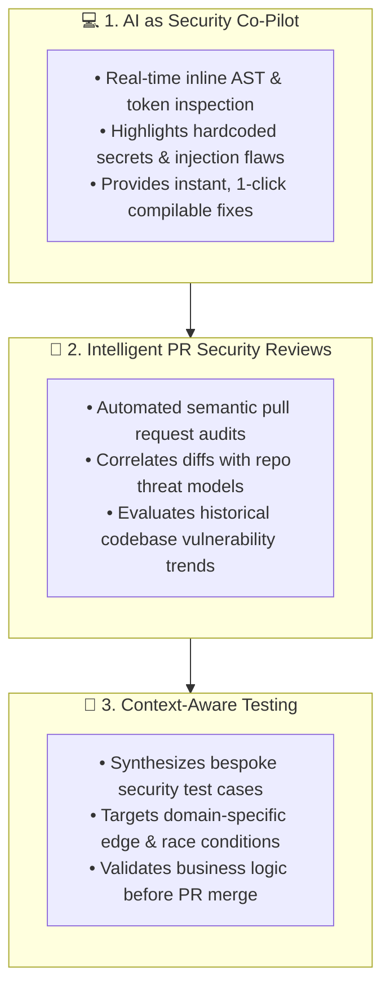

# Shift-Left Reimagined: Security Co-Pilots & Autonomous Pre-Commit Defense

## Overview

The historical mandate to **"Shift Left"** focused on moving security reviews earlier into build pipelines.

Against machine-speed agentic threats, shifting left has been completely reimagined: **deploying co-developing AI security agents directly into the developer's inner loop to intercept and remediate vulnerabilities before code is ever committed to a repository.**

---

## The 3 Pillars of Reimagined Shift-Left

---

## Detailed Examination of the 3 Defensive Pillars

### 1. AI as Security Co-Pilot (Inline Pre-Commit Protection)
* **How It Operates**:
  * Integrated directly into developer surfaces (Antigravity IDE companion, VS Code, JetBrains, and terminal agents like `agy`).
  * Analyzes code syntax, variable flows, and prompt structures on every save or keystroke.
* **Risky Patterns Intercepted**:
  * Hardcoded API keys, JWT secret leakage, SQL concatenation, unsafe deserialization, prompt injection vectors in LLM calls, and unvalidated Model Context Protocol (MCP) tool execution.
* **Developer Experience**:
  * Instead of blocking developers with error messages, the co-pilot surfaces drop-in, compilable remediation code snippets immediately.

---

### 2. Intelligent PR Security Reviews (Semantic Threat Modeling)
* **How It Operates**:
  * Automated AI code reviewers (e.g. Google Critique analyzers, **Code Mender**, and Wiz Code) inspect incoming pull request diffs before human review.
* **Contextual Correlation**:
  * Evaluates changes against the full application context: does this PR introduce new public routes? Does it modify IAM permissions? Does it touch sensitive database tables?
* **Historical Memory**:
  * Cross-references past CVEs and previously patched regressions to ensure old vulnerability classes are not reintroduced.

---

### 3. Context-Aware Testing (Semantic Test Synthesis)
* **How It Operates**:
  * Rather than relying on generic fuzzing or static test suites, AI models analyze the specific business logic and semantic contracts of newly authored code.
* **Synthesis of Edge-Case Payloads**:
  * Automatically generates unit tests, boundary condition checks, and malformed payload assertions tailored specifically to the application's unique domain models.
* **Impact**:
  * Dramatically increases pre-commit validation accuracy and guarantees deterministic verification before code merges.

---

## Traditional Shift-Left vs. Reimagined AI Shift-Left

| Dimension | Traditional Shift-Left | Reimagined AI Shift-Left | Google Platform Enabler |
| :--- | :--- | :--- | :--- |
| **Intervention Time** | CI/CD build pipeline | **Inline authoring &amp; save events** | Antigravity IDE Companion &amp; CLI |
| **Remediation Method**| Static error logs &amp; tickets | **Instant drop-in fix suggestions** | **Code Mender** automated AST patching |
| **PR Review Model** | Manual human peer review | **Automated semantic threat analysis** | Google Critique AI &amp; Cloud Build |
| **Security Testing** | Generic regex test payloads | **Domain-tailored semantic test cases** | ADK Eval &amp; Vertex AI Test Synthesizer |
