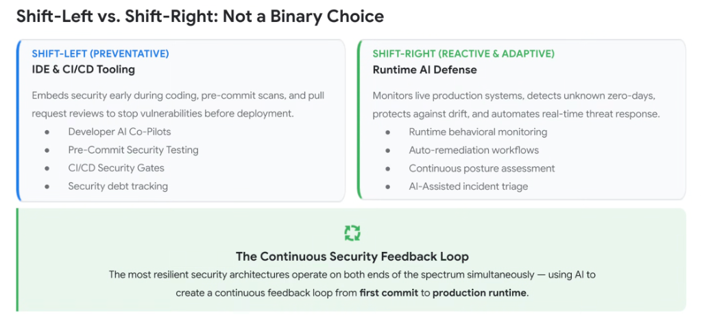
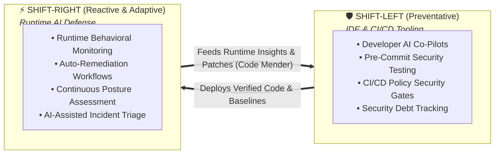

# Shift-Left vs. Shift-Right: A Continuous Unified Feedback Loop

## Overview

A common pitfall in application security strategy is treating **Shift-Left** and **Shift-Right** as mutually exclusive or competing priorities.

> **Core Architectural Principle: Shift-Left vs. Shift-Right is not a binary choice.**
> The most resilient security architectures operate on both ends of the spectrum simultaneously—using AI to create a **continuous feedback loop from first commit to production runtime.**

---

## Architecture: The Continuous Security Feedback Loop

---

## Detailed Breakdown of the Dual Spectrum

### 1. Shift-Left: Preventative Defense (IDE & CI/CD Tooling)
* **Mission**: Embeds intelligence early during coding, pre-commit scans, and pull request reviews to stop vulnerabilities *before* code is merged or deployed.
* **Core Capabilities**:
  * **Developer AI Co-Pilots**: Ambient AST inspection highlighting hardcoded secrets, prompt injections, and SQL concatenation inline.
  * **Pre-Commit Security Testing**: Synthesizes domain-specific boundary test cases to validate edge conditions before repository push.
  * **CI/CD Security Gates**: Deterministically blocks high-risk flaws from reaching production without manual human approval bottlenecks.
  * **Security Debt Tracking**: Measures vulnerability burn-down velocity and MTTR trajectories over time.

---

### 2. Shift-Right: Reactive & Adaptive Defense (Runtime AI Defense)
* **Mission**: Monitors live production systems, detects unknown zero-days, protects against configuration drift, and automates real-time threat response.
* **Core Capabilities**:
  * **Runtime Behavioral Monitoring**: Signatureless kernel sensors (**Wiz Defend**) and inline LLM proxies (**Google Model Armor**) catching anomalous process spawns and prompt drift.
  * **Auto-Remediation Workflows**: Sub-second isolation of rogue agent sessions and revocation of ephemeral IAM credentials.
  * **Continuous Posture Assessment**: Real-time detection of IAM privilege sprawl and exposed cloud storage buckets.
  * **AI-Assisted Incident Triage**: Correlates runtime telemetry with the **Wiz Security Graph** to draft root-cause summaries and reduce MTTR.

---

## How the Closed-Loop Feedback Operates in Practice

1. **Left-to-Right (Baseline Enforcement)**:
   * Formal specifications (`SPEC.md`) and declarative repo guardrails (`AGENTS.md`) define deterministic execution boundaries that runtime sensors enforce.
2. **Right-to-Left (Autonomous Self-Healing)**:
   * When runtime sensors detect a novel exploit attempt in production, telemetry is routed to **Code Mender**, which automatically authors an AST patch, generates regression unit tests, and submits a PR to prevent future reoccurrences.

---

## Unified Shift-Left / Shift-Right Architectural Matrix

| Architectural Layer | Shift-Left (Preventative) | Shift-Right (Adaptive &amp; Reactive) | Synergy / Feedback Link |
| :--- | :--- | :--- | :--- |
| **Primary Focus** | Early vulnerability interception | Live threat containment &amp; zero-day detection | Continuous telemetry closed loop |
| **Target Surfaces** | IDE, Git, CI/CD pipelines | GKE, Cloud Run, Cloud IAM, Vertex AI | Pre-commit specs guide runtime baselines |
| **Key Mechanism** | AST parsing &amp; test synthesis | Kernel sensors &amp; Model Armor | Runtime signals inform static linters |
| **Remediation Model**| 1-click inline suggestions | Automated session isolation &amp; fix PRs | **Code Mender** bridges runtime to repo |
| **Google Platform** | Antigravity IDE &amp; Cloud Build | Wiz AI-APP &amp; Security Command Center | Unified Google Cloud Security Fabric |
