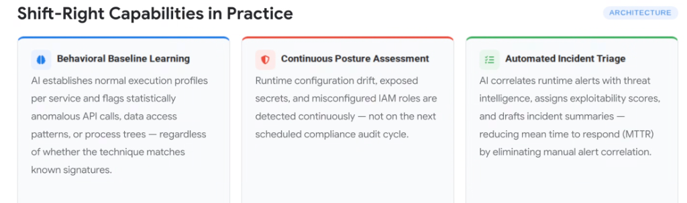
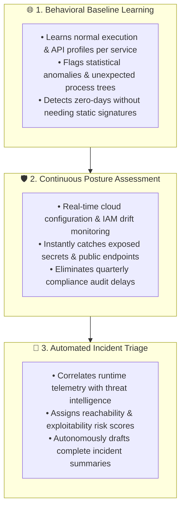

# Shift-Right Capabilities in Practice: Behavioral Baselines & Automated Triage

## Overview

In modern agentic cloud architectures, runtime security cannot rely on static heuristic rules or periodic audit checkpoints.

**Shift-Right Capabilities in Practice** operationalizes continuous, autonomous defense across three core technical pillars: **Behavioral Baseline Learning**, **Continuous Posture Assessment**, and **Automated Incident Triage**. Together, these capabilities provide real-time runtime visibility, eliminate blind spots, and dramatically compress the Mean Time to Respond (MTTR).

---

## Architecture: The 3 Shift-Right Operational Pillars

---

## Detailed Examination of the 3 Architectural Capabilities

### 1. Behavioral Baseline Learning (Signatureless Anomaly Detection)
* **Operational Scope**: Containerized services, GKE pods, Cloud Run instances, and autonomous agent processes.
* **Mechanism**:
  * AI engines establish dynamic baseline execution profiles for each microservice and agent: typical API call sequences, tool call arguments, network egress destinations, token consumption rates, and child process trees.
* **The Breakthrough**:
  * Flags anomalous execution (e.g. an agent suddenly calling `os.system('curl ...')` or querying sensitive customer database schemas) **regardless of whether the attack matches a known CVE signature or WAF rule**.

---

### 2. Continuous Posture Assessment (Real-Time Cloud Hygiene)
* **Operational Scope**: Cloud IAM, VPC networking, storage buckets, Vertex AI endpoints, and Model Context Protocol (MCP) gateways.
* **Mechanism**:
  * Streaming event buses (Google Cloud Asset Inventory, Eventarc) continuously monitor resource configurations.
* **The Breakthrough**:
  * Instead of waiting for the next quarterly compliance audit, security teams are alerted within seconds if an engineer or Terraform script inadvertently grants broad IAM permissions (`roles/owner`), disables VPC-SC perimeters, or exposes an internal MCP gateway to the public internet.

---

### 3. Automated Incident Triage (Autonomous MTTR Compression)
* **Operational Scope**: SecOps alerting pipelines, SIEM/SOAR platforms, and on-call engineering rotations.
* **Mechanism**:
  * AI correlation engines ingest telemetry across Cloud Audit Logs, OpenTelemetry traces, and runtime sensors, mapping them against the **Wiz Security Graph**.
* **The Breakthrough**:
  * Eliminates hours of manual log digging. The AI system calculates true reachability, scores exploitability, and delivers an executive-level root-cause incident brief with exact execution timelines and recommended isolation steps.

---

## Shift-Right Technical Capabilities Summary Matrix

| Capability Pillar | Core Functionality | Legacy Approach | Google Cloud Platform Enabler |
| :--- | :--- | :--- | :--- |
| **1. Behavioral Baselines** | Signatureless anomaly detection | Static regex &amp; signature matching | **Wiz Defend &amp; Model Armor** |
| **2. Posture Assessment** | Real-time IAM &amp; config drift tracking | Scheduled quarterly audits | **Wiz Cloud &amp; Cloud Asset Inventory** |
| **3. Automated Triage** | Graph correlation &amp; incident drafting | Manual alert log stitching in SIEM | **Security Command Center &amp; Wiz Graph** |
