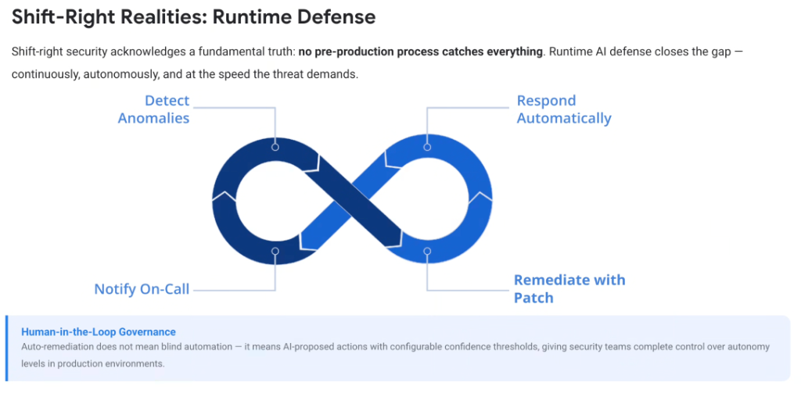
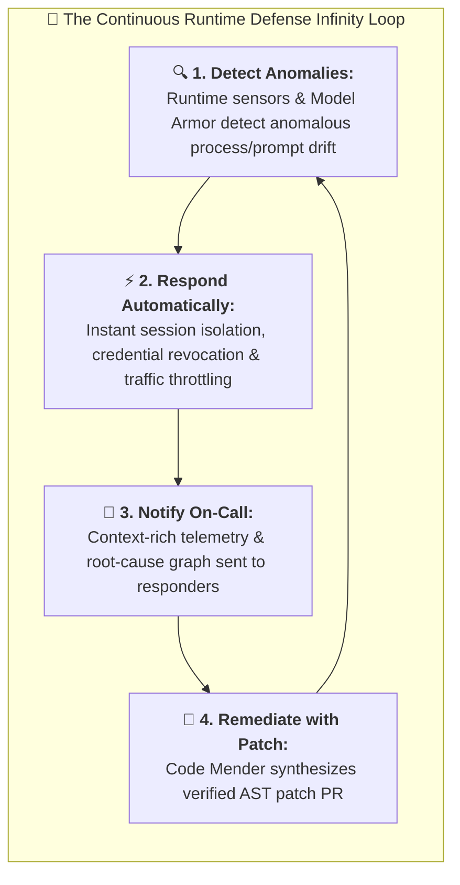

# Shift-Right Realities: Runtime Defense & Governance

## Overview

Shift-right security acknowledges a fundamental, inescapable truth: **no pre-production process catches everything.**

In modern cloud environments running multi-agent swarms, dynamic Model Context Protocol (MCP) tool integrations, and non-deterministic LLM pipelines, runtime AI defense closes the remaining protection gap—**continuously, autonomously, and at the exact machine-speed tempo demanded by modern threats.**

---

## The Shift-Right Continuous Runtime Loop

---

## Detailed Examination of the 4 Runtime Stages

### 1. Detect Anomalies (Continuous Kernel & Prompt Sensing)
* **Execution Layer**: Runtime kernel sensors (**Wiz Defend**) and inline LLM proxies (**Google Model Armor**) continuously monitor live cloud workloads.
* **Signals Captured**:
  * Unexpected shell spawns (`/bin/sh`, `/bin/bash`) by containerized agents.
  * Anomalous socket connections or DNS egress to unrecognized command-and-control (C2) servers.
  * In-flight prompt injection attempts and sensitive PII exfiltration in LLM output streams.

---

### 2. Respond Automatically (Sub-Second Containment)
* **Autonomous Action**:
  * Freezes or kills compromised worker agent processes in sub-seconds.
  * Revokes ephemeral Cloud IAM OAuth tokens and active MCP session keys.
  * Applies dynamic Cloud Armor / VPC-SC ingress rules to isolate compromised network boundaries.

---

### 3. Notify On-Call (Contextual, Low-Noise Alerting)
* **Intelligent Synthesis**:
  * Instead of sending raw, opaque log lines, the AI system compiles a complete incident brief:
    * Exact execution trace and call stack.
    * Blast radius graph showing accessed cloud resources.
    * Root-cause code location and exploit timeline.

---

### 4. Remediate with Patch (Closed-Loop Self-Healing)
* **Code Remediation**:
  * Connects the runtime anomaly directly back to source code via **Code Mender**.
  * Autonomously generates an AST-level patch, runs regression unit tests, and submits a pull request to permanently eliminate the vulnerability.

---

## Human-in-the-Loop Governance: Configurable Autonomy

> **"Auto-remediation does not mean blind automation — it means AI-proposed actions with configurable confidence thresholds, giving security teams complete control over autonomy levels in production environments."**

### Autonomy Tiering Model

| Confidence Tier | Threshold Score | Automated Action | Human Oversight Model |
| :--- | :---: | :--- | :--- |
| **Tier 1: Critical Containment** | **$\ge$ 95%** | **Autonomous Immediate Execution** (Process kill, token revocation, IP block) | Post-action audit log notification |
| **Tier 2: Code Patching** | **80% – 94%** | **Autonomous PR Preparation** (**Code Mender** generates patch &amp; runs test suite) | **1-Click Human Approval** before merge |
| **Tier 3: Ambiguous Anomalies** | **< 80%** | **Context Enrichment &amp; Draft Findings** (Compiles telemetry &amp; reachability graph) | Full human analyst investigation &amp; triage |

---

## Shift-Right Runtime Defense Summary Matrix

| Runtime Dimension | Traditional SOC Model | AI-Assisted Shift-Right Defense | Google Cloud Platform Enabler |
| :--- | :--- | :--- | :--- |
| **Detection Speed** | Minutes to hours (SIEM query lag) | **Real-time (< 5 seconds)** | Wiz Defend &amp; Model Armor |
| **Containment Action**| Manual analyst ticket execution | **Autonomous policy-driven isolation** | Cloud Functions &amp; Eventarc |
| **Incident Context** | Raw log dumps &amp; manual stitching | **Full graph correlation &amp; root cause** | Wiz Security Graph &amp; Cloud Audit |
| **Permanent Fix** | Weeks in developer backlogs | **Sub-minute patch PR (Code Mender)**| **Code Mender &amp; Cloud Build** |
