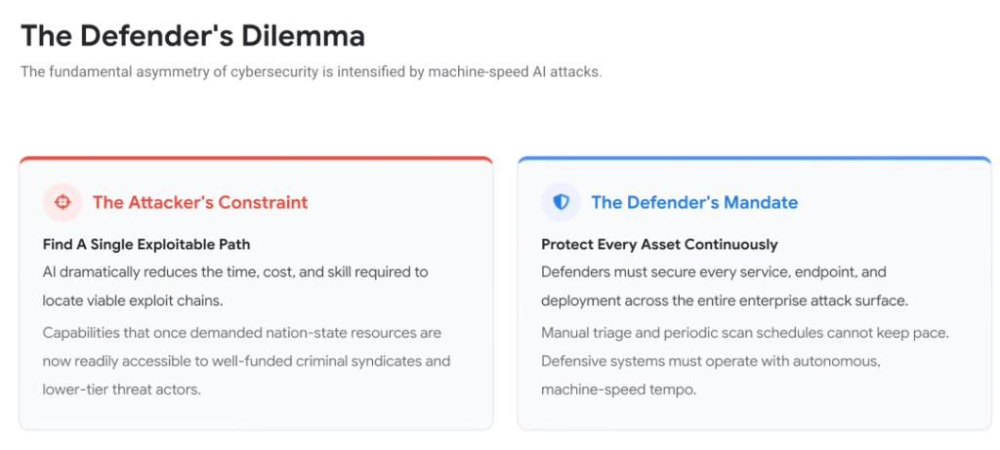
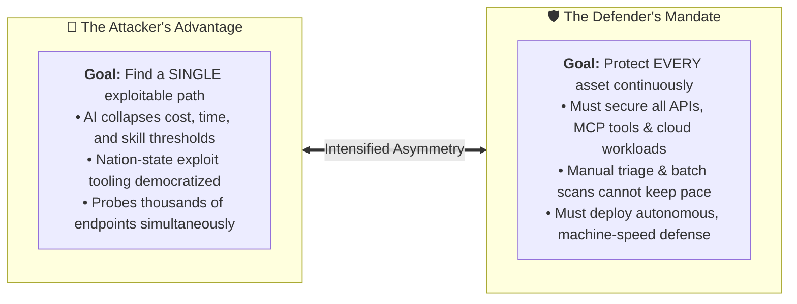

# The Defender's Dilemma: Cybersecurity Asymmetry Intensified by AI

## Overview

The fundamental law of cybersecurity has always been asymmetric: **an attacker needs only one flaw to succeed, while a defender must secure everything.**

In the era of agentic software engineering and autonomous threat actors, **generative AI massively intensifies this asymmetry**. When adversaries leverage autonomous models to uncover exploit paths in seconds, human-paced defensive paradigms collapse.

---

## The AI-Intensified Asymmetry Equation

---

## Detailed Examination of the Two Opposing Realities

### 1. The Attacker's Constraint: Find a Single Exploitable Path
* **Democratization of Advanced Capabilities**:
  * Offenses that previously required months of nation-state research and million-dollar budgets can now be executed by lower-tier criminal groups using open-weight models and agentic harnesses.
* **Autonomous Exploit Chaining**:
  * Attackers do not need an obvious zero-day vulnerability; they use autonomous agents to chain together three minor, low-severity misconfigurations into a full system compromise.
* **Zero Cost of Failure**:
  * An attacker can fail 9,999 times at zero marginal cost. The 10,000th attempt that succeeds yields full data exfiltration.

---

### 2. The Defender's Mandate: Protect Every Asset Continuously
* **Total Surface Coverage**:
  * Enterprise defenders must protect every public API, legacy backend service, internal database, container image, CI/CD pipeline, and Model Context Protocol (MCP) server across multi-cloud environments.
* **The Failure of Human Linear Bandwidth**:
  * Human security teams cannot scale with exponential code velocity. If defense relies on manual pull request audits and quarterly penetration tests, defenders are structurally compromised by design.
* **The Machine-Speed Imperative**:
  * The only way to solve the Defender's Dilemma is to **fight machine speed with machine speed**—deploying autonomous AST remediation (**Code Mender**), graph-based risk correlation (**Wiz Security Graph**), and real-time prompt filtering (**Google Model Armor**).

---

## The Asymmetric Battle: Attackers vs. Defenders

| Operational Dimension | The Attacker (Machine-Speed Offense) | The Defender (Machine-Speed Defense) |
| :--- | :--- | :--- |
| **Objective** | Find **one** vulnerable entry point | Defend **every** entry point continuously |
| **Resource Cost** | Minimal (a few dollars in LLM tokens) | High (infrastructure, engineering, compliance) |
| **Pace of Operation** | Continuous, 24/7 autonomous probing | **Autonomous, sub-minute self-healing loops** |
| **Exploit Discovery** | Automated CVE weaponization &amp; fuzzing | Continuous reachability scoring &amp; toxic graph correlation |
| **Remediation Gap** | Exploits flaws before humans wake up | **Automated PR patch generation (Code Mender)** |
