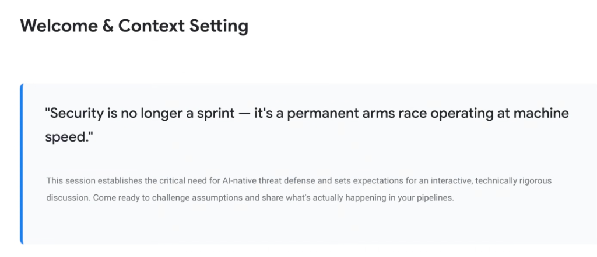
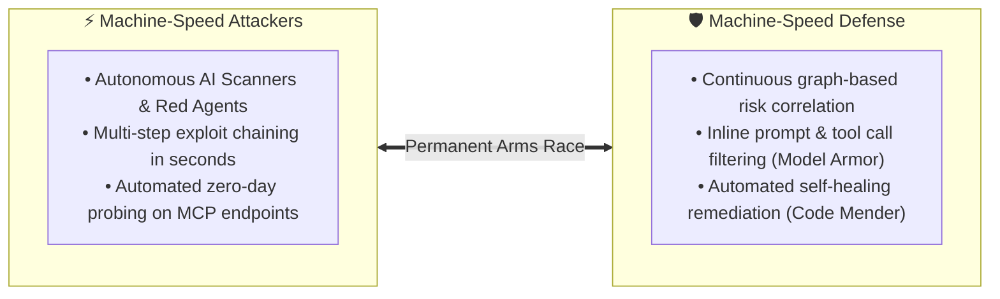

# Welcome & Context Setting: The Machine-Speed Arms Race

## Overview

> **"Security is no longer a sprint — it's a permanent arms race operating at machine speed."**

The fundamental premise of Day 3 is that the traditional software security paradigm has reached an inflection point. When software creation, architectural refactoring, and adversarial exploitation all transition from human-scale typing to **autonomous machine-speed agent execution**, security defense cannot remain a periodic human triage sprint.

---

## The Machine-Speed Asymmetry Problem

---

## The 3 Structural Shifts in Enterprise Security

### 1. Velocity Shift: From Periodic Sprints to Continuous Loops
* **Legacy Model**: Security reviews occur during pre-release staging gates or quarterly penetration testing cycles.
* **Agentic Reality**: Autonomous coding agents (`agy`, Claude Code, Codex) generate hundreds of lines of code and multi-file pull requests per hour. Vulnerabilities must be detected and neutralized before code reaches production branches.

---

### 2. Attack Surface Shift: From Web Endpoints to Agent Toolsets
* **Legacy Model**: Monolithic REST APIs, SQL databases, and perimeter firewalls.
* **Agentic Reality**: Multi-agent swarms, Model Context Protocol (MCP) server endpoints, dynamic tool descriptors, unconstrained natural language prompts, and vector embeddings.

---

### 3. Remediation Shift: From Manual JIRA Tickets to Autonomous Code Mending
* **Legacy Model**: Scanners create tickets that sit in developer backlogs for weeks or months.
* **Agentic Reality**: AI security engines like **Code Mender** and **Wiz Code** automatically analyze the abstract syntax tree (AST), generate verified patch pull requests, and execute regression test suites autonomously.

---

## Legacy AppSec vs. Machine-Speed Agentic Defense

| Dimension | Legacy AppSec (Human Speed) | Modern Agentic Defense (Machine Speed) |
| :--- | :--- | :--- |
| **Pace of Operation** | Sprints, milestone gates, quarterly audits | **Continuous, real-time autonomous execution** |
| **Exploit Discovery** | Manual pen-testing, scheduled DAST | **Autonomous Red Agents & AI DAST attackers** |
| **Protected Entities**| VMs, static containers, HTTP endpoints | **Agents, Prompts, MCP Servers, Models, Skills** |
| **Context Horizon** | Isolated file CVE matching | **Unified Security Graph & Multi-Cloud Inventory** |
| **Remediation** | Human-authored backlog patches | **Autonomous AI-generated fix PRs (Code Mender)** |
