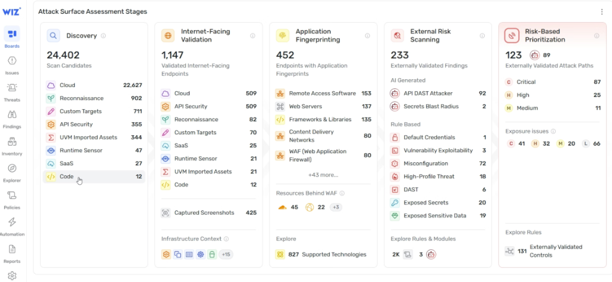
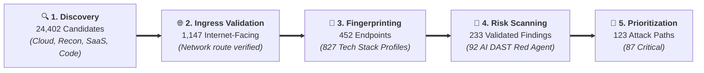

# Wiz Attack Surface Assessment Stages: The 5-Phase AI DAST Funnel

## Overview

A central operational challenge in modern cybersecurity is **alert noise**. When enterprises manage tens of thousands of cloud resources, legacy scanners overwhelm security teams with unprioritized CVE lists.

The **Wiz Attack Surface Assessment** console demonstrates the power of the **5-Phase Funnel**: systematically filtering **24,402 raw scan candidates** down to **123 validated, high-impact attack paths** (87 Critical) using real-time internet validation, deep application fingerprinting, and autonomous **AI DAST Red Agent** exploit simulation.

---

## The 5-Stage Assessment Funnel

---

## Detailed Examination of the 5 Funnel Stages

### Stage 1: Discovery (Total Attack Surface Census)
* **Candidate Volume**: **24,402 Scan Candidates**
* **Multi-Corpus Asset Ingestion**:
  * **Cloud Workloads**: 22,627 resources across GCP, AWS, and Azure.
  * **OSINT & Reconnaissance**: 902 public DNS entries and subdomains.
  * **Custom External Targets**: 711 monitored hostnames and CIDRs.
  * **API Security Endpoints**: 355 API gateways and serverless routes.
  * **UVM Imported Assets**: 344 infrastructure entities.
  * **Runtime Sensors**: 47 active kernel-monitored hosts.
  * **SaaS & Code Repos**: 27 SaaS tenants + 12 source code repositories.

---

### Stage 2: Internet-Facing Validation (True Ingress Verification)
* **Validated Volume**: **1,147 Validated Endpoints**
* **Filtering Logic**:
  * Evaluates VPC routing tables, cloud load balancers, and external firewalls to confirm actual public routability.
  * Captures live visual screenshots (**425 captured**) to catalog active login portals and web applications.
  * Discards tens of thousands of isolated private-network workloads that cannot be touched by external attackers.

---

### Stage 3: Application Fingerprinting (Technology Stack Profiling)
* **Fingerprinted Volume**: **452 Endpoints**
* **Technology Detection (827 Supported Stacks)**:
  * **Remote Access Software**: 153 endpoints (VPNs, SSH, RDP gateways).
  * **Web Servers**: 137 endpoints (Nginx, Apache, Envoy).
  * **Frameworks & Libraries**: 135 endpoints (Spring, Express, Django).
  * **Content Delivery Networks (CDNs)**: 80 endpoints.
  * **Web Application Firewalls (WAFs)**: 80 endpoints (with 45+ resources protected behind WAF).

---

### Stage 4: External Risk Scanning (AI-Driven vs. Rule-Based)
* **Validated Findings**: **233 Externally Validated Findings**
* **AI Generated (Autonomous Red Agent)**:
  * **API DAST Attacker (Red Agent)**: **92 active exploit simulations**.
  * **Secrets Blast Radius**: 2 multi-resource exfiltration paths.
* **Rule-Based Detection**:
  * **Misconfigurations**: 72 findings.
  * **Exposed Secrets**: 20 findings.
  * **Exposed Sensitive Data**: 19 findings.
  * **High-Profile Threats**: 18 findings.
  * **DAST & Exploitability**: 9 findings.
  * **Default Credentials**: 1 finding.

---

### Stage 5: Risk-Based Prioritization (Toxic Attack Path Isolation)
* **Attack Paths Isolated**: **123 Validated Paths** (89 Red Agent verified)
* **Severity Stratification**:
  * 🔴 **Critical**: **87 Attack Paths** (immediate exploitation potential).
  * 🟠 **High**: **25 Attack Paths**.
  * 🟡 **Medium**: **11 Attack Paths**.
* **Exposure Breakdown**: 41 Critical, 32 High, 20 Medium, 66 Low exposure issues across 131 externally validated controls.

---

## 5-Stage Assessment Funnel Summary Matrix

| Stage | Input Volume | Filter / Analysis Applied | Output Volume | Efficiency Ratio |
| :--- | :---: | :--- | :---: | :---: |
| **1. Discovery** | 24,402 | Multi-cloud, OSINT, SaaS &amp; code census | 24,402 | Baseline |
| **2. Ingress Validation** | 24,402 | Network route verification &amp; screenshot capture | 1,147 | **95.3% filtered** |
| **3. Fingerprinting** | 1,147 | 827 tech stack fingerprints &amp; WAF mappings | 452 | **60.6% filtered** |
| **4. Risk Scanning** | 452 | AI DAST Red Agent + rule-based exploit checks | 233 | **48.5% filtered** |
| **5. Prioritization** | 233 | Graph toxic combination reachability scoring | **123 (87 Critical)** | **99.5% total reduction** |
