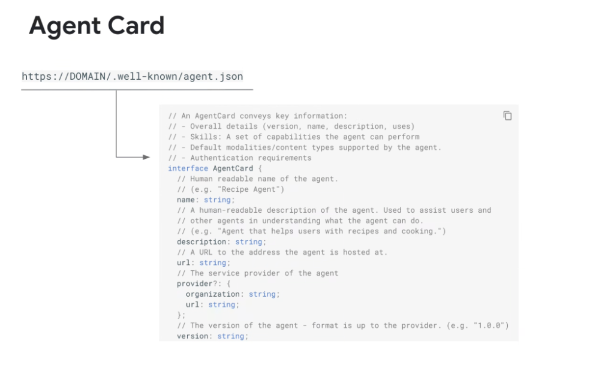
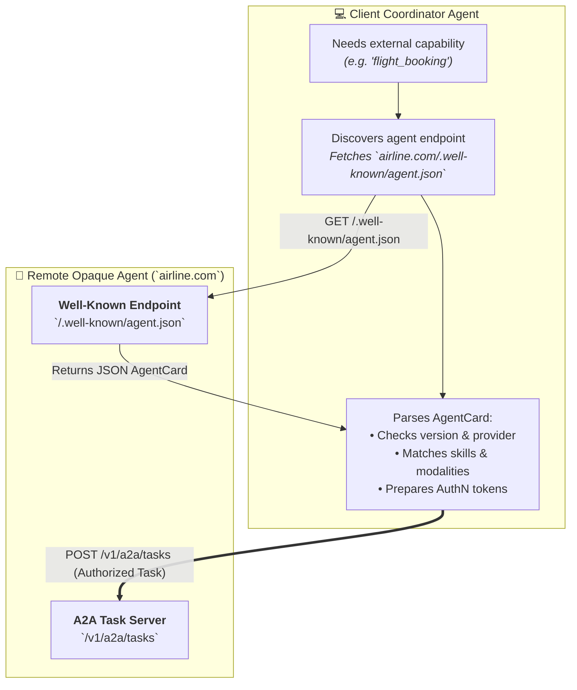

# A2A Agent Card: The `.well-known/agent.json` Discovery Schema



## Overview

For autonomous agents to collaborate across corporate boundaries and heterogeneous clouds without manual hardcoded integrations, they require a **standardized discovery mechanism**.

The **A2A Protocol** defines the **Agent Card**—hosted at the standardized URI:
$$\text{https://<DOMAIN>/.well-known/agent.json}$$

Modeled after RFC 5785 and OAuth OpenID discovery (`.well-known/openid-configuration`), the Agent Card provides a machine-readable declaration of an opaque agent's identity, capabilities, endpoints, supported modalities, and security requirements.

---

## Agent Discovery & Capability Negotiation Flow



---

## Detailed Examination of the Agent Card Schema

An `AgentCard` conveys four core operational dimensions:

### 1. Overall Identity & Service Metadata
* **`name`**: Human- and machine-readable name of the agent (e.g. `"Enterprise Procurement Agent"`).
* **`description`**: Semantic explanation of the agent's purpose, domain scope, and constraints. Client LLMs use this description for dynamic routing decisions.
* **`url`**: Canonical base URL address where the agent's A2A task server is hosted.
* **`provider`**: Organization details, legal entity, and contact URL.
* **`version`**: Semantic versioning string (e.g. `"1.2.0"`).

---

### 2. Skills & Capability Declarations
* Enumerates the discrete actions the agent can perform.
* Each skill defines input JSON schemas, output schemas, idempotency guarantees, and estimated execution latencies.

---

### 3. Modalities & Supported Content Types
* Declares supported streaming and media formats (e.g. `text/plain`, `application/json`, `image/png`, `audio/pcm`).

---

### 4. Authentication & Security Requirements
* Declares the authentication protocols required to invoke the agent (e.g. OAuth 2.0 Bearer tokens, Workload Identity Federation, mTLS, OIDC claims).

---

## Complete TypeScript Interface Definition

```typescript
// Formal A2A AgentCard Specification (draft-01)
export interface AgentCard {
  // Human and machine-readable name of the agent
  name: string;

  // Semantic description assisting client agents in routing decisions
  description: string;

  // The base HTTPS endpoint where the agent's A2A server is hosted
  url: string;

  // The service provider organization hosting the agent
  provider?: {
    organization: string;
    url: string;
  };

  // SemVer release version of the agent
  version: string;

  // Capabilities and tasks supported by this agent
  skills: AgentSkill[];

  // Supported input/output content types (e.g. "application/json", "text/markdown")
  supported_modalities?: string[];

  // Security and auth requirements for invocation
  authentication: {
    type: "oauth2" | "oidc" | "workload_identity" | "api_key" | "none";
    token_url?: string;
    scopes?: string[];
    issuer?: string;
  };
}

export interface AgentSkill {
  id: string;
  name: string;
  description: string;
  input_schema: Record<string, any>; // JSON Schema
  output_schema: Record<string, any>; // JSON Schema
  is_idempotent?: boolean;
}
```

---

## Production JSON Example (`/.well-known/agent.json`)

```json
{
  "name": "Cloud Infra Optimizer Agent",
  "description": "Analyzes Google Cloud resource utilization, identifies idle VMs/disks, and suggests cost optimization Terraform patches.",
  "url": "https://optimizer.internal.enterprise.com/v1/a2a",
  "provider": {
    "organization": "Cloud Infrastructure Team",
    "url": "https://internal.enterprise.com/teams/infra"
  },
  "version": "2.4.0",
  "supported_modalities": ["application/json", "text/markdown", "text/diff"],
  "authentication": {
    "type": "workload_identity",
    "issuer": "https://accounts.google.com",
    "scopes": ["https://www.googleapis.com/auth/cloud-platform"]
  },
  "skills": [
    {
      "id": "analyze_gke_cost",
      "name": "Analyze GKE Cluster Cost",
      "description": "Calculates CPU/RAM waste across namespaces for a specified cluster.",
      "input_schema": {
        "type": "object",
        "properties": {
          "cluster_name": { "type": "string" },
          "region": { "type": "string" }
        },
        "required": ["cluster_name", "region"]
      },
      "output_schema": {
        "type": "object",
        "properties": {
          "monthly_waste_usd": { "type": "number" },
          "recommendations": { "type": "array" }
        }
      }
    }
  ]
}
```

---

## Agent Card Field Reference Matrix

| Field | Type | Mandatory? | Architectural Purpose |
| :--- | :--- | :---: | :--- |
| **`name`** | `string` | **Yes** | Primary identifier in agent registries |
| **`description`** | `string` | **Yes** | Ingested by client orchestrator LLMs for routing |
| **`url`** | `string` (URI) | **Yes** | Target A2A RPC / REST invocation endpoint |
| **`version`** | `string` (SemVer)| **Yes** | Enables protocol and schema version negotiation |
| **`skills`** | `AgentSkill[]` | **Yes** | Granular input/output contract per capability |
| **`authentication`**| `Object` | **Yes** | Enforces zero-trust cross-domain security |
| **`provider`** | `Object` | Optional | Provenance, ownership, and compliance auditing |
