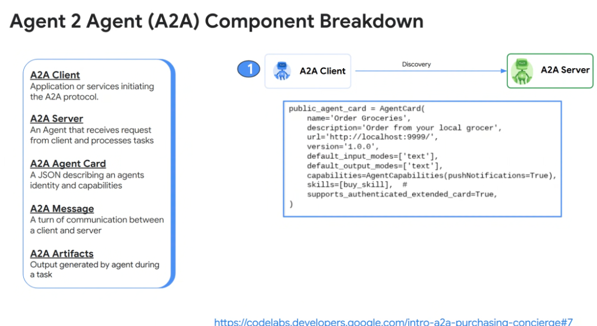
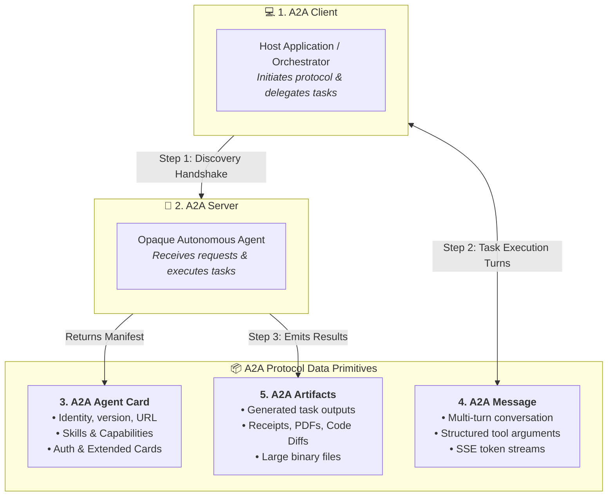

# A2A Component Breakdown: The 5 Core Primitives



## Overview

The **Agent-to-Agent (A2A) Protocol** establishes a standardized, contract-driven architecture for federating heterogeneous agentic systems.

To enable interoperability between client orchestrators and remote server agents, A2A defines five foundational architectural primitives: **Client**, **Server**, **Agent Card**, **Message**, and **Artifacts**.

---

## The 5 Core A2A Primitives & Discovery Lifecycle



---

## Detailed Examination of the 5 Primitives

### 1. A2A Client
* **Definition**: The application, orchestrator agent, or microservice initiating the A2A protocol.
* **Responsibilities**:
  * Resolves the remote agent's endpoint via registry or DNS.
  * Fetches and parses the remote agent's `AgentCard`.
  * Manages user authorization headers and submits structured task requests.

---

### 2. A2A Server
* **Definition**: The autonomous agent listening on an HTTP/gRPC endpoint that receives requests from clients and executes domain tasks.
* **Responsibilities**:
  * Implements the A2A state machine (e.g. `PENDING`, `RUNNING`, `INTERRUPTED`, `COMPLETED`).
  * Executes reasoning loops, tools, and sub-workflows.
  * Streams real-time progress and manages lifecycle interruptions.

---

### 3. A2A Agent Card (`AgentCard`)
* **Definition**: A structured declarative manifest describing an agent's identity, version, endpoint URL, input/output modalities, and skills.
* **Advanced Capability: Authenticated Extended Cards**:
  * `supports_authenticated_extended_card=True`: Enables **Progressive Disclosure of Agent Capabilities**.
  * Unauthenticated callers see a minimal public card; authenticated enterprise clients presenting valid IAM/OAuth tokens receive an *Extended Card* exposing sensitive, privileged skills.

---

### 4. A2A Message
* **Definition**: A single turn of structured communication exchanged between a client and server.
* **Contents**: Text dialogue, structured JSON parameters, streaming delta chunks, and state transition signals.

---

### 5. A2A Artifacts
* **Definition**: The tangible outputs produced by the server agent during task execution.
* **Examples**: Executable code diffs, generated purchase order PDFs, structured database export payloads, or signed audit receipts.

---

## Production Python Implementation (A2A Server & Card Definition)

Reference implementation from the Google A2A Purchasing Concierge architecture:

```python
from a2a import AgentCard, AgentCapabilities, AgentSkill, A2AServer

# 1. Define Reusable Domain Skill
buy_grocery_skill = AgentSkill(
    id="buy_groceries",
    name="Purchase Grocery Items",
    description="Places a grocery order with the local store matching user constraints.",
    input_schema={
        "type": "object",
        "properties": {
            "item_list": {"type": "array", "items": {"type": "string"}},
            "delivery_address": {"type": "string"},
            "max_budget_usd": {"type": "number"}
        },
        "required": ["item_list", "delivery_address"]
    },
    output_schema={
        "type": "object",
        "properties": {
            "order_id": {"type": "string"},
            "total_cost_usd": {"type": "number"},
            "estimated_delivery": {"type": "string"}
        }
    }
)

# 2. Construct Public Agent Card
public_agent_card = AgentCard(
    name="Order Groceries",
    description="Order from your local grocer",
    url="http://localhost:9999/",
    version="1.0.0",
    default_input_modes=["text"],
    default_output_modes=["text"],
    capabilities=AgentCapabilities(pushNotifications=True),
    skills=[buy_grocery_skill],
    supports_authenticated_extended_card=True,
)

# 3. Mount A2A Server
server = A2AServer(agent_card=public_agent_card)

if __name__ == "__main__":
    server.run(host="0.0.0.0", port=9999)
```

---

## A2A 5-Component Reference Matrix

| Component | Responsibility | Primary Protocol Endpoint | Key Data Format |
| :--- | :--- | :--- | :--- |
| **`A2A Client`** | Task initiation &amp; user representation | Client-side runtime | HTTP POST / gRPC |
| **`A2A Server`** | Task execution &amp; state management | `POST /v1/a2a/tasks` | JSON / SSE stream |
| **`Agent Card`** | Identity, skills &amp; capability manifest | `GET /.well-known/agent.json` | JSON Schema / TypeScript |
| **`A2A Message`** | Multi-turn communication turns | `POST /v1/a2a/tasks/{id}/turns`| JSON Messages |
| **`A2A Artifacts`** | Concrete task deliverables &amp; outputs | `GET /v1/a2a/tasks/{id}/artifacts`| Binary / JSON / Multipart |

---

## References & Further Reading
* Google Codelabs: [Intro to A2A: Building an Autonomous Purchasing Concierge](https://codelabs.developers.google.com/intro-a2a-purchasing-concierge#7)
