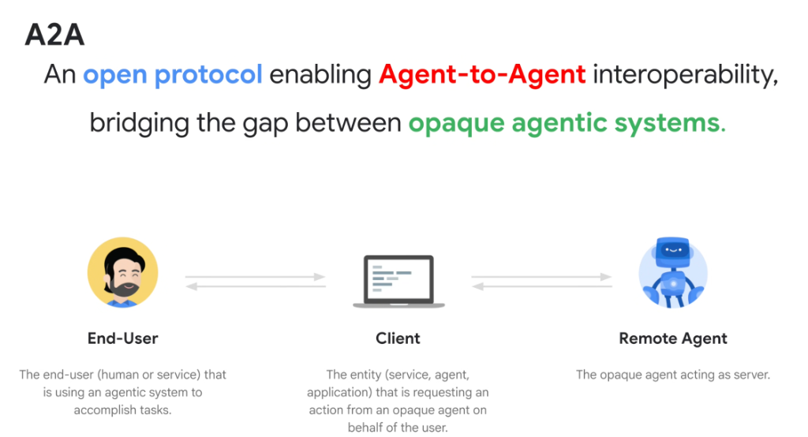
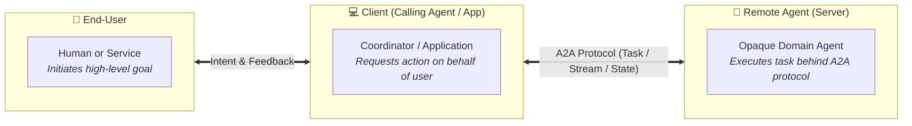

# A2A: Open Protocol for Agent-to-Agent Interoperability

## Overview

As enterprise AI adoption scales, organizations inevitably deploy heterogeneous agent systems built across diverse frameworks—**Google ADK**, **LangGraph**, **AutoGen**, and commercial SaaS agents (**Salesforce Agentforce**, **ServiceNow**, **Workday**).

Without an open standard, these systems exist as isolated, incompatible silos.

> **Definition of A2A:**
> **A2A (Agent-to-Agent)** is an **open protocol** enabling standardized communication, task delegation, and state negotiation between disparate, **opaque agentic systems**.

---

## The 3-Entity A2A Actor Model

---

## Detailed Breakdown of the 3 Actor Roles

### 1. End-User (Originating Principal)
* **Role**: The human operator or automated enterprise service utilizing the agentic system to accomplish complex objectives.
* **Context**: Owns the high-level intent, security credentials, and final decision authority.

---

### 2. Client (Calling Agent / Host Application)
* **Role**: The entity requesting an action from an opaque remote agent on behalf of the end-user.
* **Responsibilities**:
  * Formulates structured task requests conforming to the remote agent's published capability schema.
  * Propagates user identity tokens (OAuth / OIDC / Workload Identity Federation) across the network boundary.
  * Manages client-side UX, response rendering, and workflow continuation.

---

### 3. Remote Agent (Opaque Server Agent)
* **Role**: The specialized server agent encapsulating domain logic and tools.
* **The "Opaque System" Principle**:
  * The remote agent operates as a **black box**. The client does not need visibility into its underlying LLM (Gemini, Claude, GPT-4), internal prompts, RAG databases, or memory structures.
  * It exposes only standard A2A endpoints for capability discovery, task execution, progress streaming, and artifact delivery.

---

## Core Pillars of the A2A Protocol

1. **Declarative Capability Discovery (`a2a.json`)**:
   * Remote agents publish machine-readable manifests describing supported intents, parameter schemas, and authentication requirements.
2. **Standardized Task Lifecycle**:
   * Supports synchronous request-response, asynchronous long-running task polling, and real-time Server-Sent Events (SSE) token streaming.
3. **Identity & Context Delegation**:
   * Enforces zero-trust propagation of user identity and tenant boundaries across multi-hop agent chains.
4. **Human-in-the-Loop Interruption Handshake**:
   * Allows the remote agent to signal an `A2A_INTERRUPT_REQUIRED` status back to the client when human approval or input is necessary.

---

## Protocol Comparison: A2A vs. MCP vs. Traditional REST

| Protocol Dimension | Traditional REST API | Model Context Protocol (MCP) | Agent-to-Agent (A2A) Protocol |
| :--- | :--- | :--- | :--- |
| **Primary Interaction** | Client-to-Server Data RPC | **LLM-to-Tool Function Calling** | **Agent-to-Agent Task Delegation** |
| **Participant Roles** | App $\rightarrow$ Microservice | Agent $\rightarrow$ Database / Local Tool | Coordinator Agent $\rightarrow$ Autonomous Sub-Agent |
| **Intelligence Level** | Static endpoints (no reasoning) | Deterministic tool execution | **Full autonomous reasoning on both ends** |
| **Execution State** | Stateless HTTP request | Synchronous tool execution | **Multi-turn stateful task negotiation** |
| **HITL Support** | Custom application logic | None (returns error) | **Native protocol interrupt &amp; resume** |
| **Ecosystem Role** | Legacy web backends | Data &amp; tool abstraction layer | **Cross-framework agent federation** |
