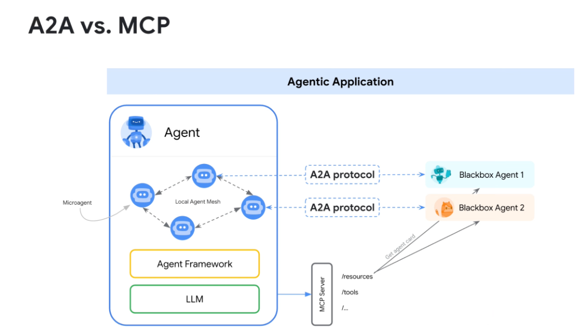
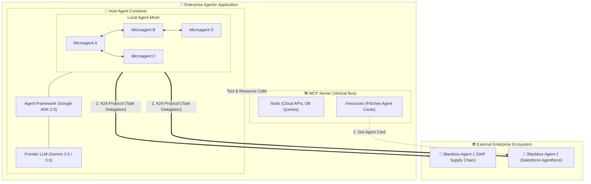

# A2A vs. MCP: Architectural Coexistence & Interoperability

## Overview

A frequent source of confusion in modern agent architecture is distinguishing between **Model Context Protocol (MCP)** and the **Agent-to-Agent (A2A) Protocol**.

> **Core Architectural Principle: A2A and MCP are complementary, not competing.**
> * **MCP** is the **Vertical Data & Tool Bus**: Connects an agent downward to tools, databases, file systems, and resources.
> * **A2A** is the **Horizontal Agent Federation Bus**: Connects an agent outward to external, opaque, black-box agent systems.

Together, MCP and A2A form the foundational connectivity fabric of enterprise agentic applications.

---

## Architectural Blueprint: The Coexistence Model

---

## Detailed Examination of the 3 Architectural Layers

### 1. The Local Agent Mesh (Internal Execution Plane)
* **What It Is**: The internal network of specialized microagents running within the host application container.
* **Orchestration**: Managed deterministically by the **Google ADK 2.0 StateGraph** engine.
* **Characteristics**: Shared memory, typed state variables, low-latency in-process communication, and shared LLM context windows.

---

### 2. MCP Server: The Vertical Data & Resource Bus
* **What It Is**: The open standard interface connecting the agent to deterministic enterprise capabilities.
* **Key Endpoints**:
  * `/tools`: Exposes database querying, shell execution, Cloud SQL mutations, and API calls.
  * `/resources`: Exposes static or dynamic documents, schemas, and files.
* **The Bootstrap Bridge**:
  * An agent can query an MCP `/resources` endpoint to retrieve the external **Agent Card** (`https://DOMAIN/.well-known/agent.json`) of a third-party partner.

---

### 3. A2A Protocol: The Horizontal Agent Federation Bus
* **What It Is**: The peer-to-peer protocol governing communication between the local agent mesh and external **Blackbox Agents**.
* **Why "Blackbox"?**:
  * The host agent treats the remote agent as an opaque service. It does not inspect its prompts, internal vector databases, or model weights.
* **Execution Flow**:
  * Once the host agent inspects the remote agent's Agent Card (via MCP or registry lookup), it initiates a stateful A2A session to delegate complex business workflows across organizational boundaries.

---

## Deep Comparison Matrix: A2A vs. MCP

| Architectural Dimension | Model Context Protocol (MCP) | Agent-to-Agent Protocol (A2A) |
| :--- | :--- | :--- |
| **Communication Axis** | **Vertical (Downward)** | **Horizontal (Lateral / Outward)** |
| **Connected Entities** | Agent $\longleftrightarrow$ Tools, APIs, DBs, Files | Agent $\longleftrightarrow$ External Blackbox Agent |
| **Reasoning Model** | One-sided (LLM calls dumb tool) | **Dual-sided (Both entities reason &amp; plan)** |
| **Statefulness** | Stateless function execution | **Stateful multi-turn task negotiation** |
| **Discovery Mechanism** | MCP `list_tools`, `list_resources` | **`/.well-known/agent.json` (Agent Card)** |
| **Execution Flow** | Deterministic JSON input $\rightarrow$ Output | **Autonomous sub-goal delegation &amp; streaming** |
| **Human-in-the-Loop** | Handled at tool caller level | **Native protocol interrupt &amp; resume signals** |
| **Typical Example** | Querying a BigQuery table via MCP | Delegating supply chain re-order to SAP Agent |
