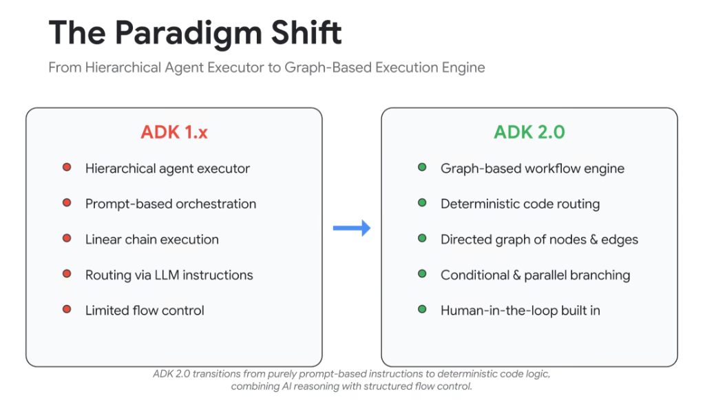

# The Paradigm Shift: ADK 1.x to ADK 2.0 Graph Execution Engine



## Overview

The evolution from **Google ADK 1.x** to **Google ADK 2.0** represents a fundamental architectural revolution in enterprise agent engineering: **transitioning from hierarchical, prompt-based agent executors to a deterministic, graph-based execution engine.**

> **Core Philosophy:**
> *"ADK 2.0 transitions from purely prompt-based instructions to deterministic code logic, combining AI reasoning with structured flow control."*

While ADK 1.x enabled rapid prototyping by delegating control flow to natural language LLM prompts, production enterprise systems require strict determinism, parallel fan-out, robust error recovery, and native human-in-the-loop checkpoints. ADK 2.0 delivers this through a **Directed Acyclic Graph (DAG) of Nodes and Edges**.

---

## Architectural Comparison: Hierarchical Chains vs. Graph Execution

```mermaid
flowchart TD
    subgraph ADK1["🔴 ADK 1.x: Hierarchical Prompt Executor"]
        direction TB
        P1["User Query"] --> P2["Parent Router Agent (LLM Prompt)"]
        P2 -->|"Fuzzy Prompt Routing"| P3["Sub-Agent A (Linear)"]
        P3 -->|"Sequential Hand-off"| P4["Sub-Agent B (Linear)"]
        P4 --> P5["Final Output"]
    end

    subgraph ADK2["🟢 ADK 2.0: Graph-Based Workflow Engine"]
        direction TB
        G1["State Ingestion Node"] --> G2{"Deterministic Python Router"}
        G2 -->|"Condition True (Parallel Branch)"| G3["Agent Node 1 (LLM Reasoning)"]
        G2 -->|"Condition True (Parallel Branch)"| G4["Agent Node 2 (Code / Tool)"]
        G3 &amp; G4 --> G5["Join / Reducer Node"]
        G5 --> G6{"Human-in-the-Loop Node?"}
        G6 -->|"Approved"| G7["State Checkpoint &amp; Output"]
        G6 -.->|"Rejected / Feedback"| G1
    end
```

---

## Detailed Comparative Analysis

### 1. Control Flow & Routing
* **ADK 1.x (Prompt-Based Orchestration)**:
  * Control flow was governed by system prompts (e.g. *"If the user asks about billing, transfer to BillingAgent"*).
  * Susceptible to prompt drift, model hallucination, and non-deterministic routing failures in production.
* **ADK 2.0 (Deterministic Code Routing)**:
  * Transitions are explicitly defined via programmatic Python/Go code logic and state conditions (`edge = ConditionalEdge(condition_fn)`).
  * Guarantees 100% deterministic routing paths while reserving LLM intelligence for reasoning tasks within individual nodes.

---

### 2. Execution Topology
* **ADK 1.x (Linear Chain Execution)**:
  * Agents executed sequentially in single-threaded chains or strict parent-child hierarchies.
  * Incurred high cumulative latency penalties and lacked native mechanisms for parallel task fan-out.
* **ADK 2.0 (Directed Graph of Nodes & Edges)**:
  * Full support for arbitrary DAGs, cyclic state machines, loops, and parallel branch execution.
  * Workflows can fan-out across multiple agent nodes concurrently and synchronize via join/reducer nodes.

---

### 3. Flow Control & State Resilience
* **ADK 1.x (Limited Flow Control)**:
  * Error recovery required re-prompting the LLM. Pausing workflows for human approval required complex custom state hacking.
* **ADK 2.0 (Built-In Human-in-the-Loop & State Checkpointing)**:
  * Native first-class primitives for `interrupt()`, `resume()`, and persistent state time-travel.
  * Allows workflows to pause execution, wait for human sign-off via Slack/Webhooks, and resume seamlessly from stored checkpoints.

---

## ADK 1.x vs. ADK 2.0 Code Pattern Comparison

### ADK 1.x (Prompt-Based Delegation)
```python
# ADK 1.x: Relying on LLM prompt instructions to route
parent_agent = Agent(
    model="gemini-1.5-pro",
    instruction="You are a dispatcher. If financial, call financial_agent. If technical, call tech_agent.",
    subagents=[financial_agent, tech_agent]
)
```

### ADK 2.0 (Graph-Based State Workflow Engine)
```python
# ADK 2.0: Deterministic graph nodes, edges, and branching
from google.genai.adk import StateGraph, START, END

builder = StateGraph(EnterpriseState)

# Define Nodes (Agents, Tools, Functions)
builder.add_node("financial_analyzer", financial_agent_node)
builder.add_node("technical_analyzer", tech_agent_node)
builder.add_node("human_review", human_approval_node)
builder.add_node("aggregator", reduce_results_node)

# Define Deterministic Routing Edges
builder.add_edge(START, "router")
builder.add_conditional_edges(
    "router",
    deterministic_routing_fn,
    {
        "finance": "financial_analyzer",
        "tech": "technical_analyzer",
        "both": ["financial_analyzer", "technical_analyzer"] # Parallel Fan-Out
    }
)
builder.add_edge(["financial_analyzer", "technical_analyzer"], "aggregator")
builder.add_edge("aggregator", "human_review")
builder.add_edge("human_review", END)

graph = builder.compile(checkpointer=CloudFirestoreCheckpointer())
```

---

## Architectural Comparison Matrix

| Capability Dimension | ADK 1.x (Legacy) | ADK 2.0 (Current Standard) |
| :--- | :--- | :--- |
| **Orchestration Model** | Hierarchical Agent Executor | **Graph-Based Workflow Engine (DAG / Cyclic)** |
| **Routing Mechanism** | Fuzzy Prompt Instructions | **Deterministic Code &amp; State Logic** |
| **Execution Cadence** | Sequential Linear Chains | **Conditional &amp; Parallel Branching (Scatter/Gather)** |
| **Flow Control** | Fragile Re-prompting | **Structured Loops, Retries &amp; State Checkpoints** |
| **Human-in-the-Loop** | Manual bespoke hacks | **Native `interrupt()` / `resume()` Primitives** |
| **State Persistence** | Ephemeral In-Memory | **Pluggable Checkpointers (Firestore, Cloud SQL, Spanner)** |
| **Production Fit** | Prototyping &amp; Simple Q&amp;A | **Mission-Critical Enterprise Business Workflows** |
