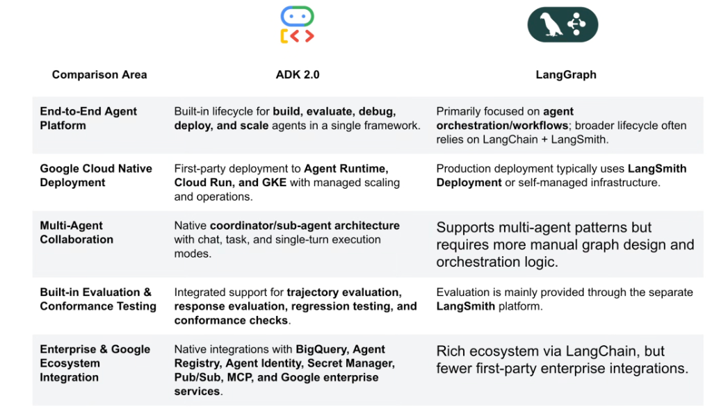
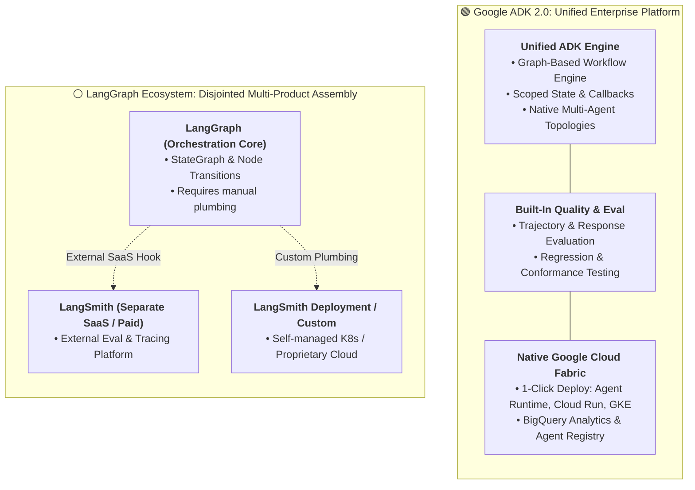

# Competitive Analysis: Google ADK 2.0 vs. LangGraph

## Overview

When enterprise architecture teams evaluate frameworks for building mission-critical agentic systems, the two primary graph-based orchestrators are **Google ADK 2.0** and **LangGraph** (LangChain ecosystem).

While both frameworks utilize graph-based workflows (DAGs, state nodes, conditional edges), their **architectural scope, operational model, and enterprise maturity differ significantly**. 

> **Key Architectural Differentiation:**
> **LangGraph** is primarily an orchestration library that requires assembling multiple disparate products (LangChain, LangSmith, LangServe) to achieve a full development lifecycle.
> **Google ADK 2.0** is an **End-to-End Enterprise Agent Platform**—unifying development, deterministic graph routing, trajectory evaluation, security guardrails, and Google Cloud production deployment within a single framework.

---

## Architectural Comparison: Unified Platform vs. Disjointed Ecosystem

---

## Detailed Examination of the 5 Core Comparison Pillars

### 1. End-to-End Agent Platform Lifecycle
* **Google ADK 2.0**:
  * Provides a complete, cohesive lifecycle for **build $\rightarrow$ evaluate $\rightarrow$ debug $\rightarrow$ deploy $\rightarrow$ scale $\rightarrow$ monitor** within a single unified SDK and CLI (`agents-cli`).
  * No external subscriptions or fragmented dependencies required.
* **LangGraph**:
  * Strictly an orchestration library for defining graph logic.
  * Developers must stitch together LangChain (prompt templates/tools), LangSmith (tracing/eval), and LangServe (REST hosting).

---

### 2. Google Cloud Native Production Deployment
* **Google ADK 2.0**:
  * First-party, automated deployment targeting **Vertex AI Agent Runtime**, **Google Cloud Run**, and **Google Kubernetes Engine (GKE)**.
  * Native integration with Google Cloud IAM (Workload Identity Federation), VPC Service Controls, and automated autoscaling.
* **LangGraph**:
  * Production hosting typically requires subscribing to LangSmith Hosted Deployment or maintaining custom Docker/FastAPI boilerplate on self-managed infrastructure.

---

### 3. Multi-Agent Collaboration & Topology
* **Google ADK 2.0**:
  * Native **Coordinator / Sub-Agent architecture** with first-class primitives for:
    * Interactive multi-turn chat mode.
    * Batch background task execution.
    * Single-turn deterministic tool delegation.
  * Supports Swarm, Hierarchical, and Graph patterns with minimal boilerplate.
* **LangGraph**:
  * Supports multi-agent workflows but requires verbose, manual definition of state reducers, message passing channels, and custom routing functions.

---

### 4. Built-in Evaluation & Conformance Testing
* **Google ADK 2.0**:
  * Native, integrated evaluation tooling (`agents-cli eval`) supporting:
    * **Trajectory Evaluation**: Validates intermediate reasoning steps and tool selection sequences.
    * **Response Evaluation**: Assesses final output accuracy against Golden Datasets.
    * **Regression Testing**: Automated Pytest execution inside standard CI/CD pipelines (Cloud Build).
* **LangGraph**:
  * Lacks integrated local CLI evaluation; offloads evaluation to the third-party **LangSmith** cloud platform.

---

### 5. Enterprise & Google Ecosystem Integration
* **Google ADK 2.0**:
  * Deep native bindings to the Google Cloud security and data fabric:
    * **BigQuery**: Automated telemetry and agent execution analytics.
    * **Agent Registry & Agent Identity**: Central governance and fine-grained IAM.
    * **Secret Manager**: Secure API key and credential resolution.
    * **Pub/Sub & Cloud Tasks**: Asynchronous event-driven execution.
    * **Model Context Protocol (MCP)**: Native enterprise MCP client and server support.
* **LangGraph**:
  * Broad open-source community ecosystem, but relies on community-maintained wrappers with inconsistent API guarantees and lack of enterprise SLA support.

---

## Detailed Competitive Comparison Matrix

| Architectural Dimension | Google ADK 2.0 | LangGraph |
| :--- | :--- | :--- |
| **Platform Scope** | **Unified End-to-End Enterprise Platform** | Orchestration-only workflow library |
| **Development Lifecycle** | Built-in build, eval, debug, deploy &amp; scale | Requires assembling 3+ separate tools |
| **Deployment Targets** | **Agent Runtime, Cloud Run, GKE (1-click)** | LangSmith Cloud or manual Docker containers |
| **Multi-Agent Primitives** | **Native Coordinator / Sub-agent patterns** | Manual state reducer &amp; channel plumbing |
| **Evaluation Suite** | **Integrated Trajectory &amp; Response Eval CLI** | Decoupled (requires LangSmith subscription) |
| **Enterprise Cloud IAM** | **Workload Identity Federation (WIF/STS)** | Generic environment variables |
| **Analytics &amp; Logging** | **BigQuery Agent Analytics &amp; Cloud Logging** | Proprietary LangSmith traces |
| **MCP Tool Governance** | **Native first-party MCP client &amp; server** | Community wrapper integration |
| **Vendor Support &amp; SLA** | **Google Cloud Enterprise SLA &amp; Support** | Community / LangChain commercial support |
