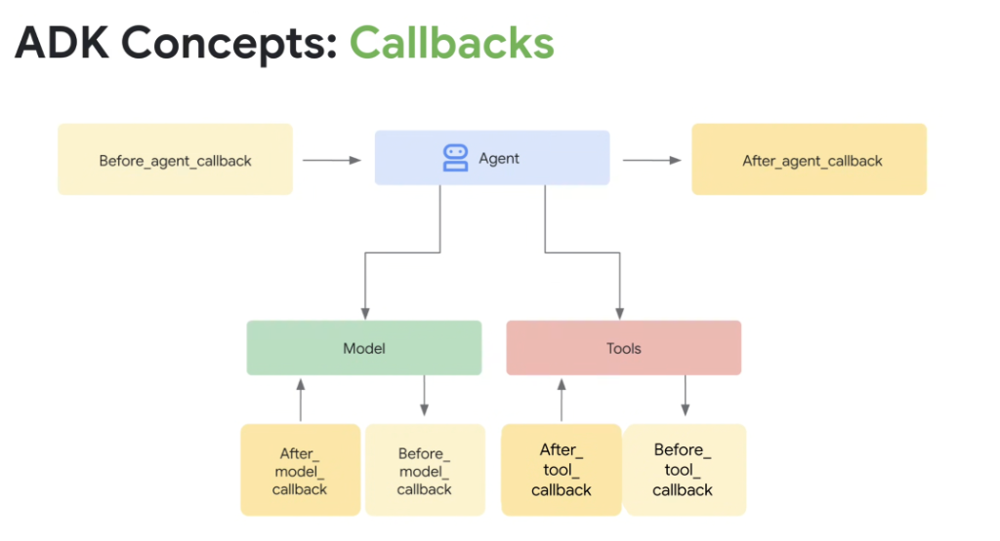
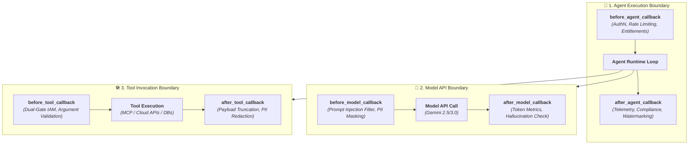

# ADK Concepts: Callbacks & Lifecycle Interception Hooks



## Overview

In enterprise agent engineering, modifying core agent code to insert logging, security validation, or rate limiting creates brittle and unmaintainable architectures.

**Google ADK Callbacks** provide a clean, non-invasive interceptor pattern across the entire execution lifecycle. By exposing six discrete callback hooks across three execution boundaries (**Agent**, **Model**, and **Tools**), developers can inject security guardrails, OpenTelemetry tracing, PII masking, and deterministic validation without altering business logic.

---

## The 6 ADK Lifecycle Callback Hooks



---

## Detailed Examination of the 6 Lifecycle Hooks

### 1. Agent Lifecycle Hooks
* **`before_agent_callback(context: InvocationContext) -> Optional[Response]`**:
  * **Trigger Point**: Executed before the agent performs any planning, reasoning, or model invocations.
  * **Use Cases**: Validates user JWT tokens, verifies tenant entitlement tiers, warms up caches, or returns early cached responses without invoking LLMs.
* **`after_agent_callback(context: InvocationContext, response: Response) -> Response`**:
  * **Trigger Point**: Executed immediately before the final response is returned to the user or calling system.
  * **Use Cases**: Formats final text outputs, injects compliance disclaimers, writes telemetry to Google Cloud Logging, and emits trace spans to OpenTelemetry.

---

### 2. Model Lifecycle Hooks
* **`before_model_callback(context: InvocationContext, contents: List[Content]) -> List[Content]`**:
  * **Trigger Point**: Executed immediately prior to sending the message payload to the Gemini API endpoint.
  * **Use Cases**: Runs **Google Model Armor** inline prompt injection filters, redacts client PII (SSNs, credit card numbers), and injects dynamic RAG context or few-shot examples.
* **`after_model_callback(context: InvocationContext, response: ModelResponse) -> ModelResponse`**:
  * **Trigger Point**: Executed as soon as the model finishes generating tokens or streaming chunks.
  * **Use Cases**: Records prompt/completion token consumption for billing, validates structured JSON/Pydantic schemas, and triggers automated retries on malformed syntax.

---

### 3. Tool Lifecycle Hooks
* **`before_tool_callback(context: ToolContext, tool_name: str, tool_args: dict) -> dict`**:
  * **Trigger Point**: Executed when the model requests a tool call, *before* the function executes.
  * **Use Cases**: Enforces **Dual-Gate Cloud IAM authorization**, sanitizes SQL/shell parameters, validates schema bounds, and enforces Human-in-the-Loop confirmation modals for high-risk mutations.
* **`after_tool_callback(context: ToolContext, tool_name: str, tool_result: Any) -> Any`**:
  * **Trigger Point**: Executed after the tool finishes running, *before* the result is added back into the agent's context window.
  * **Use Cases**: Truncates massive database results (preventing context blowout), redacts sensitive internal server credentials, and normalizes error messages into readable feedback.

---

## Production Python Implementation Example

```python
from google.genai.adk import Agent, InvocationContext, ToolContext
import logging

def audit_before_agent(ctx: InvocationContext):
    logging.info(f"[AUDIT] Starting turn for user={ctx.session.user_id}")

def protect_before_model(ctx: InvocationContext, contents):
    # Sanitize prompt before sending to Gemini
    sanitized = [mask_pii(c.text) for c in contents]
    return sanitized

def authorize_before_tool(ctx: ToolContext, tool_name: str, tool_args: dict):
    if tool_name == "execute_cloud_mutation":
        if not ctx.has_permission("roles/admin"):
            raise PermissionError("User lacks IAM permission for mutation tool.")
    return tool_args

def truncate_after_tool(ctx: ToolContext, tool_name: str, tool_result: dict):
    # Prevent 50MB database dumps from blowing context window
    if len(str(tool_result)) > 4000:
        return {"summary": "Result truncated", "sample": str(tool_result)[:1000]}
    return tool_result

# Register callbacks directly on the ADK Agent
secure_agent = Agent(
    model="gemini-2.5-pro",
    name="EnterpriseOpsAgent",
    before_agent_callback=audit_before_agent,
    before_model_callback=protect_before_model,
    before_tool_callback=authorize_before_tool,
    after_tool_callback=truncate_after_tool,
)
```

---

## ADK Callbacks Summary Reference Matrix

| Callback Hook | Interception Level | Typical Latency Overhead | Primary Enterprise Application |
| :--- | :--- | :---: | :--- |
| **`before_agent_callback`** | Agent Invocation | < 1 ms | AuthN verification &amp; session warm-up |
| **`after_agent_callback`** | Agent Completion | < 2 ms | Output formatting &amp; Cloud Audit Logs |
| **`before_model_callback`** | LLM API Ingress | 5–15 ms | Model Armor prompt defense &amp; PII masking |
| **`after_model_callback`** | LLM API Egress | < 1 ms | Token cost tracking &amp; JSON schema validation |
| **`before_tool_callback`** | Tool Execution Ingress | < 2 ms | Dual-Gate IAM &amp; destructive action safety |
| **`after_tool_callback`** | Tool Execution Egress | < 5 ms | Payload truncation &amp; error normalization |
