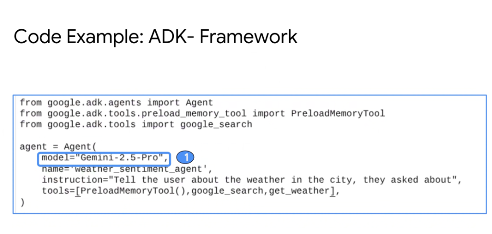
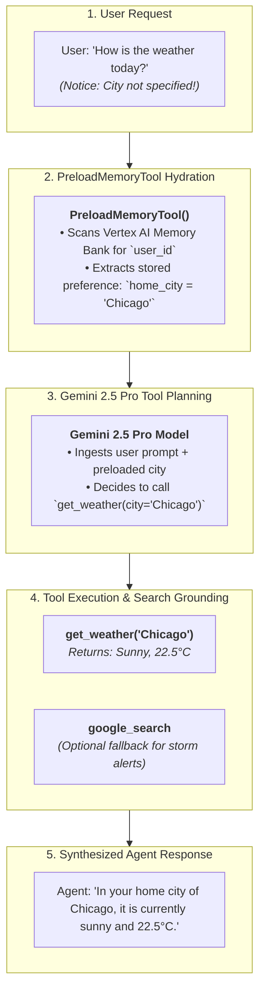

# ADK Framework Code Reference: Agent Instantiation & PreloadMemoryTool



## Overview

The **Google Agent Development Kit (ADK)** provides a clean, declarative Python API for defining production agents. 

This reference demonstrates the standard pattern for instantiating an ADK `Agent` with frontier reasoning models (**Gemini 2.5 Pro**), integrating **`PreloadMemoryTool`** for automatic memory hydration, and binding both first-party grounding tools (`google_search`) and custom domain APIs (`get_weather`).

---

## Code Pattern: Declarative ADK Agent Instantiation

```python
from google.adk.agents import Agent
from google.adk.tools.preload_memory_tool import PreloadMemoryTool
from google.adk.tools import google_search

# Custom deterministic tool definition
def get_weather(city: str) -> dict:
    """Fetches real-time temperature, humidity, and forecast for a given city."""
    # In production, queries weather API or Cloud SQL
    return {"city": city, "temp_c": 22.5, "condition": "Sunny", "humidity": 45}

# Declarative Agent Instantiation
agent = Agent(
    model="Gemini-2.5-Pro",
    name="weather_sentiment_agent",
    instruction="Tell the user about the weather in the city, they asked about",
    tools=[PreloadMemoryTool(), google_search, get_weather],
)
```

---

## Architectural Execution Flow



---

## Detailed Parameter Breakdown

### 1. `model="Gemini-2.5-Pro"`
* Binds the agent to Google's frontier reasoning model.
* Provides high-fidelity function calling, complex multi-step tool planning, and broad context window utilization.

---

### 2. `tools=[PreloadMemoryTool(), google_search, get_weather]`
* **`PreloadMemoryTool()`**:
  * Automatically intercepts turn initiation.
  * Queries the **Vertex AI Agent Engine Memory Bank** for user-scoped preferences (e.g. favorite locations, preferred temperature units, past queries) and preloads them into the agent's context window without requiring the LLM to spend extra round-trips asking tool questions.
* **`google_search`**:
  * Native Google Search grounding tool providing live, citation-backed web knowledge for recent events and external data.
* **`get_weather`**:
  * Native Python business function or Model Context Protocol (MCP) tool executed securely in the local environment.

---

### 3. `name='weather_sentiment_agent'`
* Serves as the unique logical identifier registered within the **Agent Registry**, Cloud Trace spans, OpenTelemetry logs, and multi-agent mesh coordinator routers.

---

## End-to-End Production Invocation with Runner & Session

```python
from google.adk.runners import Runner
from google.adk.services import InMemorySessionService, VertexAIMemoryBankService

# Initialize backing services
memory_service = VertexAIMemoryBankService(
    project_id="elevate-prod-2026",
    location="us-central1",
    bank_id="user-preferences"
)
session_service = InMemorySessionService()

# Build Runner
runner = Runner(
    agent=agent,
    session_service=session_service,
    memory_service=memory_service
)

# Start Session for User
session = runner.create_session(user_id="user_sacramento_11286")

# Execute Turn
response = runner.run_turn(
    session=session,
    user_message="Should I take an umbrella today?"
)

print(response.text)
```

---

## ADK Agent Instantiation Reference Matrix

| Parameter | Type | Required? | Architectural Function |
| :--- | :--- | :---: | :--- |
| **`model`** | `str` | **Yes** | Specifies target model tier (`Gemini-2.5-Pro`, `Gemini-2.5-Flash`) |
| **`name`** | `str` | **Yes** | Unique agent name in registry, telemetry &amp; trace spans |
| **`instruction`**| `str` | **Yes** | System prompt establishing role, boundaries &amp; output style |
| **`tools`** | `List[Union[Tool, Callable]]`| Optional | Binds memory preloading, first-party search &amp; custom APIs |
| **`callbacks`**| `List[Callback]` | Optional | Lifecycle interceptors (`before_model`, `before_tool`, etc.) |
