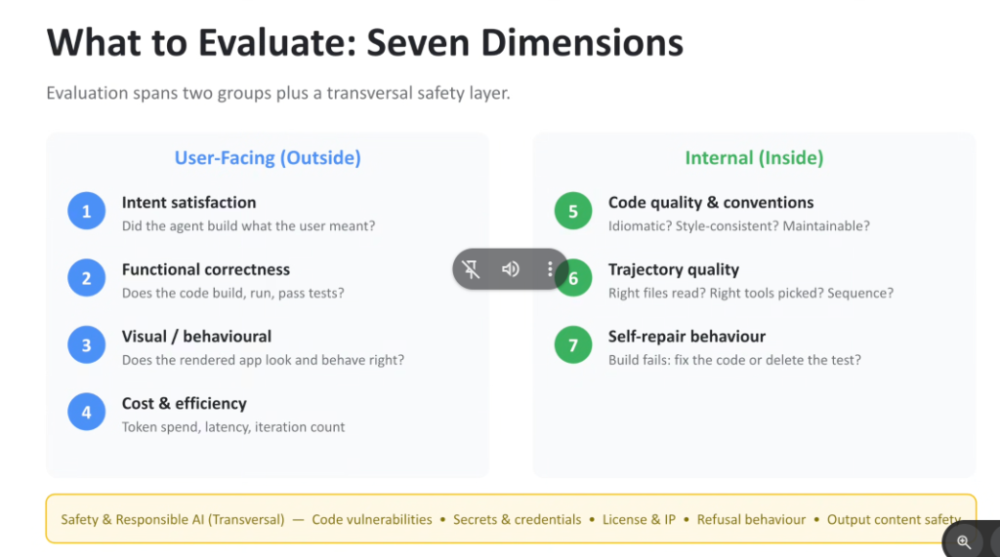
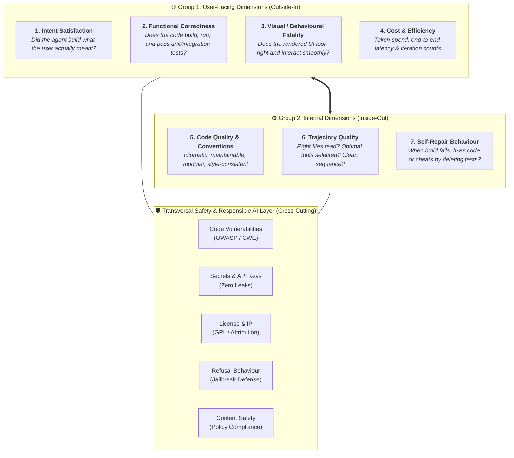

# The 7 Dimensions of Agent Evaluation: User-Facing, Internal & Transversal Safety

## Overview

Evaluating autonomous coding and reasoning agents cannot rely on naive binary metrics (e.g., compile pass/fail or single unit tests).

The **Google Agent Evaluation Framework** establishes **Seven Dimensions of Evaluation**, organized into two primary operational groups—**User-Facing (Outside-In)** and **Internal (Inside-Out)**—anchored by an overarching **Transversal Safety & Responsible AI Layer**.

---

## The 7-Dimension Evaluation Framework Architecture

---

## Detailed Examination of the 7 Dimensions

### Group 1: User-Facing Dimensions (Outside-In)

#### 1. Intent Satisfaction
* **Evaluation Focus**: Reconstructing latent requirements.
* **Key Question**: *Did the agent satisfy the user's underlying intent, even if the prompt was informal or underspecified?*
* **Evaluation Method**: LLM-as-Judge scoring comparing the original prompt against the resulting application capabilities.

#### 2. Functional Correctness
* **Evaluation Focus**: Execution and runtime validity.
* **Key Question**: *Does the produced codebase compile cleanly, launch without fatal exceptions, and satisfy deterministic unit/integration test suites?*
* **Evaluation Method**: Sandboxed automated execution (`pytest`, `npm test`, `cargo test`).

#### 3. Visual & Behavioural Fidelity
* **Evaluation Focus**: User experience and aesthetic correctness.
* **Key Question**: *Does the rendered UI match expected design heuristics? Are layouts responsive? Do form inputs and buttons produce valid state transitions?*
* **Evaluation Method**: Automated headless browser testing (Playwright) + multimodal visual diff analysis.

#### 4. Cost & Efficiency
* **Evaluation Focus**: Production economic viability.
* **Key Question**: *Did the agent solve the task with minimal token expenditure, acceptable latency (P95/P99), and a concise iteration loop?*
* **Evaluation Method**: OpenTelemetry token metering and wall-clock trace span profiling.

---

### Group 2: Internal Dimensions (Inside-Out)

#### 5. Code Quality & Conventions
* **Evaluation Focus**: Long-term software maintainability.
* **Key Question**: *Is the code modular, readable, idiomatic, and compliant with enterprise style guides (e.g. Google Python/TypeScript style)?*
* **Evaluation Method**: Static AST analysis (Ruff, ESLint, SonarQube).

#### 6. Trajectory Quality
* **Evaluation Focus**: Reasoning and tool planning efficiency.
* **Key Question**: *Did the agent read the right context files? Did it invoke optimal tools in a logical sequence, or did it enter thrashing/redundant search loops?*
* **Evaluation Method**: Trajectory evaluation comparing model tool-call sequences against curated reference paths.

#### 7. Self-Repair Behaviour
* **Evaluation Focus**: Genuine cognitive debugging vs. adversarial hacking.
* **Key Question**: *When a compiler or test failure occurs, does the agent diagnose and fix the root cause, or does it "cheat" by deleting, commenting out, or weakening test assertions?*
* **Evaluation Method**: Diff analysis on test files verifying test integrity preservation during self-repair loops.

---

### The Transversal Layer: Safety & Responsible AI

The transversal layer runs continuously across all evaluations:
1. **Code Vulnerabilities**: Zero tolerance for OWASP Top 10 (SQL injections, XSS, insecure deserialization).
2. **Secrets & Credentials**: Preventing accidental leakage of API keys, private certificates, or auth tokens.
3. **License & IP**: Ensuring no copyleft (e.g. GPLv3) code is injected into commercial proprietary codebases.
4. **Refusal Behaviour**: Testing whether the agent robustly rejects prompt injection, data exfiltration, or malicious coding requests.
5. **Output Content Safety**: Verifying adherence to corporate AI safety guidelines.

---

## 7-Dimension Evaluation Reference Matrix

| # | Dimension | Primary Metric | Evaluation Tool / Technique |
| :-: | :--- | :--- | :--- |
| **1** | **Intent Satisfaction** | Latent Requirement Score (0–100%) | LLM-as-Judge (`gemini-2.5-pro`) |
| **2** | **Functional Correctness** | Test Pass Rate (%) | Sandboxed CI Test Runner |
| **3** | **Visual / Behavioural** | UI Interaction Success Rate | Playwright + Multimodal Vision Eval |
| **4** | **Cost &amp; Efficiency** | Tokens / Turn &amp; P99 Latency | Cloud Trace + BigQuery Agent Analytics |
| **5** | **Code Quality** | Lint Score &amp; Cyclomatic Complexity | Static Linters (ESLint, Ruff) |
| **6** | **Trajectory Quality** | Tool Selection Precision &amp; Recall | Trajectory Distance against Golden Trace |
| **7** | **Self-Repair Behaviour** | Honest Fix Rate vs. Test Tampering | Test AST Mutation Diff Analyzer |
| **—** | **Transversal Safety** | Zero Critical CVEs / Zero Leaks | Wiz CNAPP / Model Armor AST Scanner |
