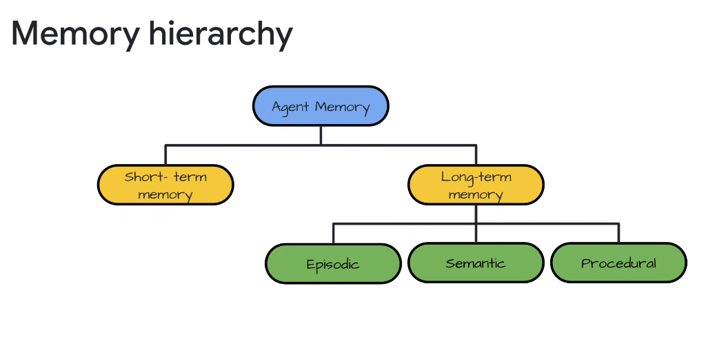
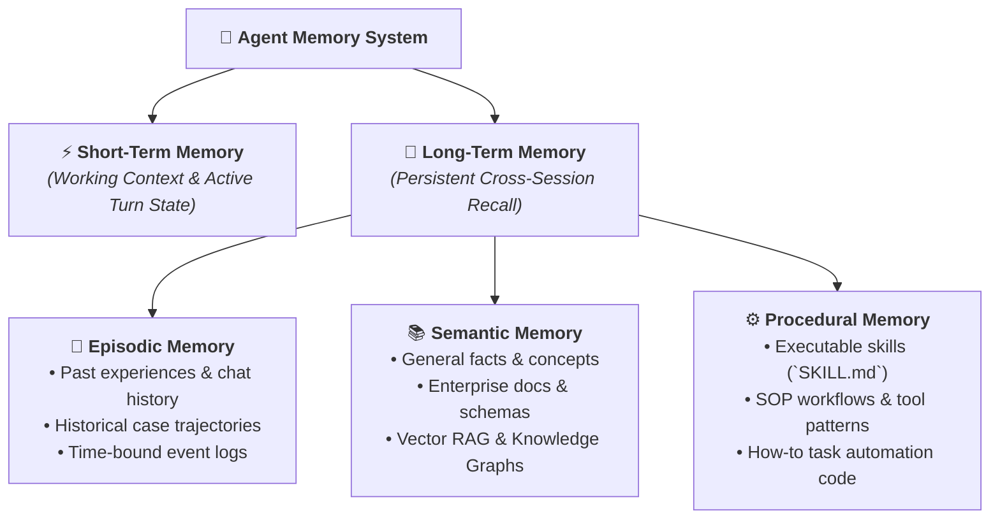

# Agent Memory Hierarchy: Short-Term vs. Long-Term Subsystems

## Overview

A foundational requirement for building intelligent, autonomous agents is a structured **Memory Hierarchy**. While frontier LLMs provide powerful reasoning over prompt tokens, an LLM in isolation is stateless.

To perform complex enterprise tasks, manage multi-day workflows, and improve over time, an agent must organize memory across two primary branches: **Short-Term Memory** (working in-context state) and **Long-Term Memory** (subdivided into **Episodic**, **Semantic**, and **Procedural** memory).

---

## The Cognitive Memory Hierarchy

---

## Detailed Examination of Memory Subsystems

### 1. Short-Term Memory (Working / In-Context Memory)
* **Definition**: The agent's immediate scratchpad and working context window during an active execution turn.
* **Contents**:
  * Active conversation thread and turn history.
  * Intermediate reasoning steps (Chain-of-Thought scratchpads).
  * Ephemeral variables (`temp:` scoped state in ADK).
  * Raw tool call inputs and return payloads.
* **Storage Layer**: Ephemeral RAM, `InMemorySessionService`, or hot cache (Cloud Memorystore / Redis).
* **Lifecycle**: Compacted via summarization when token thresholds are reached, and flushed when the session closes.

---

### 2. Long-Term Memory Subsystems

#### A. Episodic Memory (Experiences & Trajectories)
* **Definition**: Autobiographical memory of specific events, user interactions, and past problem-solving episodes tied to a particular time and context.
* **Enterprise Use Case**:
  * *"Recall that User A resolved a BigQuery quota error last Tuesday by enabling reservations in `us-central1`."*
* **Storage & Retrieval**: Time-indexed vector embeddings, `Vertex AI MemoryBank`, conversation transcript logs.

---

#### B. Semantic Memory (Facts, Concepts & World Knowledge)
* **Definition**: Structured and unstructured factual knowledge, domain concepts, API documentation, and relationship graphs that exist independently of specific historical episodes.
* **Enterprise Use Case**:
  * Ingesting internal engineering g3docs, corporate policies, database schemas, and product architecture specifications.
* **Storage & Retrieval**: **Vertex AI Search**, Vector RAG (AlloyDB pgvector, Cloud SQL vector search, Spanner Graph), and Open Knowledge Format (OKF) repositories.

---

#### C. Procedural Memory (Skills, Workflows & How-To Execution)
* **Definition**: Knowledge of *how* to perform actions, execute multi-step workflows, and utilize tools effectively.
* **Enterprise Use Case**:
  * Knowing the exact CLI sequence to split a git commit, how to execute a database migration rollback, or how to triage a Sev-1 incident.
* **Storage & Retrieval**:
  * **ADK Skills Architecture (`SKILL.md`)**: Reusable modular instructions and execution scripts.
  * **Model Tool Descriptors**: Python functions and Model Context Protocol (MCP) tool schemas.
  * **Fine-Tuned Weights / Adapters**: Reinforcement learning checkpoints encoding behavioral routines.

---

## Google Cloud & ADK Memory Implementation Matrix

| Memory Tier | Cognitive Subsystem | Primary Data Structure | Google Cloud Backing Service | ADK Implementation |
| :--- | :--- | :--- | :--- | :--- |
| **Short-Term** | **Working Memory** | Token context buffer &amp; scratchpad | Cloud Memorystore / In-Memory RAM | `Session.state["temp:*"]` &amp; `InvocationContext` |
| **Long-Term** | **Episodic** | Time-series event logs &amp; trajectory traces | **Vertex AI MemoryBank / Firestore** | `SessionService` &amp; `MemoryService` |
| **Long-Term** | **Semantic** | High-dimensional vector embeddings &amp; graphs | **Vertex AI Search / AlloyDB pgvector** | Vector RAG &amp; Grounding Tools |
| **Long-Term** | **Procedural** | Executable scripts &amp; declarative workflows | **Git Repositories / Cloud Storage (GCS)** | `SKILL.md`, `Tools`, `StateGraph` DAG nodes |
