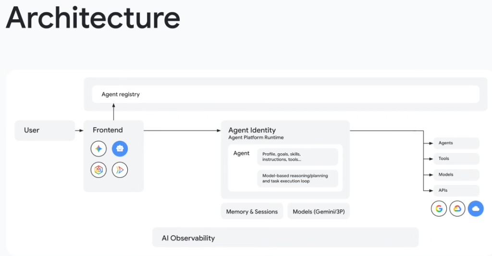
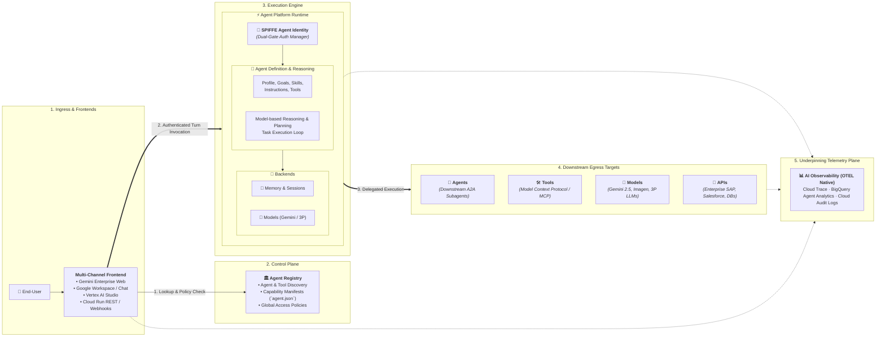

# Agent Platform Runtime: End-to-End System Architecture

## Overview

The complete **Google Agent Platform Runtime** architecture establishes a unified, enterprise-grade ecosystem connecting front-end user surfaces to intelligent back-end tools, auxiliary models, downstream sub-agents, and corporate APIs.

By orchestrating the entire lifecycle through a centralized **Agent Registry**, a secure **SPIFFE-governed Execution Runtime**, and a foundation of **OTEL-Native AI Observability**, enterprise systems achieve high reliability, zero-trust security, and machine-speed task execution.

---

## End-to-End System Topology & Data Flow

---

## Detailed Examination of the 5 End-to-End Stages

### 1. Ingress & Multi-Channel Frontends
* **Client Surfaces**:
  * **Gemini Enterprise**: Conversational web client for corporate knowledge workers.
  * **Google Workspace & Google Chat**: Conversational bots and contextual add-ons in Docs, Sheets, and Gmail.
  * **Vertex AI Studio / Agent Engine Console**: Developer test harnesses and administrative consoles.
  * **Custom Applications**: Mobile apps (iOS/Android) and web portals calling serverless Cloud Run endpoints.
* **Dual-Action Flow**:
  1. *Registry Query*: The frontend queries the **Agent Registry** to fetch the agent's public card, verify that the caller possesses access rights, and inspect required parameter schemas.
  2. *Invocation Dispatch*: The frontend forwards the user turn along with the caller's OAuth/OIDC identity token to the **Agent Platform Runtime**.

---

### 2. The Control Plane: Agent Registry
* **Central Directory**: Catalogs all approved production agents, internal Model Context Protocol (MCP) servers, and partner A2A agents (`/.well-known/agent.json`).
* **Dynamic Policy Engine**: Enforces role-based and attribute-based access controls (RBAC/ABAC), ensuring sensitive finance or HR agents cannot be discovered or invoked by unauthorized services.

---

### 3. The Execution Engine: Agent Platform Runtime
* **SPIFFE-Based Identity & Dual-Gate Auth**:
  * Verifies both the human's delegated identity and the agent workload's SPIFFE SVID certificate before authorizing tool execution.
* **Agent Core Loop**:
  * Executes the ReAct reasoning and planning loop.
  * Dynamically queries **Memory & Sessions** (`SessionService` in Firestore / Cloud SQL and `Memory Bank`) to load user preferences and conversation state.
  * Generates tokens via the **Models Gateway** (Gemini 2.5 Pro / Flash or third-party frontier models).

---

### 4. Downstream Egress Targets (The 4 Execution Pillars)
Once the reasoning loop decides upon actions, it dispatches calls across four discrete targets:
1. **Agents**: Federates complex multi-domain sub-tasks to remote external agents via the **A2A Protocol** (e.g. delegating an ERP procurement task to an SAP Agent).
2. **Tools**: Invokes deterministic tools and data resources via **Model Context Protocol (MCP)** servers (e.g. querying a Cloud SQL database, executing BigQuery analytics, or manipulating local files).
3. **Models**: Routes multimodal sub-tasks to specialized models (e.g. generating diagrams with Imagen 3, transcribing audio, or calling fine-tuned code models).
4. **APIs**: Connects directly to enterprise SaaS platforms (Salesforce, ServiceNow, Jira, Workday) and Google Cloud REST/gRPC services.

---

### 5. The Underpinning Telemetry Plane: AI Observability
* Standardized on **OpenTelemetry (OTEL)** semantic conventions for GenAI.
* Streams real-time distributed trace spans (`traceparent`), token accounting metrics, model latencies, and tool execution logs directly into **Google Cloud Trace**, **Cloud Logging**, and **BigQuery Agent Analytics**.

---

## End-to-End Component Reference Matrix

| Architectural Layer | Core Components | Protocols &amp; Standards | Google Cloud Enablers |
| :--- | :--- | :--- | :--- |
| **Ingress** | Gemini Enterprise, Workspace, Mobile/Web | HTTPS / REST / WebSockets | Google Cloud Run, Cloud CDN |
| **Control Plane** | **Agent Registry** | A2A Manifest (`agent.json`), IAM | Cloud Asset Inventory, Apigee |
| **Execution Core** | **Agent Platform Runtime** | **SPIFFE / SVID / ReAct DAG** | **Vertex AI Agent Engine / GKE** |
| **State &amp; Memory** | SessionStore &amp; Memory Bank | Scoped State (`session`, `user:`) | **Firestore, AlloyDB, Cloud SQL** |
| **Model Gateway** | Frontier Multimodal LLMs | REST / gRPC Function Calling | **Gemini 2.5 Pro/Flash, Vertex AI** |
| **Egress (A2A)** | Federated Blackbox Agents | **A2A Open Protocol (RFC-aligned)** | Service Mesh, Workload Identity |
| **Egress (Tools)** | Deterministic DB &amp; System Tools | **Model Context Protocol (MCP)** | Cloud Run, BigQuery, Pub/Sub |
| **Telemetry** | Distributed Spans &amp; Audit Logs | **OpenTelemetry (OTEL)** | **Cloud Trace, BigQuery Analytics** |
