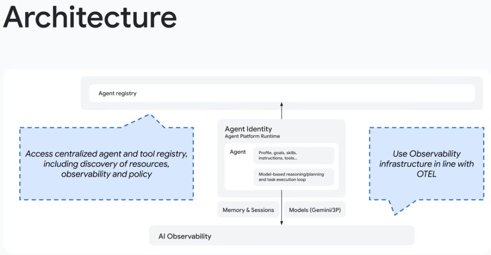
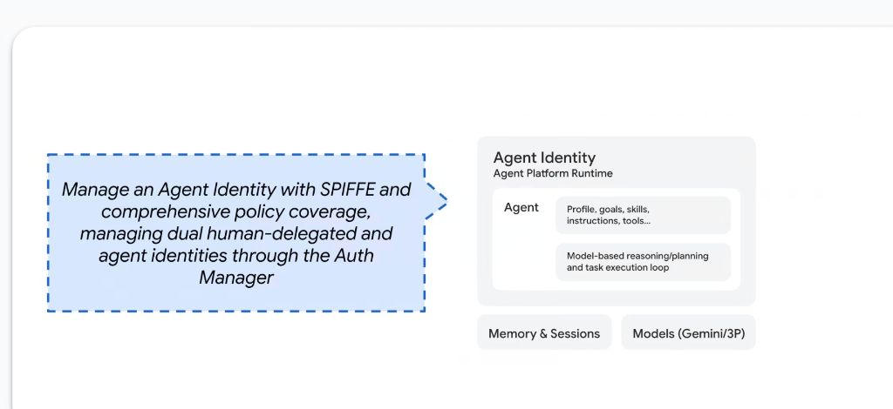

# Agent Platform Runtime: Registry, SPIFFE Identity & OTEL Observability



## Overview

Deploying autonomous agents into enterprise production requires an integrated platform runtime capable of governing agent discovery, cryptographic workload identity, dual-delegated authorization, and end-to-end telemetry.

The **Google Agent Platform Runtime** architecture establishes three foundational operational planes:
1. **Agent Registry (Top Control Plane)**: Centralized discovery of agents, tools, policies, and resources.
2. **Agent Platform Runtime & Identity (Center Execution Plane)**: Cryptographic **SPIFFE-based Agent Identity** with dual human-delegated auth and model execution.
3. **AI Observability (Bottom Telemetry Plane)**: Native **OpenTelemetry (OTEL)** infrastructure capturing distributed traces, token metrics, and execution spans.

---

## Master Architecture: The Triad of Enterprise Agent Governance

```mermaid
flowchart TD
    subgraph Registry["🏛️ Agent Registry (Top Control Plane)"]
        direction TB
        R1["<b>Centralized Agent &amp; Tool Catalog</b><br/>• Resource &amp; Tool Discovery (MCP / A2A)<br/>• Global Access Policies &amp; Compliance Rules<br/>• Versioning &amp; Endpoint Management"]
    end

    subgraph Runtime["⚡ Agent Platform Runtime (Center Execution Plane)"]
        direction TB
        subgraph Identity["🔐 SPIFFE Agent Identity &amp; Auth Manager"]
            direction LR
            AID["<b>SPIFFE Agent ID</b><br/>`spiffe://corp/sa/agent-01`"]
            HID["<b>Human Delegated ID</b><br/>User OAuth/OIDC Token"]
            AM["<b>Dual-Gate Auth Manager</b><br/><i>Requires User AND Agent Auth</i>"]
            AID &amp; HID --> AM
        end

        subgraph Core["🤖 Agent Core Container"]
            direction LR
            Prof["<b>Agent Definition</b><br/>Profile, Goals, Skills,<br/>Instructions &amp; Tools"]
            Loop["<b>Execution Engine</b><br/>Model reasoning &amp; planning,<br/>Task execution loop"]
        end

        subgraph Backends["🔌 Subsystems"]
            direction LR
            Mem["💾 Memory &amp; Sessions"]
            Mod["🧠 Models (Gemini / 3P)"]
        end

        Identity --> Core --> Backends
    end

    subgraph Obs["📊 AI Observability (Bottom Telemetry Plane)"]
        direction TB
        O1["<b>OTEL-Native Infrastructure</b><br/>• Distributed Spans across Model &amp; Tools<br/>• Token accounting &amp; P99 Latencies<br/>• BigQuery Agent Analytics &amp; Cloud Trace"]
    end

    Registry <==>|"Discovery, Policies &amp; Metadata"| Runtime
    Runtime <==>|"OTEL Traces, Spans &amp; Audit Logs"| Obs
```

---

## Detailed Examination of the 3 Architectural Planes

### 1. Agent Registry (Centralized Governance & Discovery)
* **Mission**: Serves as the single source of truth for all enterprise agent assets.
* **Core Capabilities**:
  * **Resource & Tool Discovery**: Exposes available internal agents, Model Context Protocol (MCP) servers, and A2A Agent Cards (`/.well-known/agent.json`).
  * **Policy Enforcement**: Dynamically maps which human personas, services, and agent coordinators have permission to discover and call specific downstream agents.
  * **Registry-Driven Observability**: Ingests health checks, uptime status, and performance SLOs across the entire fleet.

---

### 2. Agent Platform Runtime & SPIFFE Identity



* **Mission**: Executes reasoning loops securely while preventing "Confused Deputy" privilege escalation.
* **SPIFFE-Based Agent Identity**:
  * Every running agent is provisioned a cryptographically signed **SPIFFE ID** (e.g. `spiffe://prod.corp.google.com/sa/agent-finance-01`) embedded in an X.509 SVID certificate.
  * Provides zero-trust, mutual TLS (mTLS) authentication between agent containers, microservices, and databases.
* **The Dual Human-Delegated & Agent Auth Manager**:
  * In enterprise operations, an action should only succeed if **both conditions are met**:
    1. *The Human User* is entitled to request the action.
    2. *The Agent Workload* is explicitly permitted to invoke that specific tool.
  * The **Auth Manager** evaluates both identity claims simultaneously before executing any backend mutation or data retrieval.
* **Core Runtime Subsystems**:
  * **Profile, Goals & Skills**: Declarative system instruction, operational boundaries, and `SKILL.md` workflows.
  * **Reasoning Loop**: ReAct planning, structured function calling, and self-correction cycles.
  * **Memory & Sessions**: Seamless integration with `SessionService` and `Memory Bank`.
  * **Model Gateway**: High-throughput inference routing across Gemini 2.5 Pro/Flash and third-party models.

---

### 3. AI Observability (OTEL-Native Telemetry)
* **Mission**: Provides deep runtime visibility across non-deterministic LLM execution paths.
* **Core Capabilities**:
  * **OpenTelemetry (OTEL) Compliance**: Emits standard semantic conventions for GenAI (capturing prompt tokens, completion tokens, model names, temperature, and duration).
  * **Distributed Trace Context**: Propagates `traceparent` headers across multi-agent A2A hops, tool executions, and database queries.
  * **BigQuery Agent Analytics**: Streams structured execution logs into BigQuery for cost attribution, quality scoring, and forensic auditing.

---

## SPIFFE Dual-Gate Security vs. Traditional Service Account

| Security Dimension | Traditional Service Account (Legacy) | SPIFFE Dual-Gate Agent Identity |
| :--- | :--- | :--- |
| **Identity Entity** | Static API Key or Shared Service Account | **Ephemeral, cryptographically signed SPIFFE SVID** |
| **Human Context** | Lost upon handoff to agent | **Preserved via delegated OAuth/OIDC claims** |
| **Privilege Model** | All-or-nothing broad access | **Dual-Gate: $\min(\text{User Permissions}, \text{Agent Permissions})$** |
| **Confused Deputy Risk**| High (compromised agent can do anything) | **Zero (agent cannot exceed human's scope)** |
| **Key Rotation** | Manual or quarterly | **Automated sub-hour mTLS certificate rotation** |
| **Audit Fidelity** | Logs show only generic service account | **Logs attribute action to both User AND Agent** |

---

## Agent Platform Runtime Summary Reference Matrix

| Architectural Plane | Primary Technology | Key Protocol / Standard | Enterprise Value |
| :--- | :--- | :--- | :--- |
| **Control Plane** | **Agent Registry** | A2A Manifest (`agent.json`) / MCP | Unified discovery, versioning &amp; catalog |
| **Execution Plane**| **Agent Platform Runtime** | **SPIFFE / SVID / Auth Manager** | Secure reasoning, dual-gate RBAC &amp; state |
| **Data Plane** | **AI Observability** | **OpenTelemetry (OTEL) / Cloud Trace** | End-to-end distributed latency &amp; cost visibility |
