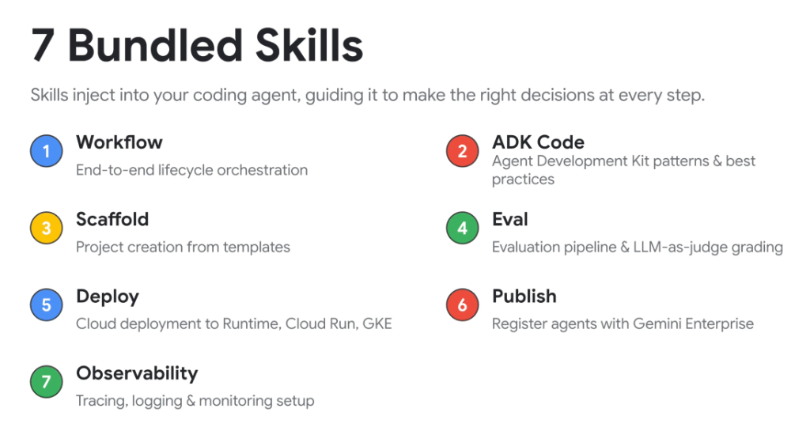
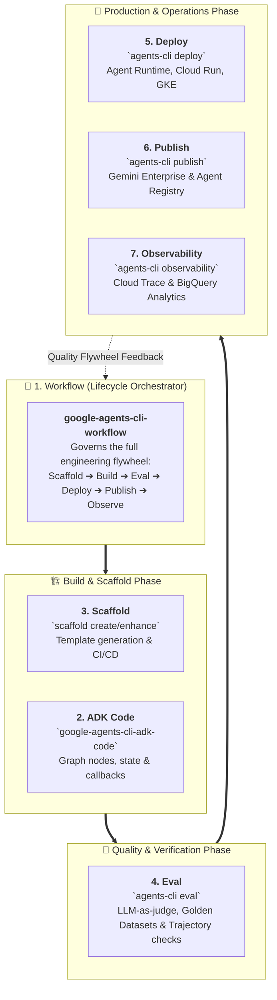

# Google Agents CLI: The 7 Bundled Skills Suite

## Overview

The **Google Agents CLI (`agents-cli`)** provides an integrated command-line interface and modular **Skills Suite** designed to guide developer assistants and platform engineers through the complete agent engineering lifecycle.

> **Core Philosophy:**
> *"Skills inject into your coding agent, guiding it to make the right decisions at every step."*

Rather than relying on generic LLM coding intuition, the 7 bundled skills encode Google's architectural best practices, deterministic API schemas, and production deployment standards directly into the developer's IDE companion.

---

## The 7 Bundled Skills Architecture

---

## Deep Dive into the 7 Bundled Skills

### 1. Workflow (`google-agents-cli-workflow`)
* **Role**: The overarching entrypoint and lifecycle coordinator.
* **Responsibilities**:
  * Guides developer assistants on which specialized skill to invoke at each development milestone.
  * Enforces model selection standards (Gemini 2.5 Pro vs. Flash) and strict code preservation invariants.

---

### 2. ADK Code (`google-agents-cli-adk-code`)
* **Role**: Python API patterns and structural code generation.
* **Responsibilities**:
  * Scaffolds deterministic `StateGraph` workflows, custom tool definitions, and scoped state variables (`session`, `user:`, `app:`, `temp:`).
  * Implements the 6 lifecycle callbacks (`before_model_callback`, `before_tool_callback`, etc.) for security and PII masking.

---

### 3. Scaffold (`google-agents-cli-scaffold`)
* **Role**: Rapid prototype generation from battle-tested production templates.
* **Key Commands**:
  * `agents-cli scaffold create`: Generates a fully structured agent project with Dockerfiles, virtual environments, and test harnesses.
  * `agents-cli scaffold enhance`: Adds CI/CD (Cloud Build), deployment manifests, and secret management to existing projects.

---

### 4. Eval (`google-agents-cli-eval`)
* **Role**: Scientific evaluation and quality assurance.
* **Responsibilities**:
  * Manages Golden Datasets (`eval_dataset.json`) containing prompt-trajectory-response triplets.
  * Executes **LLM-as-Judge** scoring across tool selection accuracy, reasoning fidelity, and output helpfulness.
  * Integrates automated Pytest regression gates into CI/CD pipelines.

---

### 5. Deploy (`google-agents-cli-deploy`)
* **Role**: Automated, enterprise-grade cloud deployment.
* **Supported Targets**:
  * **Vertex AI Agent Runtime**: Fully managed serverless execution with native state persistence.
  * **Google Cloud Run**: Containerized, autoscaling microservices with sub-second scale-to-zero.
  * **Google Kubernetes Engine (GKE)**: High-throughput, distributed multi-agent clusters.
* **Responsibilities**: Automates IAM service account binding, Workload Identity Federation, and zero-downtime rolling updates.

---

### 6. Publish (`google-agents-cli-publish`)
* **Role**: Enterprise agent discovery and registration.
* **Responsibilities**:
  * Registers agents with **Gemini Enterprise** and the central **Agent Registry** (`agents-cli publish gemini-enterprise`).
  * Publishes machine-readable **Agent Cards** (`/.well-known/agent.json`) for federated A2A discovery.

---

### 7. Observability (`google-agents-cli-observability`)
* **Role**: Distributed telemetry and live production monitoring.
* **Responsibilities**:
  * Configures **Google Cloud Trace** spans across model calls and tool executions.
  * Streams structured logs into **BigQuery Agent Analytics** for cost analysis, latency tracking, and error forensics.

---

## 7 Bundled Skills Comprehensive Reference Matrix

| # | Skill Name | CLI Command Equivalent | Primary Objective | Key Output Artifacts |
| :-: | :--- | :--- | :--- | :--- |
| **1** | **Workflow** | `agents-cli workflow` | End-to-end lifecycle orchestration | Overall development plan |
| **2** | **ADK Code** | `agents-cli code` | ADK Python patterns &amp; best practices | `agent.py`, `tools.py`, `callbacks.py` |
| **3** | **Scaffold** | `agents-cli scaffold create` | Project generation from templates | `Dockerfile`, `pyproject.toml`, skeleton |
| **4** | **Eval** | `agents-cli eval run` | Evaluation pipeline &amp; LLM-as-judge | `eval_results.json`, confusion matrix |
| **5** | **Deploy** | `agents-cli deploy cloud-run`| Automated Google Cloud deployment | Cloud Run Service, Service Account IAM |
| **6** | **Publish** | `agents-cli publish` | Enterprise registry registration | Agent Card (`.well-known/agent.json`) |
| **7** | **Observability**| `agents-cli monitor` | Tracing, logging &amp; telemetry setup | Cloud Trace spans, BigQuery dataset |
