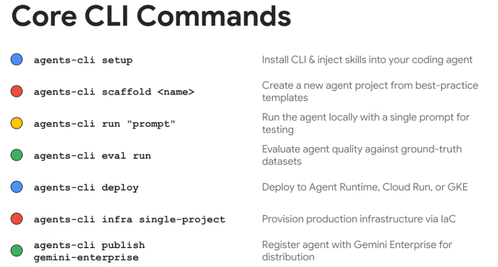
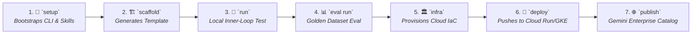

# Google Agents CLI: Core Command Reference & Workflows



## Overview

The **Google Agents CLI (`agents-cli`)** provides the definitive command-line interface for the entire agent development, evaluation, and operational deployment lifecycle.

From initial environment bootstrapping (`setup`) to automated IaC provisioning (`infra`) and enterprise distribution (`publish`), `agents-cli` ensures deterministic, repeatable agent engineering across Google Cloud.

---

## The End-to-End CLI Command Workflow



---

## Detailed Command Syntax & Operations Reference

### 1. `agents-cli setup`
* **Purpose**: Installs the CLI binaries, configures Google Cloud Application Default Credentials (ADC), and injects the 7 bundled skills into local IDE companions (Antigravity, VS Code, JetBrains).
* **Usage**:
  ```bash
  $ agents-cli setup --ide antigravity --inject-skills
  [+] Authenticated with Google Cloud (sacramentoj@google.com)
  [+] Injected 7 agent engineering skills into ~/.gemini/config/skills/
  ```

---

### 2. `agents-cli scaffold <name>`
* **Purpose**: Creates a complete, production-grade agent project from verified Google ADK templates.
* **Key Flags**:
  * `--template <chat|workflow|rag>`: Selects the architectural pattern.
  * `--target <cloud-run|agent-runtime|gke>`: Pre-configures deployment manifests.
* **Usage**:
  ```bash
  $ agents-cli scaffold order-concierge --template workflow --target cloud-run
  [+] Created project at ./order-concierge
  [+] Generated agent.py, tools.py, StateGraph definitions, and Dockerfile.
  ```

---

### 3. `agents-cli run "<prompt>"`
* **Purpose**: Executes the agent locally with a test prompt for fast inner-loop debugging without incurring cloud deployment cycles.
* **Key Flags**:
  * `--interactive` / `-i`: Launches an interactive terminal multi-turn chat session.
  * `--verbose-tools`: Prints detailed tool invocation arguments and return payloads.
* **Usage**:
  ```bash
  $ agents-cli run "Find flights from SFO to JFK on Friday" --verbose-tools
  [TOOL CALL] flight_search(origin="SFO", dest="JFK", date="2026-08-21")
  [AGENT] Found 3 direct flights available...
  ```

---

### 4. `agents-cli eval run`
* **Purpose**: Evaluates agent performance against curated Golden Datasets using LLM-as-Judge scoring.
* **Key Flags**:
  * `--dataset <path>`: Specifies the evaluation dataset (`eval_dataset.json`).
  * `--judge-model <model>`: Defaults to `gemini-2.5-pro`.
* **Usage**:
  ```bash
  $ agents-cli eval run --dataset tests/eval_data.json
  [+] Running 50 evaluation test cases...
  [RESULT] Trajectory Accuracy: 96.0% | Response Helpfulness: 98.4% | Tests Passed: 48/50
  ```

---

### 5. `agents-cli infra single-project`
* **Purpose**: Provisions all necessary Google Cloud infrastructure using automated Terraform Infrastructure-as-Code.
* **Resources Provisioned**: Artifact Registry repository, Cloud Run service account, Firestore/Cloud SQL session store, Secret Manager secrets, and IAM role bindings.
* **Usage**:
  ```bash
  $ agents-cli infra single-project --project-id elevate-prod-2026 --region us-central1
  [+] Running Terraform plan & apply...
  [SUCCESS] Infrastructure provisioned: Cloud Run, Artifact Registry, Firestore.
  ```

---

### 6. `agents-cli deploy`
* **Purpose**: Builds the container image via Cloud Build and deploys the agent to the specified production runtime.
* **Supported Targets**:
  * `agent-runtime`: Managed Vertex AI Agent Runtime.
  * `cloud-run`: Serverless container with auto-scaling to zero.
  * `gke`: Dedicated Kubernetes cluster for high-concurrency swarms.
* **Usage**:
  ```bash
  $ agents-cli deploy --target cloud-run --service-account agent-sa@elevate-prod-2026.iam.gserviceaccount.com
  [+] Building container with Cloud Build...
  [+] Deploying to Cloud Run service 'order-concierge'...
  [SUCCESS] Service URL: https://order-concierge-74829-uc.a.run.app
  ```

---

### 7. `agents-cli publish gemini-enterprise`
* **Purpose**: Registers the deployed agent in the central **Gemini Enterprise Agent Catalog** and publishes the standardized A2A Agent Card (`/.well-known/agent.json`) for federated enterprise discovery.
* **Usage**:
  ```bash
  $ agents-cli publish gemini-enterprise --display-name "Order Concierge" --category "Operations"
  [+] Published Agent Card to https://order-concierge-74829-uc.a.run.app/.well-known/agent.json
  [SUCCESS] Agent registered in Gemini Enterprise Catalog.
  ```

---

## Core CLI Command Reference Matrix

| Command | Lifecycle Phase | Input / Arguments | Primary Output | Typical Execution Time |
| :--- | :--- | :--- | :--- | :---: |
| **`setup`** | Environment Bootstrapping | IDE &amp; auth flags | Injected skills &amp; ADC config | < 10 seconds |
| **`scaffold`**| Project Inception | Project name, template | Boilerplate code repo &amp; Dockerfile | < 5 seconds |
| **`run`** | Local Development | Prompt string / `-i` | Terminal response &amp; tool traces | Instant |
| **`eval run`**| Quality &amp; Verification | Golden Dataset JSON | Accuracy report &amp; confusion matrix | 30–90 seconds |
| **`infra`** | Cloud Provisioning | Project ID, region | Cloud resources via Terraform | 1–3 minutes |
| **`deploy`** | Production Release | Target environment | Live HTTPS Service Endpoint | 1–2 minutes |
| **`publish`** | Catalog Distribution | Agent metadata | Registry entry &amp; Agent Card | < 15 seconds |
