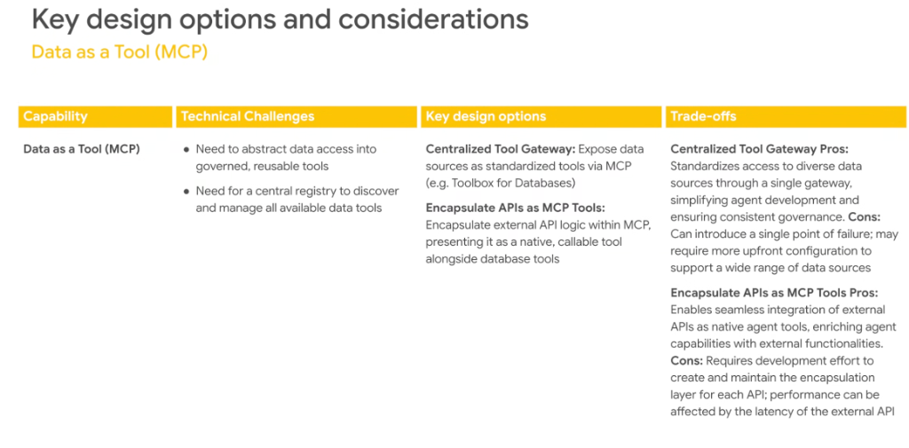

# Design Patterns & Trade-offs: Data as a Tool (MCP)



## Overview

In enterprise agent architectures, granting models direct raw database connections or hardcoding SQL queries leads to security vulnerabilities, schema fragility, and governance blindspots.

The **Data as a Tool** pattern leverages the **Model Context Protocol (MCP)** to abstract enterprise data sources (AlloyDB, BigQuery, Cloud SQL, Spanner) and corporate REST APIs into standardized, governed, and callable tools.

---

## Data as a Tool: Architectural Topologies

```mermaid
flowchart TD
    subgraph AgentMesh["🤖 Enterprise Agent Runtime"]
        direction TB
        Agent["Google ADK / ReAct Agent"]
    end

    subgraph PatternA["🏛️ Option A: Centralized Tool Gateway (Toolbox for Databases)"]
        direction TB
        GW["<b>Central MCP Gateway Proxy</b><br/>• Global Access Control &amp; Token Auth<br/>• Unified Audit Logging &amp; Caching"]
        DB1["AlloyDB (pgvector)"]
        DB2["BigQuery Analytics"]
        DB3["Cloud Spanner"]
        GW --> DB1 &amp; DB2 &amp; DB3
    end

    subgraph PatternB["🔌 Option B: Encapsulated API Tools (Micro-MCP Servers)"]
        direction TB
        MCP1["<b>ERP MCP Server</b><br/>(SAP / NetSuite)"]
        MCP2["<b>CRM MCP Server</b><br/>(Salesforce / HubSpot)"]
        MCP3["<b>Billing MCP Server</b><br/>(Stripe / Workday)"]
    end

    Agent ==>|"Standard MCP Protocol"| GW
    Agent ==>|"Standard MCP Protocol"| MCP1 &amp; MCP2 &amp; MCP3
```

---

## Core Technical Challenges

1. **Abstracting Data Access into Governed, Reusable Tools**:
   * Enterprise data resides in heterogeneous formats (relational tables, document stores, time-series, graph DBs).
   * The agent needs declarative, type-safe schemas without exposing underlying database connection strings or root credentials.
2. **Central Registry Discovery & Management**:
   * As organizations build hundreds of specialized data tools, agents need a central registry to discover available tools dynamically without hardcoded endpoints.

---

## Detailed Evaluation of Design Options

### Option A: Centralized Tool Gateway (e.g. Toolbox for Databases)
* **Architecture**: A centralized proxy gateway intercepts agent requests and multiplexes them across back-end databases.
* **Pros**:
  * **Unified Governance**: Enforces centralized IAM, rate-limiting, and Cloud Audit logging in one place.
  * **Simplified Agent Development**: Agents connect to a single gateway endpoint rather than managing 20 distinct database connections.
* **Cons**:
  * **Single Point of Failure (SPOF)**: Gateway outages impact all downstream agents.
  * **Upfront Configuration Overhead**: Requires centralized platform team coordination to configure and maintain multi-tenant data sources.

---

### Option B: Encapsulate APIs as Discrete MCP Tools
* **Architecture**: Developers wrap existing REST/gRPC microservices in lightweight, domain-specific MCP server wrappers.
* **Pros**:
  * **Enriched Agent Capabilities**: External APIs appear alongside database queries as native, first-class tools.
  * **Domain Autonomy**: Individual engineering teams own and deploy their respective MCP servers independently.
* **Cons**:
  * **Development & Maintenance Burden**: Requires authoring and maintaining bespoke wrapper code for every third-party API.
  * **Latency Bottlenecks**: Non-deterministic external API latency directly extends agent turn durations.

---

## Comparative Design & Trade-off Matrix

| Dimension | Centralized Tool Gateway (Option A) | Encapsulate APIs as MCP Tools (Option B) |
| :--- | :--- | :--- |
| **Primary Scope** | Enterprise Data Warehouses &amp; Relational DBs | Domain Microservices &amp; 3rd-Party SaaS APIs |
| **Integration Complexity**| Low for agent developers; High for platform team | Medium per API wrapper; Distributed ownership |
| **Governance &amp; IAM** | **Centralized Single Pane of Glass** | Distributed per-service token management |
| **Reliability Risk** | Single Point of Failure (SPOF) | Cascading latency &amp; individual service outages |
| **Discovery Model** | Unified Catalog Query (`list_tools`) | Federated Registry Lookup |
| **Best Used When...** | Standardizing corporate SQL/Vector data access | Exposing business logic, workflows &amp; SaaS |
