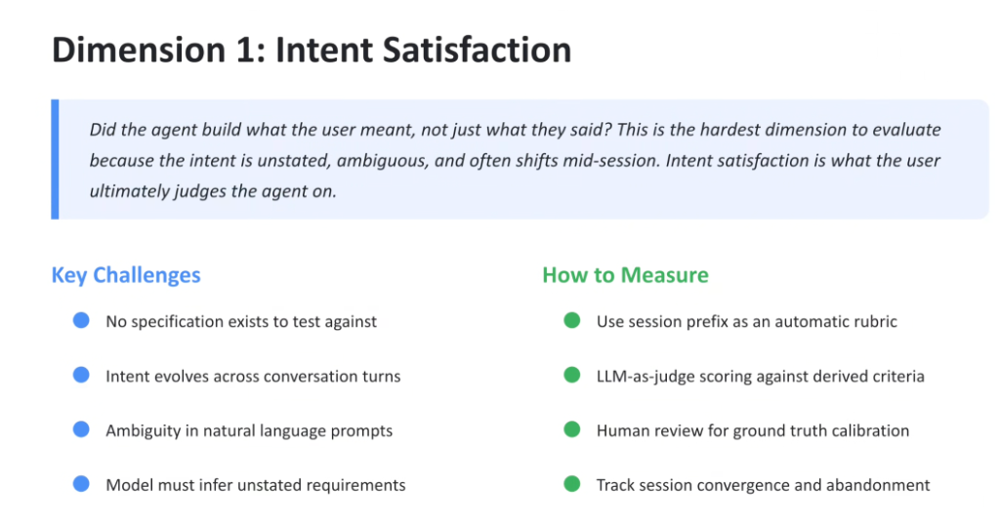
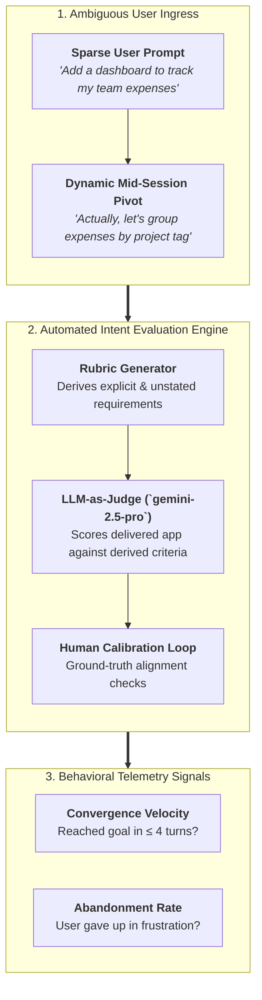

# Evaluation Dimension 1: Intent Satisfaction

## Overview

> **Core Philosophy:**
> *"Did the agent build what the user meant, not just what they said? This is the hardest dimension to evaluate because the intent is unstated, ambiguous, and often shifts mid-session. Intent satisfaction is what the user ultimately judges the agent on."*

In autonomous coding systems, code that compiles and passes unit tests is meaningless if it fails to solve the user's underlying problem. **Intent Satisfaction** evaluates whether an agent can accurately bridge the semantic chasm between sparse human prompts and fully realized software systems.

---

## Intent Satisfaction Evaluation Architecture

---

## The 4 Key Challenges of Evaluating Intent

### 1. Absence of Formal Specifications
* Unlike traditional benchmarks that test against pre-written unit test assertions, real-world agent interactions begin with zero formal specs.

---

### 2. Dynamic Mid-Session Intent Evolution
* User goals are not static. As users see intermediate UI renders or test basic features, their understanding of the problem matures, causing prompt requirements to shift across multi-turn sessions.

---

### 3. High Natural Language Ambiguity
* Everyday prompts (*"Make it snappy"*, *"Add authentication"*, *"Make it look professional"*) contain immense semantic ambiguity that cannot be parsed deterministically.

---

### 4. Inferring Unstated Latent Requirements
* An effective agent must proactively deduce implicit requirements:
  * Adding auth implies password hashing, session tokens, CSRF defense, and database user tables.
  * Adding expense tracking implies numeric currency validation, date sorting, and error boundaries.

---

## How to Measure: 4 Scientific Methodologies

### 1. Use Session Prefix as an Automatic Rubric
* The evaluation harness ingests the first $N$ turns of conversation and prompts a judge LLM to generate a structured evaluation rubric decomposing the user's explicit asks and implicit architectural prerequisites.

---

### 2. LLM-as-a-Judge Scoring Against Derived Criteria
* A frontier judge model (**Gemini 2.5 Pro**) audits the final codebase and AST structure against the generated rubric:
  $$\text{Intent Score} = \frac{\sum (\text{Explicit Criteria Met}) + \sum (\text{Implicit Latent Needs Met})}{\text{Total Derived Criteria}}$$

---

### 3. Human Review for Ground Truth Calibration
* Human software architects periodically grade a sample of agent session outputs ($5–10\%$) to calibrate LLM judge scoring thresholds and prevent judge hallucination or leniency bias.

---

### 4. Tracking Session Convergence and Abandonment
* **Convergence Velocity**: Measures how quickly a conversation stabilizes into a working, accepted state without circular prompt regressions.
* **Abandonment Rate**: High turn counts paired with sudden session termination serve as a strong negative telemetry signal of intent failure.

---

## Intent Satisfaction Evaluation Rubric Matrix

| Rubric Dimension | Evaluation Question | Scoring Weight | Target Pass Benchmark |
| :--- | :--- | :---: | :---: |
| **Explicit Ask Fidelity** | Did the agent deliver all directly requested features? | 35% | $\ge 95\%$ |
| **Latent Spec Reconstruction** | Were unstated prerequisites (auth, schema, validation) inferred? | 30% | $\ge 85\%$ |
| **Handling Dynamic Pivots** | Did the agent adapt cleanly when user modified goals mid-session? | 20% | $\ge 90\%$ |
| **Session Convergence** | Did the session converge efficiently without thrashing or abandonment? | 15% | $\le 5\text{ turns average}$ |
