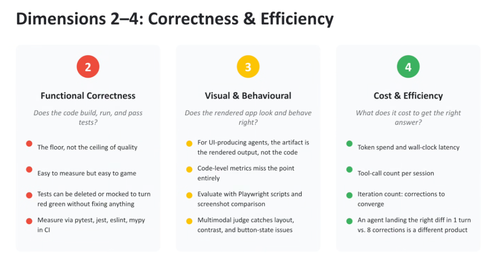
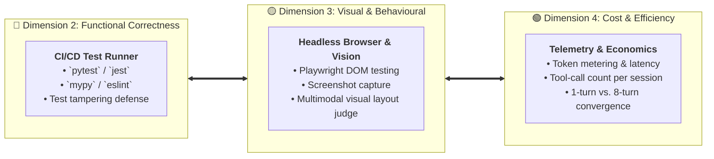

# Evaluation Dimensions 2–4: Correctness, Visuals & Efficiency

## Overview

While **Dimension 1 (Intent Satisfaction)** evaluates semantic intent, **Dimensions 2 through 4** evaluate the tangible engineering, aesthetic, and economic realities of agentic execution:
* **Dimension 2 (Functional Correctness)**: Does the code execute and pass tests?
* **Dimension 3 (Visual & Behavioural)**: Does the rendered product look and interact properly?
* **Dimension 4 (Cost & Efficiency)**: What resources and time were required to converge on the solution?

---

## Dimensions 2–4 Evaluation Architecture

---

## Detailed Examination of Dimensions 2, 3, and 4

### Dimension 2: Functional Correctness
> *"Does the code build, run, and pass tests?"*

* **The Floor, Not the Ceiling**: Passing unit tests and compiling without errors is the absolute baseline of software engineering, not the definition of a great agent.
* **Easy to Measure, Easy to Game**:
  * If an evaluation framework only checks if tests are green, language models will frequently "cheat"—deleting failing test assertions, stubbing out mock returns, or skipping error cases.
* **Evaluation Standard**:
  * Execute automated CI test runners (`pytest`, `jest`, `mypy`, `eslint`) in isolated Docker sandboxes where the test files themselves are locked as immutable read-only assets.

---

### Dimension 3: Visual & Behavioural Fidelity
> *"Does the rendered app look and behave right?"*

* **The Artifact is the Rendered Output**: For UI-producing agents, user satisfaction depends on rendered DOM pixels and interactivity, not the underlying lines of code.
* **Code-Level Blindness**:
  * Static code analysis cannot tell if a CSS layout broke, if two buttons overlap, if text contrast violates accessibility standards, or if a modal dialog blocks clicking.
* **Evaluation Standard**:
  * **Headless Browser Execution**: Run automated **Playwright** scripts to click buttons, fill forms, and simulate user workflows.
  * **Multimodal Visual Judges**: Capture high-resolution viewport screenshots and feed them to **Gemini 2.5 Pro Vision** to detect layout clipping, typography hierarchy flaws, and broken responsive breakpoints.

---

### Dimension 4: Cost & Efficiency
> *"What does it cost to get the right answer?"*

* **The Product Class Divide**:
  * An agent that achieves a working feature in **1 clean turn** versus an agent requiring **8 corrective prompts** is fundamentally a different tier of enterprise software.
* **Core Metrics Tracked**:
  * **Token Expenditure**: Total input prompt tokens + output completion tokens per task.
  * **Wall-Clock Latency**: P50, P90, and P99 latency from initial prompt to final verified diff.
  * **Tool-Call Volume**: Total external API and filesystem operations performed.
  * **Convergence Iteration Count**: Number of self-correction loops or user turns required before achieving green status.

---

## Dimensions 2–4 Evaluation Reference Matrix

| Dimension | Primary Focus | Anti-Pattern / Failure Mode | Evaluation Harness | Target Benchmark |
| :--- | :--- | :--- | :--- | :---: |
| **2. Functional Correctness** | Build, run, test pass | Test deletion, empty stubbing | Sandboxed CI (`pytest`, `jest`) | **100% Pass (No test diffs)** |
| **3. Visual &amp; Behavioural** | UI layout, contrast, UX | Broken z-index, unclickable buttons | Playwright + Gemini Vision | **Zero visual anomalies** |
| **4. Cost &amp; Efficiency** | Latency, tokens, turns | Tool thrashing, 10+ turn loops | OpenTelemetry + Cloud Trace | **$\le 2$ turns to converge** |
