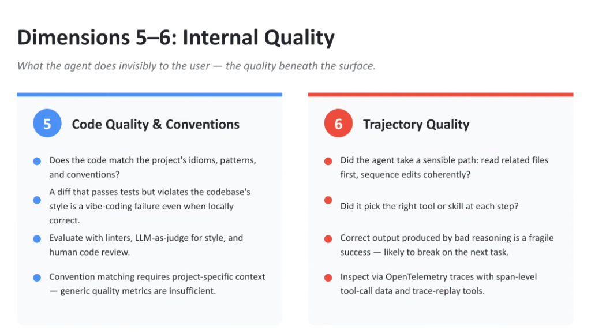
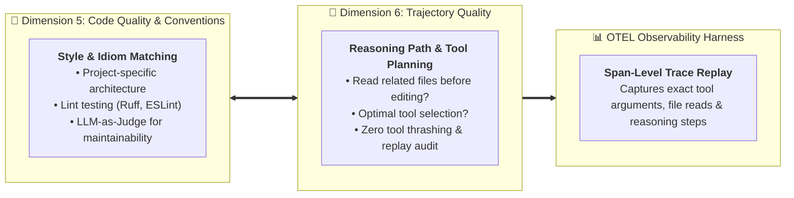

# Evaluation Dimensions 5–6: Internal Quality & Trajectory

## Overview

> **Core Philosophy:**
> *"What the agent does invisibly to the user — the quality beneath the surface."*

User-facing metrics assess whether the application appears to work. However, **Dimensions 5 and 6** evaluate the invisible engineering foundations:
* **Dimension 5 (Code Quality & Conventions)**: Does the code adhere to project-specific idioms, style guides, and maintainability standards?
* **Dimension 6 (Trajectory Quality)**: Did the agent arrive at the solution through sound, reproducible engineering reasoning, or through fragile, chaotic luck?

---

## Internal Quality & Trajectory Evaluation Architecture

---

## Detailed Examination of Dimensions 5 and 6

### Dimension 5: Code Quality & Conventions
> *"Does the code match the project's idioms, patterns, and conventions?"*

* **The Vibe Coding Style Trap**:
  * A generated pull request might pass local unit tests, but if it introduces spaghetti code, invents redundant state stores, or violates existing codebase conventions, it pollutes the repository and creates immediate technical debt.
* **Generic vs. Project-Specific Conventions**:
  * Off-the-shelf linting rules (PEP 8, standard ESLint) are insufficient. The agent must respect the *existing repository's specific architecture* (e.g. using the project's custom data-fetching hooks, specific error-handling wrappers, or designated directory layouts).
* **Evaluation Methodologies**:
  1. **Automated Static AST Linters**: Run `Ruff`, `ESLint`, and `Critique Analyzers` to verify syntax and formatting.
  2. **LLM-as-a-Judge for Code Idioms**: Prompt **Gemini 2.5 Pro** with codebase reference examples to grade the pull request on maintainability, modularity, and architectural alignment.
  3. **Human Architectural Review**: Ground-truth calibration by senior engineers.

---

### Dimension 6: Trajectory Quality
> *"Did the agent take a sensible path: read related files first, sequence edits coherently?"*

* **The Danger of "Fragile Success"**:
  > *"Correct output produced by bad reasoning is a fragile success — likely to break on the next task."*
  * If an agent arrives at the right code by guessing, brute-force rewriting entire files, or thrashing through 20 irrelevant tool calls, its success is accidental and unreproducible.
* **Key Trajectory Evaluation Signals**:
  * **Sensible Exploration**: Did the agent inspect type definitions, schema files, and existing tests *before* mutating code?
  * **Tool Selection Accuracy**: Did it pick the optimal skill (e.g. targeted symbol lookup) or run unindexed filesystem scans?
  * **Edit Coherence**: Were multi-file edits applied in dependency order?
* **Evaluation Standard**:
  * Ingest **OpenTelemetry (OTEL)** distributed traces with span-level tool-call arguments.
  * Compare the agent's execution path against a **Golden Trajectory** using trajectory edit-distance metrics.

---

## Internal Quality & Trajectory Reference Matrix

| Evaluation Dimension | Core Evaluation Question | Critical Failure Mode | Verification Tooling |
| :--- | :--- | :--- | :--- |
| **5. Code Quality &amp; Conventions** | Does the diff conform to project-specific idioms and modular patterns? | Passing tests but creating unmaintainable spaghetti code | Static Linters (`Ruff`, `ESLint`) + LLM Style Judge |
| **6. Trajectory Quality** | Did the agent follow an efficient, coherent engineering sequence? | "Fragile success": lucky answers derived from chaotic reasoning | OpenTelemetry Spans + Trace Replay Harvesters |
