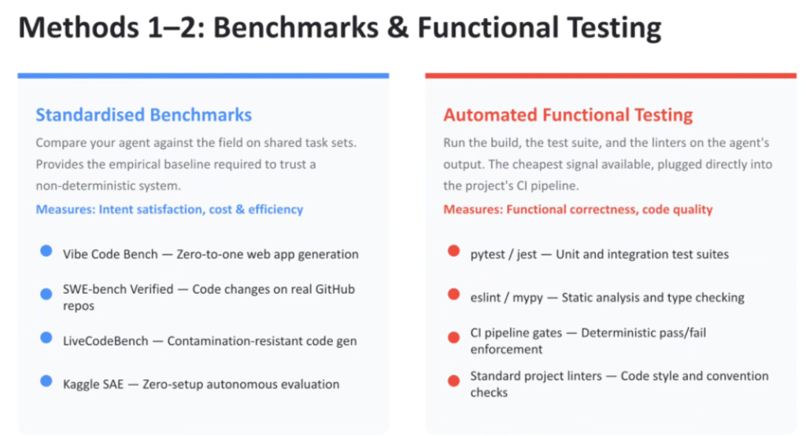
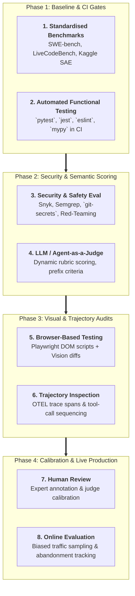
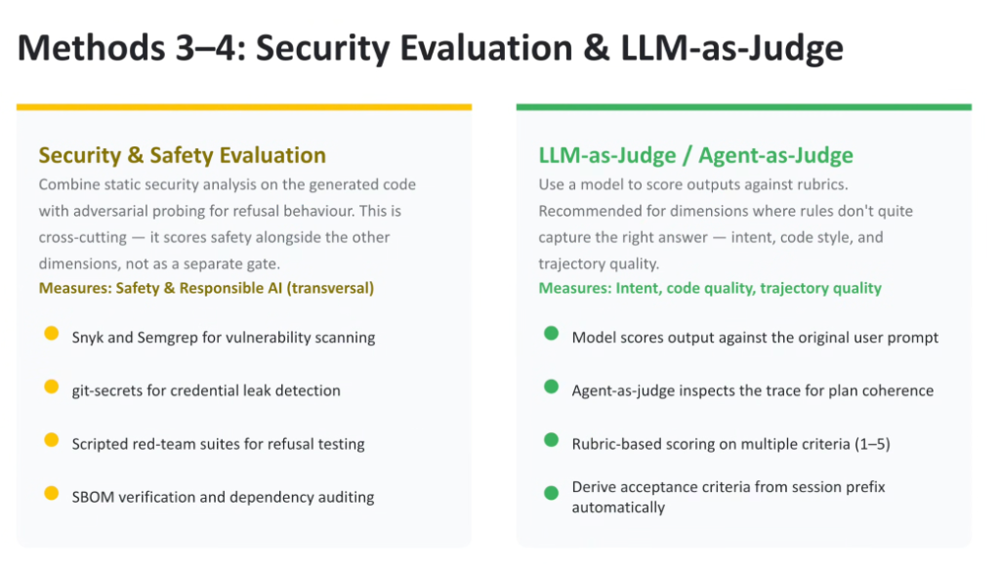
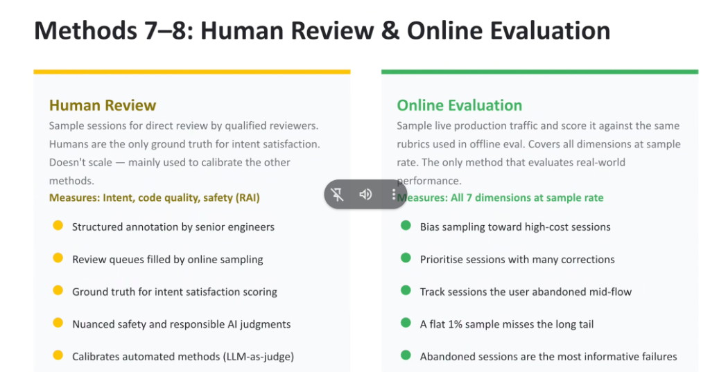

# The 8 Agent Evaluation Methods: Deep-Dive Tooling & Implementation Playbook

## Overview

A robust production agent quality pipeline cannot rely on a single testing mechanism.

The **Google Agent Evaluation Framework** pairs eight discrete, highly specialized evaluation methodologies. Together, they bridge macro industry benchmarking, deterministic local CI/CD gates, transversal security scanning, LLM-as-a-judge rubric scoring, browser interaction testing, OpenTelemetry trajectory inspection, human expert calibration, and biased online production sampling.

---

## The 8 Evaluation Methods Pipeline Architecture

---

## Deep-Dive Technical Examination of the 8 Methods

### Methods 1 & 2: Benchmarks & Functional Testing

#### Method 1: Standardised Benchmarks
* **Core Function**: Compares model and agent performance against shared, public task sets to establish empirical baseline trust.
* **Primary Dimensions Measured**: Intent satisfaction, cost & efficiency.
* **Key Tooling Ecosystem**:
  * **SWE-bench Verified**: Solves real-world GitHub issues across complex repositories.
  * **Vibe Code Bench**: Evaluates zero-to-one full-stack web application generation from sparse prompts.
  * **LiveCodeBench**: Contamination-resistant code generation benchmark continuously updated with recent competitive programming tasks.
  * **Kaggle SAE**: Zero-setup autonomous agent evaluation harness.

#### Method 2: Automated Functional Testing
* **Core Function**: The cheapest and fastest evaluation signal available, plugged directly into the repository's CI pipeline.
* **Primary Dimensions Measured**: Functional correctness, code quality.
* **Key Tooling Ecosystem**:
  * **`pytest` / `jest`**: Unit and integration test execution.
  * **`eslint` / `mypy`**: Static syntax parsing, linting, and type-checking.
  * **CI Pipeline Gates**: Enforces deterministic pass/fail build blocking before pull-request merge.

---

### Methods 3 & 4: Security Evaluation & LLM-as-Judge

#### Method 3: Security & Safety Evaluation
* **Core Function**: A transversal, cross-cutting layer that scores security alongside functional metrics at every step.
* **Primary Dimensions Measured**: Transversal Safety & Responsible AI.
* **Key Tooling Ecosystem**:
  * **Snyk & Semgrep**: Static Application Security Testing (SAST) for vulnerability identification (OWASP Top 10, buffer overflows, SQL injections).
  * **`git-secrets`**: High-entropy credential and private API key leak detection.
  * **Scripted Red-Team Suites**: Automated adversarial refusal testing (jailbreak defense, prompt injection resistance).
  * **SBOM Verification**: Software Bill of Materials supply-chain dependency auditing.

#### Method 4: LLM-as-a-Judge / Agent-as-a-Judge
* **Core Function**: Scores non-deterministic outputs against multi-criteria rubrics where hardcoded rules fail (intent fulfillment, code elegance, design consistency).
* **Primary Dimensions Measured**: Intent satisfaction, code quality, trajectory quality.
* **Key Implementation Patterns**:
  * **Session Prefix Rubric Generation**: Automatically derives acceptance criteria from the first few turns of conversation.
  * **Agent-as-a-Judge**: Evaluates OTEL execution traces for plan coherence and logical consistency.
  * **Multi-Criteria Scoring**: 1–5 qualitative rubrics evaluated by **Gemini 2.5 Pro**.

---

### Methods 5 & 6: Visual Testing & Trajectory Audits

#### Method 5: Browser-Based Testing
* **Core Function**: Executes rendered web applications in headless sandboxes to verify user-facing DOM behavior.
* **Primary Dimensions Measured**: Visual & behavioural fidelity.
* **Key Tooling Ecosystem**:
  * **Playwright / Puppeteer**: Automated multi-step browser interaction scripts (form submission, navigation, modal triggering).
  * **Multimodal Visual Judges**: High-resolution viewport screenshot diffing via **Gemini 2.5 Pro Vision** to catch z-index clipping, broken layout grids, and poor contrast.

#### Method 6: Trajectory Inspection
* **Core Function**: Audits the agent's internal reasoning and tool-invocation sequence to eliminate "fragile success" (getting the right answer through lucky, chaotic tool thrashing).
* **Primary Dimensions Measured**: Trajectory quality, efficiency.
* **Key Tooling Ecosystem**:
  * **OpenTelemetry (OTEL) Traces**: Captures span-level tool inputs, return payloads, and file retrieval order.
  * **Trace Replay Harvesters**: Replays historical execution traces against golden reference paths.

---

### Methods 7 & 8: Human Review & Online Evaluation

#### Method 7: Human Review
* **Core Function**: Provides the non-negotiable authoritative ground truth for intent satisfaction and calibrates automated evaluation judges.
* **Primary Dimensions Measured**: Intent, code quality, responsible AI safety.
* **Key Operational Patterns**:
  * **Structured Senior Engineer Annotation**: Senior software architects grade sampled sessions against formal rubrics.
  * **Judge Calibration Loop**: Compares human scores against LLM-as-a-judge scores to detect judge model drift or leniency bias.

#### Method 8: Online Evaluation (Production Sampling)
* **Core Function**: Continuously samples live production traffic from Cloud Run / Vertex AI Agent Engine and scores it against offline evaluation rubrics.
* **Primary Dimensions Measured**: All 7 dimensions across real-world workloads.
* **The Biased Sampling Strategy**:
  > *A flat 1% random sample misses the long tail. Abandoned sessions are the most informative failures.*
  * **High-Cost Session Bias**: Over-indexes on sessions exceeding token/cost thresholds.
  * **Multi-Correction Prioritization**: Focuses audit queues on sessions requiring $\ge 4$ user corrections.
  * **Abandonment Tracking**: Isolates sessions where the user abruptly exited mid-workflow as primary failure indicators.

---

## Master 8-Method Evaluation Matrix

| Method | Target Scope | Core Tooling / Metric | Primary Benefit |
| :--- | :--- | :--- | :--- |
| **1. Benchmarks** | Public Model Capability | SWE-bench, LiveCodeBench, Vibe Code Bench | Empirical industry baseline |
| **2. Functional Testing** | Code Validity & Syntax | `pytest`, `jest`, `eslint`, `mypy` | Fast, deterministic CI gate |
| **3. Security Eval** | Vulnerabilities & Leaks | Snyk, Semgrep, `git-secrets`, Red-Team | Transversal zero-trust safety |
| **4. LLM-as-Judge** | Semantic Quality | `gemini-2.5-pro` + Prefix Rubrics | Scalable intent & style scoring |
| **5. Browser Testing** | Rendered UI & DOM | Playwright + Gemini Vision | Catches visual & UX flaws |
| **6. Trajectory Inspect** | Reasoning & Tool Choice | OTEL Spans & Trace Replay | Eliminates "fragile success" |
| **7. Human Review** | Ground Truth Calibration | Senior Engineer Review Queues | Calibrates automated judges |
| **8. Online Eval** | Live Production Traffic | Biased Sampling & Abandonment Tracking | Evaluates real-world performance |
