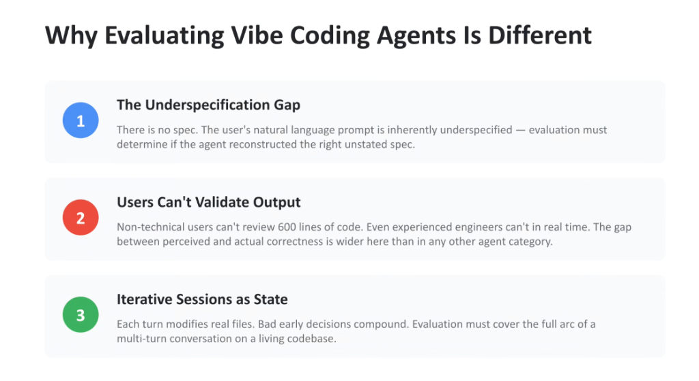
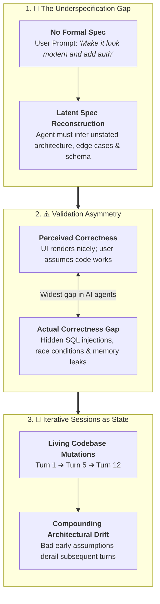

# Evaluating Vibe Coding Agents: The 3 Core Challenges



## Overview

"Vibe coding"—the paradigm where users create software through loose, conversational, and intuition-driven prompts without authoring explicit formal specifications—has transformed agentic application development.

However, evaluating vibe coding agents is fundamentally distinct from evaluating classical algorithmic coding benchmarks (e.g. HumanEval, MBPP, SWE-bench). Traditional benchmarks test single-turn problem solving against rigid unit tests, whereas vibe coding requires evaluating **intent reconstruction**, **hidden quality risks**, and **multi-turn codebase evolution**.

---

## The 3 Fundamental Evaluation Challenges



---

## Detailed Breakdown of the 3 Dimensions

### 1. The Underspecification Gap
* **The Reality**: In vibe coding, there is no PRD (Product Requirements Document), no OpenAPI schema, and no formal unit test suite. Natural language prompts are inherently ambiguous, sparse, and underspecified.
* **The Evaluation Objective**:
  * The evaluation harness cannot merely check if code compiles.
  * It must determine whether the agent **reconstructed the right unstated specification**—proactively inferring appropriate data structures, security boundaries, intuitive UX workflows, and sensible error states without overwhelming the user with clarification prompts.

---

### 2. Users Can't Validate Output (The Correctness Asymmetry)
* **The Reality**:
  * Non-technical users lack the domain expertise to audit 600 lines of generated TypeScript, SQL migrations, or Python backend code.
  * Even experienced software engineers cannot audit massive multi-file diffs in real time during fast, interactive sessions.
* **The Risk**:
  * **The Illusion of Working Software**: A web app may render beautifully on screen while possessing critical vulnerabilities (e.g., hardcoded API keys, unescaped SQL inputs, absence of CSRF protection, unhandled Promise rejections).
* **The Evaluation Objective**:
  * Evaluation harnesses must bridge the gap between *perceived correctness* and *actual engineering soundness* through automated headless browser execution, static code analysis (AST linting), vulnerability scanners, and dynamic sandboxed execution.

---

### 3. Iterative Sessions as State (Compounding Drift)
* **The Reality**: Vibe coding is an ongoing, multi-turn dialogue operating on a living, mutable repository.
* **The Failure Mode**:
  * A suboptimal data modeling decision made in Turn 1 (e.g. storing unstructured JSON strings in local state instead of normalized SQLite tables) creates technical debt that breaks Turn 7 when the user asks to "filter expenses by category."
* **The Evaluation Objective**:
  * Evaluations cannot be evaluated as isolated, single-turn prompts.
  * Test suites must execute **multi-turn session trajectories** against simulated sandbox environments, evaluating whether the agent preserves codebase maintainability and modularity across a 15-turn product build.

---

## Scientific Evaluation Strategy for Vibe Coding

| Evaluation Tier | Focus Area | Measurement Methodology | Key Metric / Tool |
| :--- | :--- | :--- | :--- |
| **Tier 1: Intent Reconstruction** | Spec fulfillment | LLM-as-Judge comparing prompt intent against final feature set | **Latent Requirement Recall (%)** |
| **Tier 2: Code Soundness** | Structural integrity | Automated syntax parsing, type checking, and unit test execution | **Compile &amp; Test Pass Rate** |
| **Tier 3: Security &amp; Safety** | Vulnerability detection | Wiz CNAPP / Model Armor AST security scanning | **Zero CWE / CVE Injections** |
| **Tier 4: Multi-Turn Trajectory** | Compounding health | Automated simulated user turns measuring codebase refactor success | **Multi-Turn Session Completion Rate** |

---

## Summary Comparison: Classical Code Eval vs. Vibe Coding Eval

```
Classical Agent Eval:  [Formal Prompt + Unit Tests] ──────> [Code Output] ───> [Pass / Fail]
                                                                                   
Vibe Coding Eval:      [Vague Intent] ───> [Reconstruct Spec] ───> [Multi-Turn Diffs] ───> [Soundness + UX + Security Evals]
```
