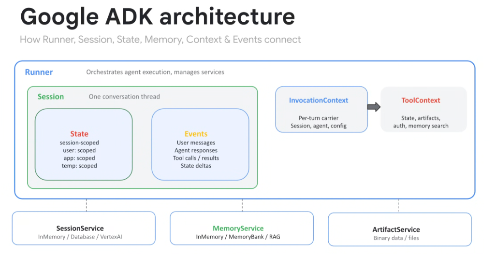
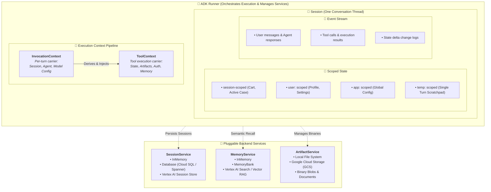

# Google ADK Architecture: Runner, Session, State & Contexts

## Overview

The **Google Agent Development Kit (ADK)** architecture separates agent orchestration, conversation lifecycle, state scoping, memory storage, and tool execution into clean, modular abstractions.

This design enables developers to build lightweight local agent prototypes using `InMemory` providers and seamlessly transition to production-grade distributed cloud deployments on **Vertex AI**, **Cloud SQL**, and **Cloud Storage** without altering core agent logic.

---

## Architectural Blueprint & Component Interactions

---

## Detailed Examination of Core ADK Primitives

### 1. The Runner
* **Role**: The master lifecycle engine.
* **Responsibilities**:
  * Initializes, coordinates, and injects backing services (`SessionService`, `MemoryService`, `ArtifactService`).
  * Drives the core ReAct agent execution loop, evaluating model output tokens, triggering tool calls, and applying state transitions.
  * Ensures clean error handling, trace propagation (OpenTelemetry), and graceful interruption.

---

### 2. The Session & 4-Tier Scoped State
A **Session** encapsulates a single ongoing conversation thread and manages two sub-structures:

#### A. Scoped State Hierarchy
ADK provides four distinct namespaces for data storage:
1. **`session` (Default)**: Scoped to the current conversation thread. Automatically discarded when the session closes (e.g. `state["cart_items"]`).
2. **`user:`**: Persistent across all conversation sessions for a specific user ID (e.g. `state["user:preferred_language"]`, `state["user:account_tier"]`).
3. **`app:`**: Global application-level state shared across all users and all sessions on the cluster (e.g. `state["app:maintenance_mode"]`).
4. **`temp:`**: Ephemeral scratchpad variables isolated to the current execution turn; automatically purged once the turn completes (e.g. `state["temp:intermediate_sql_query"]`).

#### B. Events (Append-Only Audit Log)
* Maintains a deterministic, immutable history of:
  * Inbound user prompt messages and outbound agent streaming responses.
  * Tool invocation requests, parameters, and returned JSON outputs.
  * State delta records tracking every variable mutation.

---

### 3. Context Pipelines: InvocationContext vs. ToolContext
* **`InvocationContext`**:
  * Created at the start of each execution turn.
  * Carries references to the active `Session`, the current `Agent` instance, model hyperparameters (temperature, top_p), and runtime credentials.
* **`ToolContext`**:
  * Injected directly into tool functions during execution.
  * Exposes safe programmatic access to scoped State, the `ArtifactService` (for saving/loading large files), authentication headers, and semantic memory querying (`tool_context.search_memory(...)`).

---

### 4. Pluggable Backing Services

| Service | Local Dev / Testing | Production Google Cloud Target | Primary Responsibility |
| :--- | :--- | :--- | :--- |
| **`SessionService`** | `InMemorySessionService` | **Cloud SQL / AlloyDB / Vertex AI** | Persisting conversation threads, events, and state deltas |
| **`MemoryService`** | `InMemoryMemoryService` | **Vertex AI MemoryBank &amp; Vector Search** | Long-term cross-session associative memory &amp; RAG |
| **`ArtifactService`**| `LocalFileArtifactService`| **Google Cloud Storage (GCS)** | Managing images, PDFs, CSVs without inflating LLM context |
