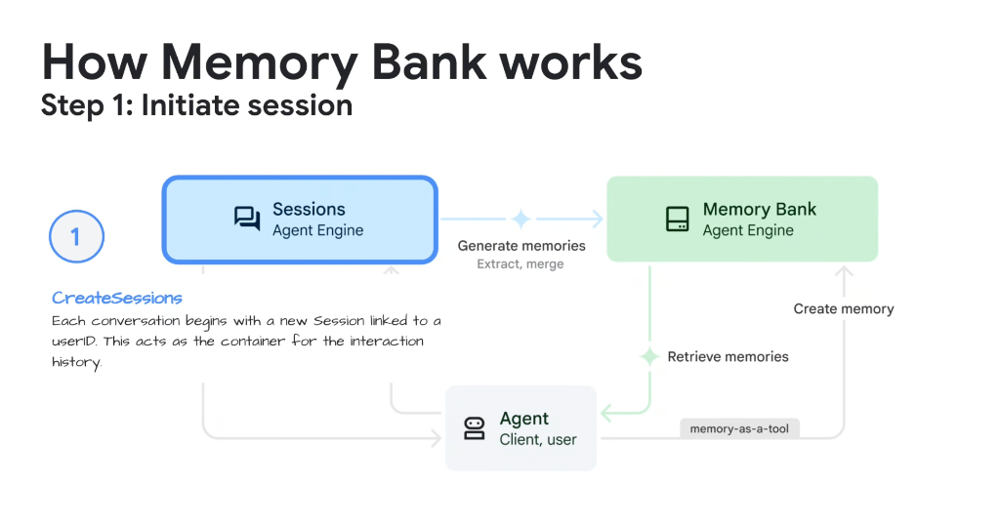
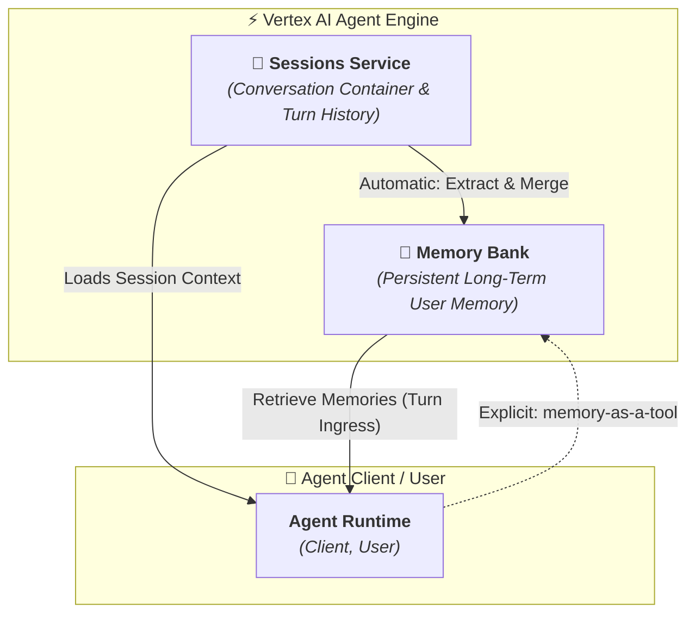

# How Memory Bank Works: Session Initiation & Lifecycle (Step 1)



## Overview

In enterprise production deployments, an agent must remember key user preferences, domain constraints, and historical context across multiple independent conversation threads without re-prompting.

**Vertex AI Agent Engine: Memory Bank** provides managed long-term memory for ADK agents. The foundational first step in this cognitive loop is **Session Initiation (`CreateSessions`)**, which establishes the relationship between the active conversation container, the user identity, and the persistent Memory Bank.

---

## Architecture: Session Initiation & Memory Bank Interaction



---

## Detailed Step-by-Step Execution Mechanics

### 1. `CreateSessions` (Session Inception)
* **API Action**: When a user connects to the agent surface (Web, Chat, IDE, API), the system calls `CreateSessions`.
* **Identity Binding**:
  * The session is cryptographically bound to a unique `userID` (and optional `tenantID`).
  * The session acts as the append-only container for interaction history, tool results, and temporary state.

---

### 2. Dual-Channel Memory Lifecycle

Memory Bank operates through two distinct synchronization channels:

#### Channel A: Automated Asynchronous Extraction (Extract & Merge)
* As turns complete inside the `Sessions` container, the **Agent Engine** analyzes conversation transcripts in the background.
* It identifies long-term facts, constraints, and user preferences (e.g. preferred deployment regions, programming language styles, account settings).
* It merges these updates into the user's permanent `Memory Bank` partition without blocking real-time turn latency.

#### Channel B: Explicit Agent Execution (`memory-as-a-tool`)
* During active execution, the agent can explicitly call `memory-as-a-tool` when the user gives direct instructions (e.g., *"Remember that my production GKE cluster is located in `us-east4`"*).
* This provides deterministic, immediate writes to the Memory Bank.

---

### 3. Contextual Memory Retrieval (`Retrieve memories`)
* At the beginning of a new session or during relevant conversational turns, the agent automatically retrieves top-$K$ semantic memories relevant to the current user and task.
* Memories are injected into the agent's `InvocationContext`, allowing the model to make informed decisions immediately.

---

## Production ADK Implementation Example

```python
from google.genai.adk import Agent, Runner
from google.genai.adk.services import VertexAIMemoryBankService, VertexAISessionService

# 1. Initialize Memory Bank & Session Backing Services
memory_service = VertexAIMemoryBankService(
    project_id="elevate-prod-2026",
    location="us-central1",
    bank_id="enterprise-user-memories"
)

session_service = VertexAISessionService(
    project_id="elevate-prod-2026",
    location="us-central1"
)

# 2. Configure Agent with Memory-as-a-Tool
agent = Agent(
    model="gemini-2.5-pro",
    name="CloudArchitectAgent",
    tools=[memory_service.as_tool()], # Enables explicit memory creation
    instruction="Assist users with cloud infrastructure. Leverage user memories for defaults."
)

# 3. Create Session bound to User ID (Step 1)
runner = Runner(
    agent=agent,
    session_service=session_service,
    memory_service=memory_service
)

session = runner.create_session(
    user_id="user_sacramento_11286",
    metadata={"department": "Customer Engineering"}
)

print(f"[+] Initialized Session ID: {session.id} for User: {session.user_id}")
```

---

## Memory Bank Step 1 Reference Matrix

| Component | Responsibility | Typical Latency | Key API / Primitives |
| :--- | :--- | :---: | :--- |
| **`Sessions`** | Encapsulates single interaction thread | < 5 ms | `CreateSessions`, `GetSession` |
| **`Memory Bank`** | Vectorized persistent user memory store | 15–30 ms | `RetrieveMemories`, `ExtractMemories` |
| **`memory-as-a-tool`** | Deterministic tool for explicit memory writes | 20–40 ms | `agent.tools = [memory_tool]` |
| **`userID` Binding** | Enforces multi-tenant data isolation | Instant | Strict IAM / RBAC boundary |
