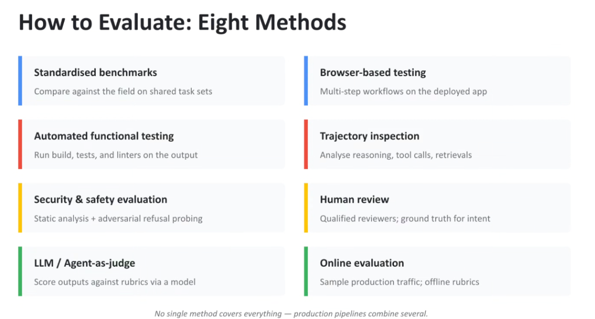
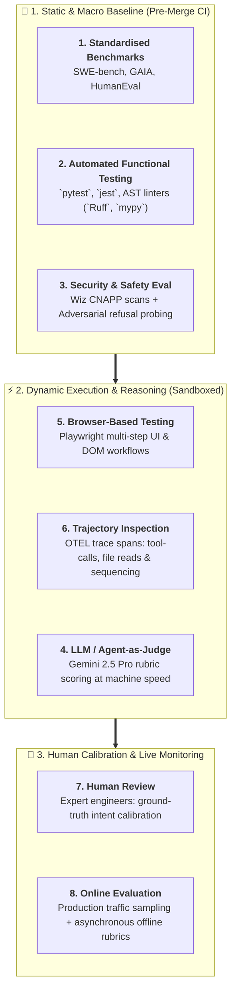

# How to Evaluate: The 8 Scientific Methodologies

## Overview

> **Core Philosophy:**
> *"No single method covers everything — production pipelines combine several."*

Evaluating enterprise agentic systems requires a multi-layered evaluation strategy. Relying solely on unit tests misses visual UI defects and security vulnerabilities; relying solely on LLM-as-a-judge introduces hallucination risks.

The **Google Agent Platform** combines **Eight Complementary Evaluation Methodologies** across pre-merge CI/CD, sandboxed execution, human calibration, and online production monitoring.

---

## The 8 Evaluation Methodologies Architecture

---

## Detailed Examination of the 8 Methods

### 1. Standardised Benchmarks
* **Objective**: Comparative macro-evaluation against industry models on public, standardized task sets (SWE-bench, HumanEval, GAIA, WebArena).
* **Role**: Baseline model validation before domain fine-tuning.

---

### 2. Automated Functional Testing
* **Objective**: Deterministic execution verification.
* **Harness**: Compiles the code, executes test suites (`pytest`, `jest`), and runs static type/syntax linters (`mypy`, `Ruff`, `ESLint`) in an isolated container.

---

### 3. Security & Safety Evaluation
* **Objective**: Threat defense and regulatory compliance.
* **Technique**: Static AST vulnerability scanning (detecting SQLi, XSS, insecure dependencies) + automated red-teaming (adversarial prompt injections, jailbreaks, data exfiltration probing).

---

### 4. LLM / Agent-as-a-Judge
* **Objective**: Scalable semantic and architectural evaluation.
* **Technique**: Uses **Gemini 2.5 Pro** prompted with granular scoring rubrics to evaluate intent fulfillment, code maintainability, and UX elegance.

---

### 5. Browser-Based Testing
* **Objective**: Validating rendered UI outputs and dynamic user interactions.
* **Technique**: Deploys the generated artifact into a temporary sandbox and executes automated **Playwright** scripts simulating clicks, forms, responsive viewports, and navigation.

---

### 6. Trajectory Inspection
* **Objective**: Ensuring sound, reproducible reasoning paths.
* **Technique**: Ingests **OpenTelemetry (OTEL)** spans to audit tool selection precision, file exploration efficiency, and edit sequencing, eliminating fragile accidental successes.

---

### 7. Human Review
* **Objective**: Authoritative ground-truth calibration.
* **Technique**: Qualified human software architects review a sampled percentage of agent outputs ($5–10\%$) to calibrate LLM judge scoring and detect metric drift.

---

### 8. Online Evaluation
* **Objective**: Production telemetry and real-world drift detection.
* **Technique**: Continuously samples live production conversations from Cloud Run / Vertex AI Agent Engine and executes offline evaluation rubrics asynchronously.

---

## Comprehensive 8-Method Evaluation Strategy Matrix

| # | Methodology | Target Artifact | Automation Level | Execution Lifecycle |
| :-: | :--- | :--- | :---: | :--- |
| **1** | **Standardised Benchmarks** | Model Weights / Foundation | 100% Automated | Model Training / Release |
| **2** | **Automated Functional Testing** | Codebase &amp; Unit Tests | 100% Automated | CI/CD Pre-Merge Gate |
| **3** | **Security &amp; Safety Eval** | AST &amp; Model Guardrails | 100% Automated | CI/CD Security Audit |
| **4** | **LLM / Agent-as-Judge** | Multi-Turn Output &amp; Diffs | 100% Automated | Automated Evaluation Flywheel |
| **5** | **Browser-Based Testing** | Rendered DOM &amp; Frontend | 100% Automated | Staging Sandboxes |
| **6** | **Trajectory Inspection** | OTEL Execution Spans | 100% Automated | Trace Analysis Pipeline |
| **7** | **Human Review** | Full Product Experience | Manual (Expert) | Calibration &amp; Audit Sampling |
| **8** | **Online Evaluation** | Production Traffic Streams | Asynchronous Auto | Continuous Production Monitoring |
