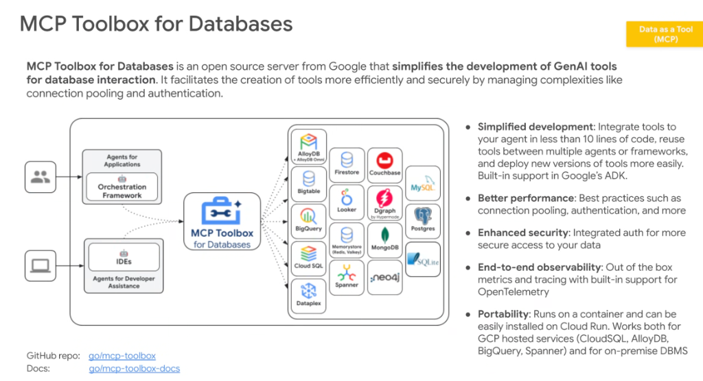
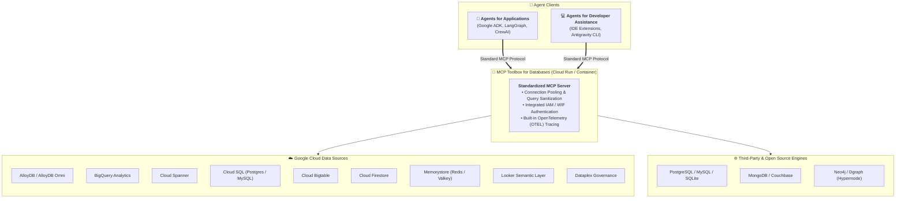

# Google MCP Toolbox for Databases: Open Source Enterprise MCP Gateway



## Overview

**MCP Toolbox for Databases** (`go/mcp-toolbox`) is an open-source server developed by Google that standardizes and simplifies how GenAI agents interact with enterprise databases.

Instead of writing bespoke, fragile database tools for every agent, the Toolbox acts as a **centralized, containerized MCP gateway**. It manages complex infrastructure requirements—such as connection pooling, query multiplexing, authentication, and OpenTelemetry tracing—behind declarative, schema-validated Model Context Protocol endpoints.

---

## Master Architecture Topology



---

## The 5 Core Architectural Pillars

### 1. Simplified Agent Development ($< 10$ Lines of Code)
* Integrates full database tool suites into **Google ADK** in less than 10 lines of declarative Python.
* Enables complete reusability of data tools across different agent frameworks and runtime environments.

---

### 2. High Performance & Connection Pooling
* Eliminates cold-start connection penalties and database connection exhaustion by maintaining managed connection pools.
* Manages async query execution and keeps agent latency minimal.

---

### 3. Enterprise Security & IAM Integration
* Natively integrates with **Google Cloud Workload Identity**, Service Accounts, and **Dual-Gate Authorization**.
* Ensures agents execute database queries with the exact minimum privileges required, eliminating hardcoded database credentials.

---

### 4. End-to-End OpenTelemetry Observability
* Emits distributed trace spans for every tool call, SQL compilation, execution time, and result payload.
* Integrates seamlessly with **Cloud Trace**, **BigQuery Agent Analytics**, and enterprise APM platforms.

---

### 5. Universal Portability (Cloud Run & On-Premises)
* Packaged as an ephemeral, lightweight container that deploys to **Cloud Run** with one command.
* Operates seamlessly across hybrid cloud architectures, supporting both Google Cloud-managed databases and on-premise DBMS clusters.

---

## Supported Database Ecosystem Matrix

| Category | Supported Storage &amp; Database Engines |
| :--- | :--- |
| **Relational &amp; HTAP** | AlloyDB (+ AlloyDB Omni), Cloud Spanner, Cloud SQL (PostgreSQL, MySQL, SQL Server), SQLite |
| **Data Warehousing &amp; Analytics**| BigQuery, Looker (Semantic Modeler), Dataplex |
| **NoSQL &amp; Key-Value** | Cloud Bigtable, Cloud Firestore, Memorystore (Redis / Valkey), MongoDB, Couchbase |
| **Graph Databases** | Neo4j, Dgraph (by Hypermode) |

---

## Declarative ADK 2.0 Integration Example

```python
from google.genai.agents import Agent
from google.genai.agents.mcp import McpToolboxClient

# 1. Connect to the containerized MCP Toolbox for Databases
db_toolbox = McpToolboxClient(
    endpoint="https://mcp-toolbox-xyz.a.run.app",
    auth_token="spiffe://corp.google/sa/billing-agent"
)

# 2. Declaratively attach database tools to the ADK Agent (< 10 lines)
finance_agent = Agent(
    name="CorporateFinanceAgent",
    model="gemini-2.5-pro",
    tools=[
        db_toolbox.get_tool("bigquery_analytics_query"),
        db_toolbox.get_tool("alloydb_customer_ledger_lookup")
    ],
    instruction="Analyze customer transaction volume and cross-reference ledger entries."
)
```
