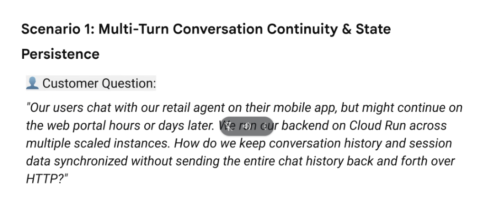
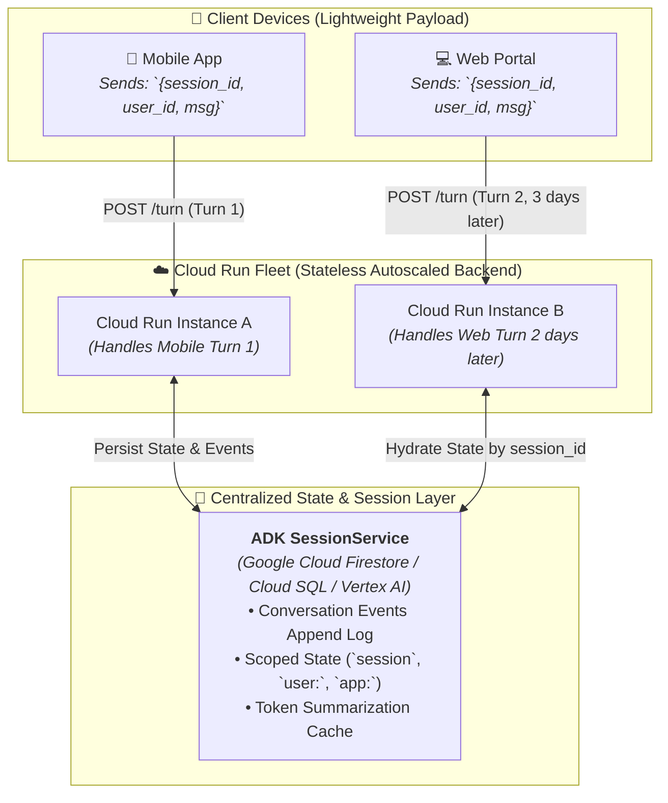

# Scenario 1: Multi-Turn Conversation Continuity & State Persistence



## Customer Challenge

> **Customer Question:**
> *"Our users chat with our retail agent on their mobile app, but might continue on the web portal hours or days later. We run our backend on Cloud Run across multiple scaled instances. How do we keep conversation history and session data synchronized without sending the entire chat history back and forth over HTTP?"*

---

## Core Engineering Dilemmas

1. **Cross-Device & Cross-Channel Continuity**:
   * Users switch devices seamlessly (e.g. initiating a return on a mobile app during a commute, then finalizing it on a desktop browser three days later).
2. **Stateless Cloud Run Autoscaling**:
   * Serverless containers on Cloud Run scale from 0 to hundreds of instances. Turn 1 might hit **Instance A**, while Turn 2 lands on **Instance B** or a freshly provisioned cold container.
3. **The "Client-Fat History" Anti-Pattern**:
   * *Anti-Pattern*: Requiring the mobile/web frontend to store the entire 50-turn chat history and re-post the full JSON transcript on every single HTTP request.
   * *Why it fails*: Massive mobile bandwidth consumption, slow HTTP upload latency, high battery drain, and critical security vulnerability (allowing malicious clients to forge previous agent outputs or manipulate state).

---

## Architectural Blueprint: Server-Side State Persistence with ADK



---

## Detailed Architectural Resolution

### 1. Minimalist Client-to-Backend Contract
* The client sends **only the new message** and routing identifiers:
  ```json
  {
    "session_id": "sess_retail_9847193",
    "user_id": "user_748291",
    "message": "Can I exchange those shoes for a size 11 instead?"
  }
  ```
* The client never manages, stores, or re-transmits conversation history.

---

### 2. Centralized Session Hydration via ADK `SessionService`
* When Cloud Run receives an incoming turn:
  1. The **ADK Runner** invokes `session_service.get_session(session_id)`.
  2. The session service fetches the conversation events, turn history, and scoped state from **Google Cloud Firestore** (or Cloud SQL / Vertex AI Session Store) in `< 10 ms`.
  3. The agent executes reasoning with full historical continuity.
  4. Upon completion, state deltas and new event records are atomically persisted back to the database.

---

### 3. Smart Token Window Trimming & Summarization
* To prevent context window inflation and runaway Gemini token costs across long multi-day conversations:
  * Recent turns (e.g. last 10 turns) are retained in full verbatim fidelity.
  * Historical turns ($> 10$ turns) are automatically summarized into a dense state summary by a background worker or callback hook (`state["session:conversation_summary"]`).

---

## Production Implementation Code (FastAPI + ADK + Firestore)

```python
from fastapi import FastAPI, HTTPException
from pydantic import BaseModel
from google.genai.adk import Agent, Runner
from google.genai.adk.services import FirestoreSessionService

app = FastAPI(title="Retail Assistant Backend")

# Initialize persistent Firestore session service (shared across all Cloud Run containers)
session_service = FirestoreSessionService(
    project_id="elevate-prod-retail",
    collection_name="retail_agent_sessions"
)

agent = Agent(
    model="gemini-2.5-flash",
    name="RetailAssistant",
    instruction="You are a helpful retail agent. Guide users through purchases and returns."
)

runner = Runner(agent=agent, session_service=session_service)

class TurnRequest(BaseModel):
    session_id: str
    user_id: str
    message: str

@app.post("/api/chat/turn")
async def handle_chat_turn(req: TurnRequest):
    try:
        # Automatically loads or creates session from Firestore
        session = runner.get_or_create_session(
            session_id=req.session_id,
            user_id=req.user_id
        )
        
        # Execute turn with complete server-side history
        response = runner.run_turn(
            session=session,
            user_message=req.message
        )
        
        return {
            "session_id": session.id,
            "agent_response": response.text
        }
    except Exception as e:
        raise HTTPException(status_code=500, detail=str(e))
```

---

## Architecture Comparison: Client-Heavy vs. Server-Side Session Store

| Dimension | ❌ Client-Heavy Anti-Pattern | ✅ ADK Server-Side SessionStore |
| :--- | :--- | :--- |
| **Network Payload** | 100 KB – 2 MB per HTTP request | **< 1 KB per request** |
| **Cross-Device Sync** | Impossible without custom client sync | **Instant &amp; automatic across all surfaces** |
| **Security &amp; Tampering** | High risk (client can edit past turns) | **Zero risk (immutable server-side audit logs)** |
| **Compute Tenancy** | Bound to client device state | **Fully stateless Cloud Run fleet** |
| **Token Cost Management** | Client controls token inclusion | **Server-side deterministic compaction &amp; RAG** |
