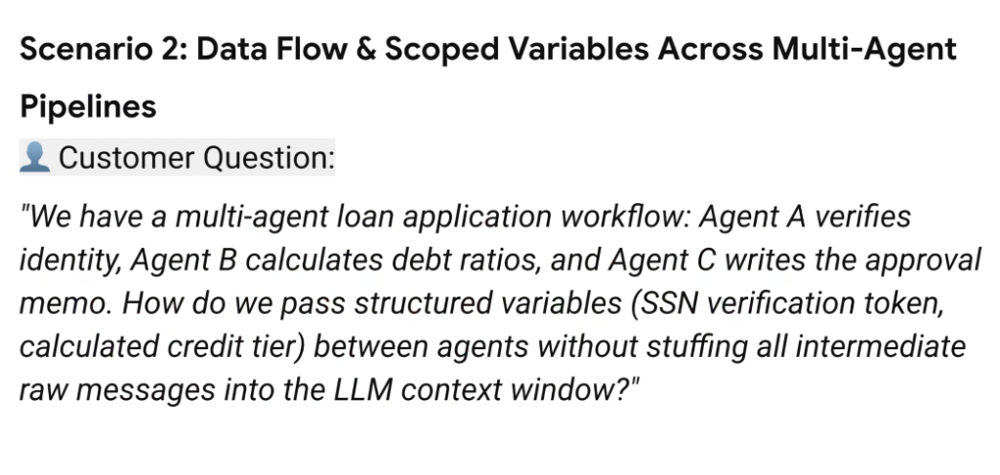
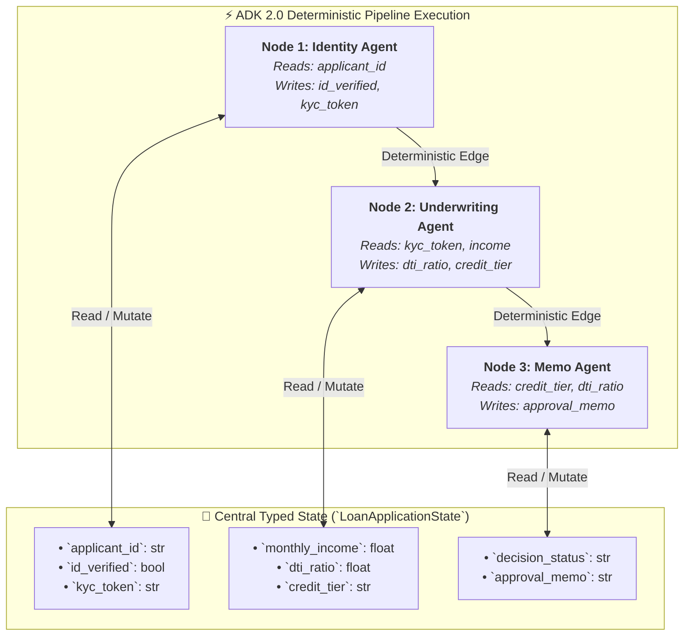

# Scenario 2: Data Flow & Scoped Variables Across Multi-Agent Pipelines



## Customer Challenge

> **Customer Question:**
> *"We have a multi-agent loan application workflow: Agent A verifies identity, Agent B calculates debt ratios, and Agent C writes the approval memo. How do we pass structured variables (SSN verification token, calculated credit tier) between agents without stuffing all intermediate raw messages into the LLM context window?"*

---

## Core Engineering Dilemmas

### The Monolithic Context-Stacking Anti-Pattern
When chaining multiple specialized agents together, naive implementations concatenate the entire conversational transcript and every intermediate tool output into a single shared message list:

```
[User Request] ➔ [Agent A Dialogue + Raw KYC API Dumps (15K tokens)] ➔ [Agent B Debt Formulas + Plaid Dumps (25K tokens)] ➔ [Agent C Memo Prompt (40K+ tokens!)]
```

* **Why it fails in production**:
  1. **Token Cost & Latency Explosion**: Downstream agents pay exponential latency and cost penalties to ingest irrelevant upstream logs.
  2. **Context Dilution & Hallucination**: As the context grows, models suffer from the *"Lost in the Middle"* phenomenon, missing critical numbers.
  3. **Security & PII Leakage**: Passing raw identity verification payloads (SSNs, raw bank transactions) directly to downstream agents violates the Principle of Least Privilege.

---

## Architectural Blueprint: Decoupled Data Plane via ADK `StateGraph`

The modern ADK 2.0 solution is **Decoupling the Data Plane (Typed State) from the Reasoning Plane (In-Context Prompt Window)**:



---

## Detailed Architectural Resolution

### 1. Strongly Typed Pydantic State Schema
* Define an explicit state contract representing the enterprise business entity:
  ```python
  from pydantic import BaseModel, Field
  from typing import Optional

  class LoanApplicationState(BaseModel):
      applicant_id: str
      applicant_name: str
      # Agent A outputs
      id_verified: bool = False
      kyc_token: Optional[str] = None
      # Agent B outputs
      monthly_income: float = 0.0
      monthly_debt: float = 0.0
      dti_ratio: Optional[float] = None
      credit_tier: Optional[str] = None
      # Agent C outputs
      approval_memo: Optional[str] = None
      decision_status: Optional[str] = None
  ```

---

### 2. Isolated Node Reasoning Contexts
* Each agent node receives the shared state object, extracts **only the specific keys required**, executes its reasoning or tool call, and returns a dictionary with mutated fields.
* **Result**: Agent C’s LLM context window contains only 400 tokens (clean summary inputs + memo prompt) instead of 40,000 tokens of raw API logs!

---

## Production Implementation Code (ADK 2.0 `StateGraph`)

```python
from google.genai.adk import StateGraph, START, END
from google.genai.adk import Agent

# 1. Define Agent Nodes with Isolated Context Windows
def identity_verification_node(state: LoanApplicationState) -> dict:
    # Executes KYC tool call using applicant_id
    token = f"kyc_token_verified_{state.applicant_id}"
    return {"id_verified": True, "kyc_token": token}

def underwriting_node(state: LoanApplicationState) -> dict:
    # Calculates DTI and credit tier deterministically or via model
    dti = state.monthly_debt / state.monthly_income if state.monthly_income > 0 else 1.0
    tier = "Prime" if dti < 0.35 else "Subprime"
    return {"dti_ratio": round(dti, 3), "credit_tier": tier}

def memo_author_node(state: LoanApplicationState) -> dict:
    # Prompt contains ONLY high-level variables, not raw API traces
    prompt = f"""
    Write a formal loan decision memo for {state.applicant_name}:
    - Identity Verified: {state.id_verified}
    - Debt-to-Income Ratio: {state.dti_ratio}
    - Credit Tier: {state.credit_tier}
    """
    memo_agent = Agent(model="gemini-2.5-flash", instruction="You are an executive credit officer.")
    response = memo_agent.run(prompt)
    
    return {
        "approval_memo": response.text,
        "decision_status": "APPROVED" if state.credit_tier == "Prime" else "MANUAL_REVIEW"
    }

# 2. Build Deterministic ADK 2.0 Graph
workflow = StateGraph(LoanApplicationState)

workflow.add_node("verify_identity", identity_verification_node)
workflow.add_node("calculate_underwriting", underwriting_node)
workflow.add_node("generate_memo", memo_author_node)

workflow.add_edge(START, "verify_identity")
workflow.add_edge("verify_identity", "calculate_underwriting")
workflow.add_edge("calculate_underwriting", "generate_memo")
workflow.add_edge("generate_memo", END)

loan_app_engine = workflow.compile()
```

---

## Architecture Comparison: Message Stacking vs. Scoped ADK State

| Architecture Dimension | ❌ Naive Message Stacking (ADK 1.x / Chat Chaining) | ✅ ADK 2.0 Scoped StateGraph |
| :--- | :--- | :--- |
| **Context Window Consumption** | Compounds with every turn (e.g. 50K+ tokens) | **Constant &amp; isolated per node (< 1K tokens)** |
| **API Latency per Turn** | Increases linearly/exponentially down the pipeline | **Fast &amp; deterministic across all stages** |
| **Data Integrity &amp; Precision**| LLM must parse raw text to extract numbers | **Direct programmatic access to typed fields** |
| **PII &amp; Security Isolation** | All upstream sensitive logs leaked to all nodes | **Strict least-privilege variable scoping** |
| **Auditability &amp; Debugging** | Unstructured chat transcript forensics | **Clear inspection of state deltas per node** |
