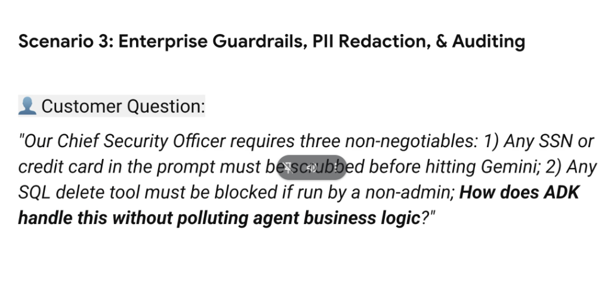
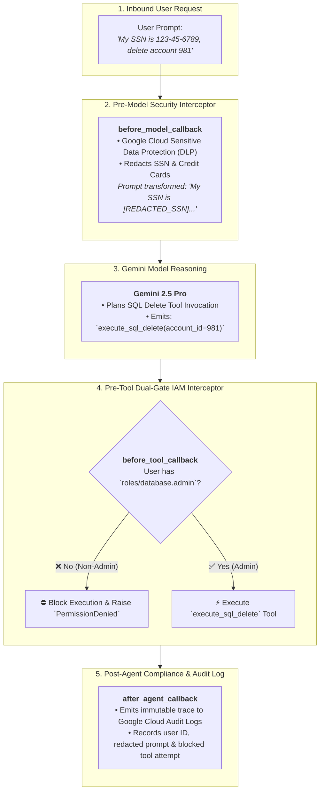

# Scenario 3: Enterprise Guardrails, PII Redaction & Tool Auditing



## Customer Challenge

> **Customer Question:**
> *"Our Chief Security Officer requires three non-negotiables: 1) Any SSN or credit card in the prompt must be scrubbed before hitting Gemini; 2) Any SQL delete tool must be blocked if run by a non-admin; How does ADK handle this without polluting agent business logic?"*

---

## Core Engineering Dilemmas

### The "Spaghetti Security" Anti-Pattern
When developers attempt to solve enterprise security inside core agent prompts or tool bodies:
* *Prompt-Based PII Defense*: Instructing the LLM *"Do not look at SSNs"* fails catastrophically because the sensitive tokens have already been transmitted over the wire to the API.
* *In-Tool RBAC Checks*: Hardcoding `if user.role != "admin"` inside every tool creates massive code duplication and breaks tool reusability across different agent contexts.

---

## Architectural Blueprint: Decoupled Interceptor Pattern via ADK Callbacks

The ADK solution enforces **Zero-Pollution Enterprise Security** by decoupling security, compliance, and audit policies into dedicated **Lifecycle Interceptor Callbacks**:



---

## Detailed Architectural Resolution

### 1. PII Scrubbing at Model Ingress (`before_model_callback`)
* **Execution Boundary**: Runs *before* the message payload leaves the application boundary to the Gemini API.
* **Mechanism**: Integrates with **Google Cloud Sensitive Data Protection (Cloud DLP)** or lightweight local regex tokenizers to identify and redact structured PII (SSNs, credit card numbers, JWT secrets, passwords).
* **Guarantees**: Compliance with PCI-DSS, HIPAA, and GDPR by ensuring sensitive raw tokens never enter LLM prompt buffers or external API logs.

---

### 2. Fine-Grained Tool RBAC at Execution Ingress (`before_tool_callback`)
* **Execution Boundary**: Runs when Gemini decides to call a tool, *before* the Python/SQL function executes.
* **Mechanism**: Inspects the caller's identity and IAM roles stored in `ToolContext.auth_context`.
* **Policy Enforcement**:
  * Destructive tools (`delete_sql_record`, `drop_table`, `revoke_cloud_iam`) require explicit `roles/database.admin` or `roles/owner` entitlements.
  * If unauthorized, the callback terminates the execution and returns a structured permission denied error back to the model, preventing destructive mutations.

---

### 3. Immutable Compliance Auditing (`after_agent_callback`)
* **Execution Boundary**: Runs after the turn finishes, before the response is returned to the client.
* **Mechanism**: Emits structured JSON audit records to **Google Cloud Audit Logs** / **Cloud Logging**, capturing:
  * Calling user ID and session metadata.
  * Sanitized prompt and response text.
  * List of attempted tool executions (including blocked authorization attempts).

---

## Production Python Implementation (ADK Enterprise Security Suite)

```python
import re
from google.genai.adk import Agent, InvocationContext, ToolContext
from google.cloud import dlp_v2

# 1. Pre-Model PII Redaction Interceptor (Requirement 1)
def redact_pii_before_model(ctx: InvocationContext, contents: list) -> list:
    """Scans and redacts SSNs and Credit Cards before calling Gemini API."""
    ssn_pattern = r"\b\d{3}-\d{2}-\d{4}\b"
    cc_pattern = r"\b(?:\d{4}[-\s]?){3}\d{4}\b"
    
    sanitized_contents = []
    for content in contents:
        text = content.text
        text = re.sub(ssn_pattern, "[REDACTED_SSN]", text)
        text = re.sub(cc_pattern, "[REDACTED_CREDIT_CARD]", text)
        content.text = text
        sanitized_contents.append(content)
        
    return sanitized_contents

# 2. Pre-Tool Dual-Gate IAM Authorization Interceptor (Requirement 2)
def authorize_before_tool(ctx: ToolContext, tool_name: str, tool_args: dict) -> dict:
    """Blocks destructive SQL operations if the user is not a verified database admin."""
    destructive_tools = ["execute_sql_delete", "drop_table", "purge_user_data"]
    
    if tool_name in destructive_tools:
        user_roles = ctx.auth_context.get("roles", [])
        if "roles/database.admin" not in user_roles:
            raise PermissionError(
                f"Security Violation: User '{ctx.session.user_id}' is not authorized to execute destructive tool '{tool_name}'."
            )
            
    return tool_args

# 3. Post-Agent Compliance & Audit Logging Interceptor
def audit_after_agent(ctx: InvocationContext, response):
    """Emits tamper-proof audit trace to Google Cloud Logging."""
    print(f"[AUDIT LOG] Session={ctx.session.id} | User={ctx.session.user_id} | Status=SUCCESS")
    return response

# 4. Clean Business Logic Agent (Zero Security Boilerplate in Prompts or Tools)
enterprise_sql_agent = Agent(
    model="gemini-2.5-pro",
    name="EnterpriseDatabaseAgent",
    instruction="Assist internal teams with querying and managing enterprise databases.",
    tools=[query_sql, execute_sql_delete], # Plain business tools
    before_model_callback=redact_pii_before_model,
    before_tool_callback=authorize_before_tool,
    after_agent_callback=audit_after_agent
)
```

---

## Security Implementation Reference Matrix

| CSO Requirement | ADK Implementation Hook | Supporting Google Cloud Service | Production Guarantee |
| :--- | :--- | :--- | :--- |
| **1. Prompt PII Scrubbing** | `before_model_callback` | **Cloud Sensitive Data Protection (DLP)** | Zero raw SSN / CC tokens reach LLM |
| **2. SQL Delete RBAC** | `before_tool_callback` | **Cloud IAM / Workload Identity** | Non-admins deterministically blocked |
| **3. Clean Architecture** | Pluggable Interceptor Pattern | ADK `Runner` / `Agent` Middleware | 0 lines of auth boilerplate in tools |
| **4. Audit Trail** | `after_agent_callback` | **Google Cloud Audit Logs** | Immutable forensic compliance record |
