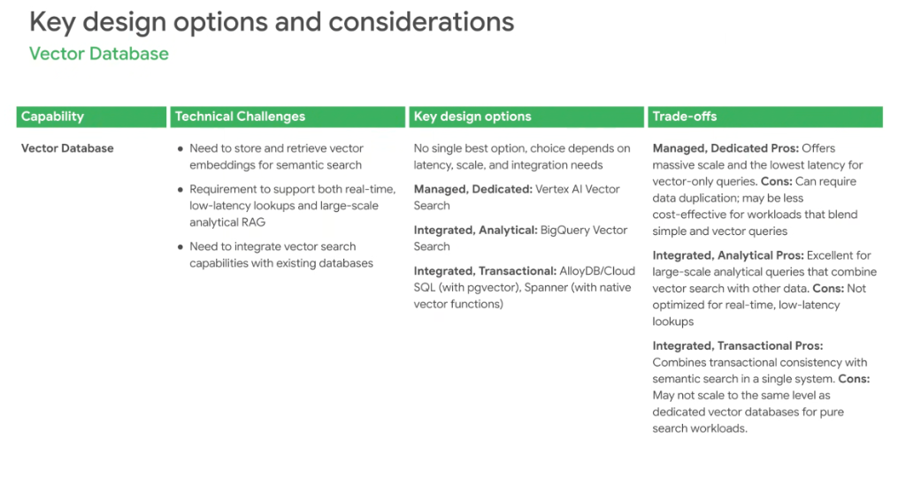
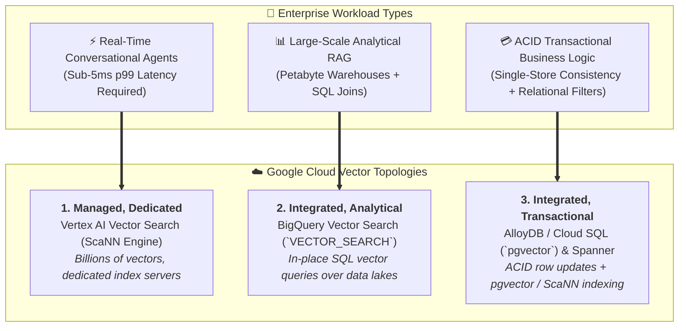

# Vector Database Architecture: Dedicated vs. Integrated Analytical vs. Transactional

## Overview

In enterprise agent and RAG architectures, selecting a vector database is not a one-size-fits-all decision.

> **Core Architectural Principle:**
> *"There is no single best option — the optimal choice depends strictly on latency requirements, vector scale, and data integration needs."*

Google Cloud provides three primary vector database archetypes: **Managed Dedicated** (Vertex AI Vector Search), **Integrated Analytical** (BigQuery Vector Search), and **Integrated Transactional** (AlloyDB / Cloud SQL `pgvector`, Cloud Spanner).

---

## The 3 Vector Database Topologies

---

## Core Technical Challenges

1. **Embedding Storage & ANN Retrieval**: Managing high-dimensional vector embeddings (768 to 1536 dims) and computing approximate nearest neighbors (ANN) efficiently.
2. **Latency vs. Scale Asymmetry**: Balancing sub-10ms interactive agent turn requirements against multi-terabyte batch knowledge extraction across historical archives.
3. **Data Duplication & Synchronization Skew**: Avoiding complex CDC / ETL pipelines when synchronizing relational operational databases with external vector stores.

---

## In-Depth Analysis of Design Topologies

### 1. Managed, Dedicated: Vertex AI Vector Search
* **Core Technology**: Google's proprietary **ScaNN (Scalable Nearest Neighbors)** algorithm running on dedicated auto-scaling index nodes.
* **Pros**:
  * **Massive Scale & Ultra-Low Latency**: Delivers sub-5ms p99 latency across billions of vector embeddings with high QPS.
  * **Purpose-Built Indexing**: Automatic index updates and optimized memory-mapped vector search.
* **Cons**:
  * **Data Duplication**: Requires continuous ETL ingestion pipelines from primary operational databases into Vertex AI.
  * **Cost Overhead for Mixed Workloads**: Overkill and less cost-effective for small-to-medium tables blending basic SQL filters with vector search.

---

### 2. Integrated, Analytical: BigQuery Vector Search
* **Core Technology**: Native GoogleSQL `VECTOR_SEARCH()` function utilizing **IVF (Inverted File)** and **TreeAH** vector indexes directly inside BigQuery tables.
* **Pros**:
  * **Zero-ETL Analytical Joins**: Run semantic similarity searches directly alongside petabyte-scale data warehouse queries and relational joins.
  * **Governance & Security**: Uses standard BigQuery IAM, Column-Level Security, and Data Masking.
* **Cons**:
  * **Analytical Latency Profile**: Typical query execution ranges from hundreds of milliseconds to seconds; not suitable for real-time sub-second conversational loops.

---

### 3. Integrated, Transactional: AlloyDB / Cloud SQL & Spanner
* **Core Technology**: Co-locating vector embeddings inside PostgreSQL relational tables via **`pgvector`** (enhanced with AlloyDB ScaNN indexing) and native **Cloud Spanner** vector distance functions.
* **Pros**:
  * **Strict ACID Consistency**: Zero synchronization skew—updating a product row immediately updates its vector index within the same atomic transaction.
  * **Single-Store Simplicity**: Unified SQL queries combining rich relational `WHERE` clauses (pricing, metadata, tenant IDs) with semantic distance sorting.
* **Cons**:
  * **Resource Contention**: Heavy vector index builds share CPU and memory with mission-critical OLTP transactional queries.

---

## Vector Database Architecture Decision Matrix

| Dimension | Managed Dedicated (Vertex AI Vector Search) | Integrated Analytical (BigQuery Vector Search) | Integrated Transactional (AlloyDB / Cloud SQL / Spanner) |
| :--- | :--- | :--- | :--- |
| **Primary Sweet Spot** | Real-time agents, high-QPS search | Enterprise BI, analytics, batch RAG | Transactional apps, single-store apps |
| **p99 Query Latency** | **Sub-5ms** ⚡ | 200ms – 3s | **5ms – 25ms** |
| **Maximum Vector Scale** | Billions of vectors | Multi-billion vectors (Petabytes) | Millions to tens of millions |
| **Data Synchronization** | Requires ETL / CDC pipeline | In-place within data warehouse | **Zero ETL (Single ACID store)** |
| **Query Language** | REST / gRPC SDKs | GoogleSQL (`VECTOR_SEARCH`) | Standard SQL (`pgvector` / Spanner SQL) |
| **Relational Filtering** | Restricted metadata attributes | **Full SQL joins &amp; expressions** | **Full ACID SQL WHERE clauses** |
| **Primary Google Tech** | Vertex AI Vector Search | BigQuery Vector Search | AlloyDB (`pgvector` + ScaNN), Spanner |
