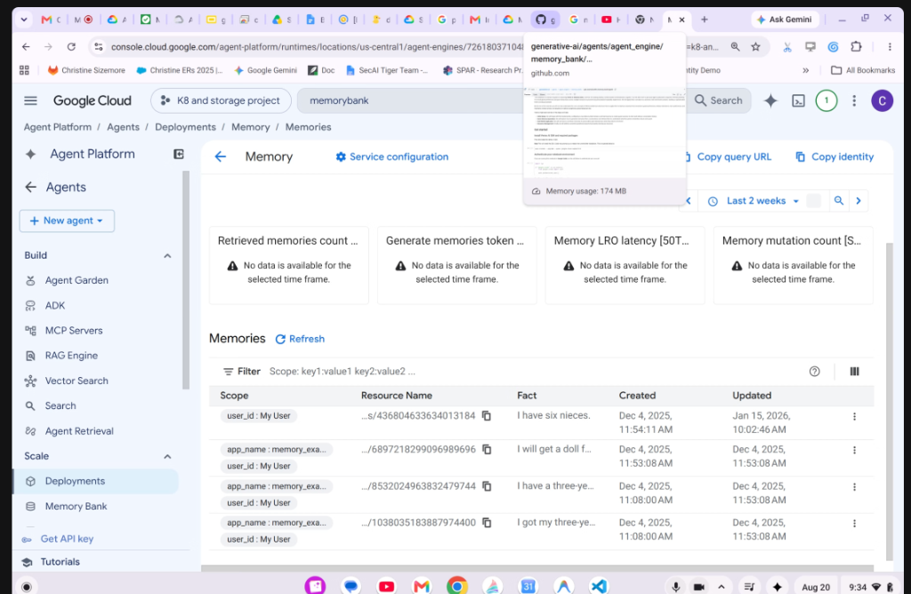
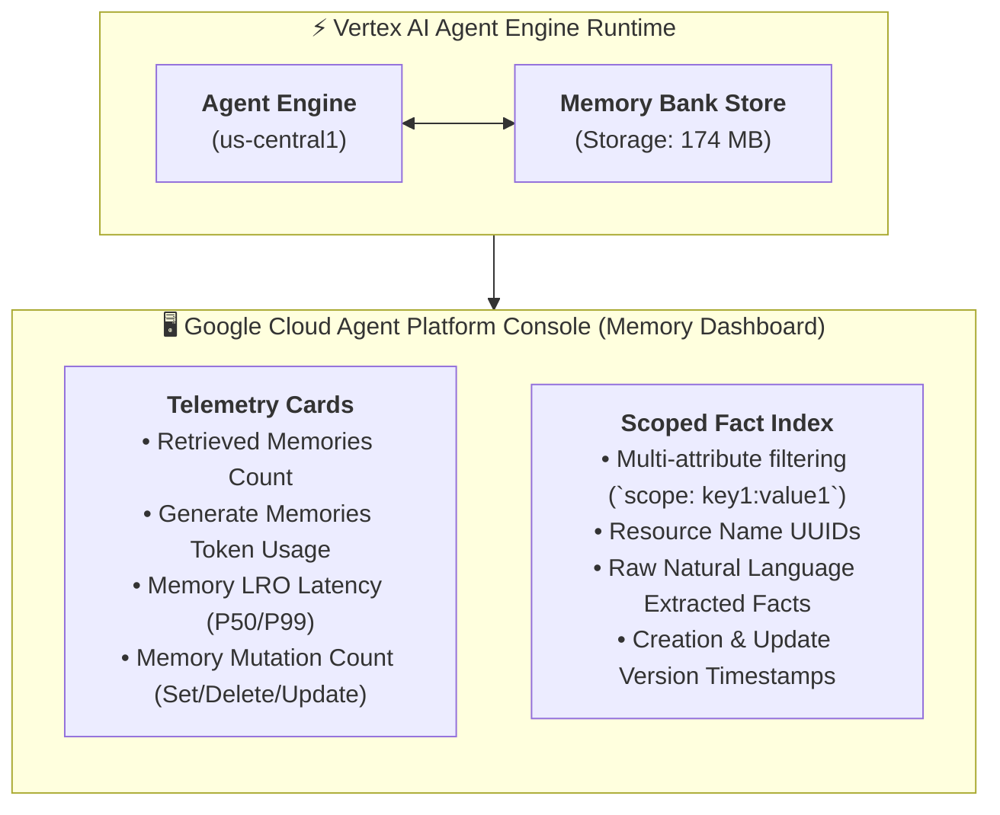

# Vertex AI Agent Engine: Memory Bank Console & Production Extraction



## Overview

In enterprise production architectures, persistent agent memory cannot be a "black box." Platform engineers and developers require complete visibility into stored user facts, extraction latencies, token consumption, and multi-tenant scoping.

The **Google Cloud Agent Platform Console** (`Agent Platform / Agents / Deployments / Memory / Memories`) provides deep operational observability into **Vertex AI Agent Engine: Memory Bank**, showcasing how asynchronous conversation streams are parsed into versioned, scoped natural language facts.

---

## Memory Bank Operational Architecture & Console Telemetry



---

## Detailed Examination of Console Telemetry & Metrics

### 1. Operational Telemetry Cards (Top Dashboard)
The Memory Bank console surfaces four critical production monitoring graphs:
* **`Retrieved memories count`**: Measures the volume and frequency of semantic memories injected into live agent turns during prompt synthesis.
* **`Generate memories token count`**: Tracks the LLM token expenditure used by background extraction jobs during turn summarization and fact deduction.
* **`Memory LRO latency [50th / 99th Percentile]`**: Monitors the duration of Long-Running Operations (LROs) responsible for asynchronous consolidation, vector indexing, and memory merging.
* **`Memory mutation count [Set / Delete / Update]`**: Tracks write operations triggered either by background consolidation or direct `memory-as-a-tool` calls.

---

## The Scoped Memories Data Model

The **Memories** data table illustrates how Vertex AI Agent Engine stores, scopes, and manages extracted knowledge:

| Scope | Resource Name (UUID) | Extracted Natural Language Fact | Created Timestamp | Updated Timestamp |
| :--- | :--- | :--- | :--- | :--- |
| `user_id: My User` | `...s/436804633634013184` | **"I have six nieces."** | Dec 4, 2025, 11:54:11 AM | Jan 15, 2026, 10:02:46 AM |
| `app_name: memory_example`<br/>`user_id: My User` | `...s/6897218299096989696` | **"I will get a doll for..."** | Dec 4, 2025, 11:53:08 AM | Dec 4, 2025, 11:53:08 AM |
| `app_name: memory_example`<br/>`user_id: My User` | `...s/8532024963832479744` | **"I have a three-year-old..."** | Dec 4, 2025, 11:08:00 AM | Dec 4, 2025, 11:53:08 AM |
| `app_name: memory_example`<br/>`user_id: My User` | `...s/1038035183887974400` | **"I got my three-year-old..."** | Dec 4, 2025, 11:08:00 AM | Dec 4, 2025, 11:53:08 AM |

---

## Key Architectural Insights from the Production Example

### 1. Multi-Dimensional Scoping & Isolation
* Memory Bank allows hierarchical tag scoping (`user_id`, `app_name`, `tenant_id`, `department`).
* A fact scoped only to `user_id` is globally available across all agents that user interacts with, whereas facts scoped with `app_name` are quarantined to a specific agent application domain.

---

### 2. Temporal Evolution & Fact Updates
* Notice the first row: Created on **Dec 4, 2025** and updated on **Jan 15, 2026**.
* Memory Bank does not simply append duplicate statements. When a user provides updated or refined context over time (e.g. adding another family member or changing preferences), the background consolidation engine **merges and updates** the existing resource record, preventing context clutter.

---

### 3. Granular Resource Identification
* Every stored fact is allocated a permanent, addressable resource name (e.g. `locations/us-central1/agentEngines/72618037104.../memories/436804633634013184`).
* This enables compliance teams to execute targeted deletions (GDPR Right to Be Forgotten) via standard Google Cloud REST APIs or CLI commands without purging the user's entire history.

---

## Production Python Code for Memory Querying & Management

```python
from google.cloud import agentplatform_v1 as agentplatform

client = agentplatform.AgentEngineServiceClient()

parent = "projects/k8-and-storage-project/locations/us-central1/agentEngines/72618037104"

# 1. Filter and list active user memories
request = agentplatform.ListMemoriesRequest(
    parent=parent,
    filter='scope.user_id="My User" AND scope.app_name="memory_example"'
)

page_result = client.list_memories(request=request)
for memory in page_result:
    print(f"Memory ID: {memory.name.split('/')[-1]}")
    print(f"Fact: {memory.fact}")
    print(f"Updated: {memory.update_time}\n")

# 2. Programmatic GDPR Fact Deletion
# client.delete_memory(name="projects/.../memories/436804633634013184")
```

---

## Memory Bank Console Operational Matrix

| UI Feature / Metric | Operational Value | Underlying Architecture |
| :--- | :--- | :--- |
| **`Memory usage: 174 MB`** | Capacity planning &amp; vector storage sizing | Managed Spanner / Vector Index |
| **`Filter Scope`** | Strict tenant isolation &amp; security auditing | Multi-attribute key-value metadata index |
| **`Fact Merging`** | Prevents context pollution &amp; hallucination | Background Gemini consolidation pipeline |
| **`Audit Timestamps`** | Traceability &amp; compliance adherence | Google Cloud Audit Logs &amp; Cloud Monitoring |
