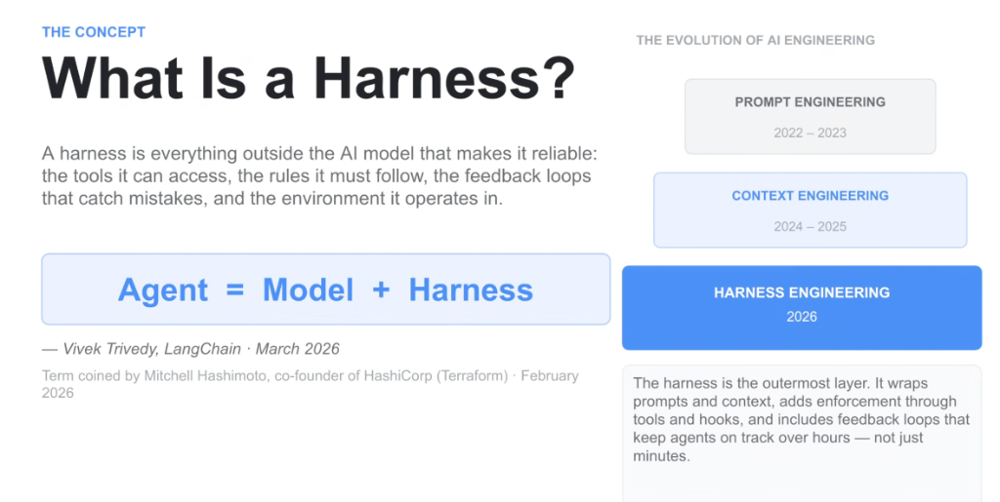
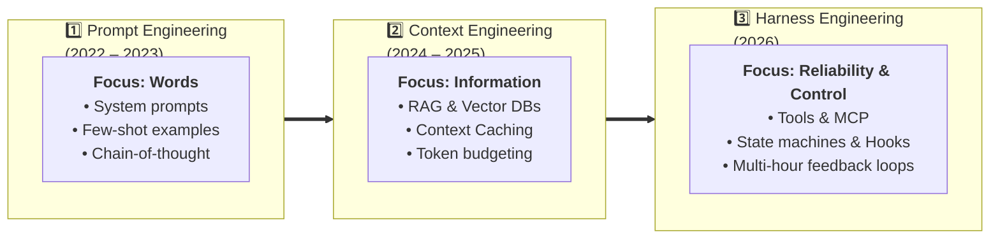
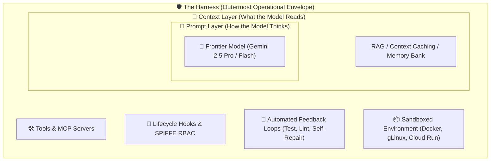

# What Is a Harness? Agent = Model + Harness

## Overview

As autonomous agent systems scale into production, raw model intelligence is insufficient to guarantee enterprise reliability.

> **The Fundamental Equation of 2026 AI Engineering:**
> $$\mathbf{Agent = Model + Harness}$$
>
> *— Vivek Trivedy, LangChain (March 2026)*  
> *Term coined by Mitchell Hashimoto, co-founder of HashiCorp (February 2026)*

A **Harness** represents everything **outside** the AI model that makes it deterministic, safe, and reliable: the tools it can access, the rules it must follow, the feedback loops that catch mistakes, and the execution environment it operates in.

---

## The 3-Era Evolution of AI Engineering

---

## Why the Harness Is the Outermost Layer

* **The Prompt Layer** governs *how* the model formats its immediate thought.
* **The Context Layer** governs *what* knowledge is visible in working memory.
* **The Harness** wraps both: it adds enforcement through tools and hooks, executes code in isolated sandboxes, and orchestrates feedback loops that keep agents on track over **hours and days—not just single turns**.

---

## The 4 Core Pillars of an Enterprise Agent Harness

### 1. Deterministic Execution & Isolated Sandboxes
* Provides clean, ephemeral runtime environments (Docker containers, Cloud Run microservices, isolated gLinux workspaces).
* Restricts destructive filesystem mutations and prevents system-level corruption.

---

### 2. Standardized Tool & Resource Interfaces
* Leverages **Model Context Protocol (MCP)** and **A2A Open Protocol** to provide declarative, schema-validated bindings to enterprise databases, APIs, and subagents.

---

### 3. Rules, Policies & Lifecycle Hooks
* Implements the 6 lifecycle callbacks (`before/after_agent`, `before/after_model`, `before/after_tool`).
* Enforces **Dual-Gate Authorization** and **SPIFFE Workload Identity**, ensuring the agent cannot execute actions exceeding user permission boundaries.

---

### 4. Compounding Feedback & Self-Repair Loops
* Couples model output with automated verification harnesses:
  * AST syntax & type linters (`Ruff`, `mypy`, `ESLint`).
  * Automated unit & integration runners (`pytest`, `jest`).
  * Headless browser tests (**Playwright**) and multimodal visual checks.
* When a failure occurs, the harness feeds the exact diagnostic traceback back into the model's context, driving honest self-repair without human intervention.

---

## The Evolution of AI Engineering: Comparative Paradigm Matrix

| Dimension | Prompt Engineering (2022–2023) | Context Engineering (2024–2025) | Harness Engineering (2026) |
| :--- | :--- | :--- | :--- |
| **Primary Unit of Work** | Words &amp; Phrasing | Documents &amp; Embeddings | **Systems, Tools &amp; Feedback Loops** |
| **Execution Horizon** | Single Turn (Seconds) | Multi-Turn RAG (Minutes) | **Autonomous Sessions (Hours / Days)** |
| **Failure Mode** | Hallucination / Formatting Error | Missing Context / Needle-in-Haystack | **Tool Thrashing / Cascading Errors** |
| **Defense Mechanism** | Prompt Tweaking / Few-Shot | Better Chunking &amp; Re-ranking | **Deterministic Sandboxes &amp; Test Gates** |
| **Key Frameworks** | LangChain 0.1, Prompt Templates | LlamaIndex, Vector DBs, Caching | **Google ADK 2.0, LangGraph, Antigravity** |
| **Architectural Focus**| Model Reasoning | Model Knowledge | **Systemic Reliability ($\text{Agent} = \text{Model} + \text{Harness}$)** |
