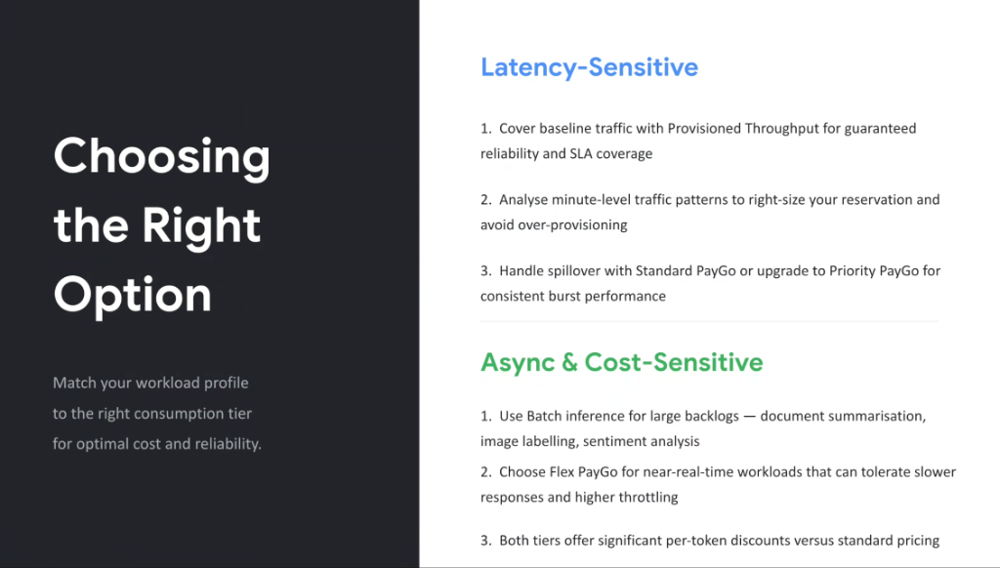
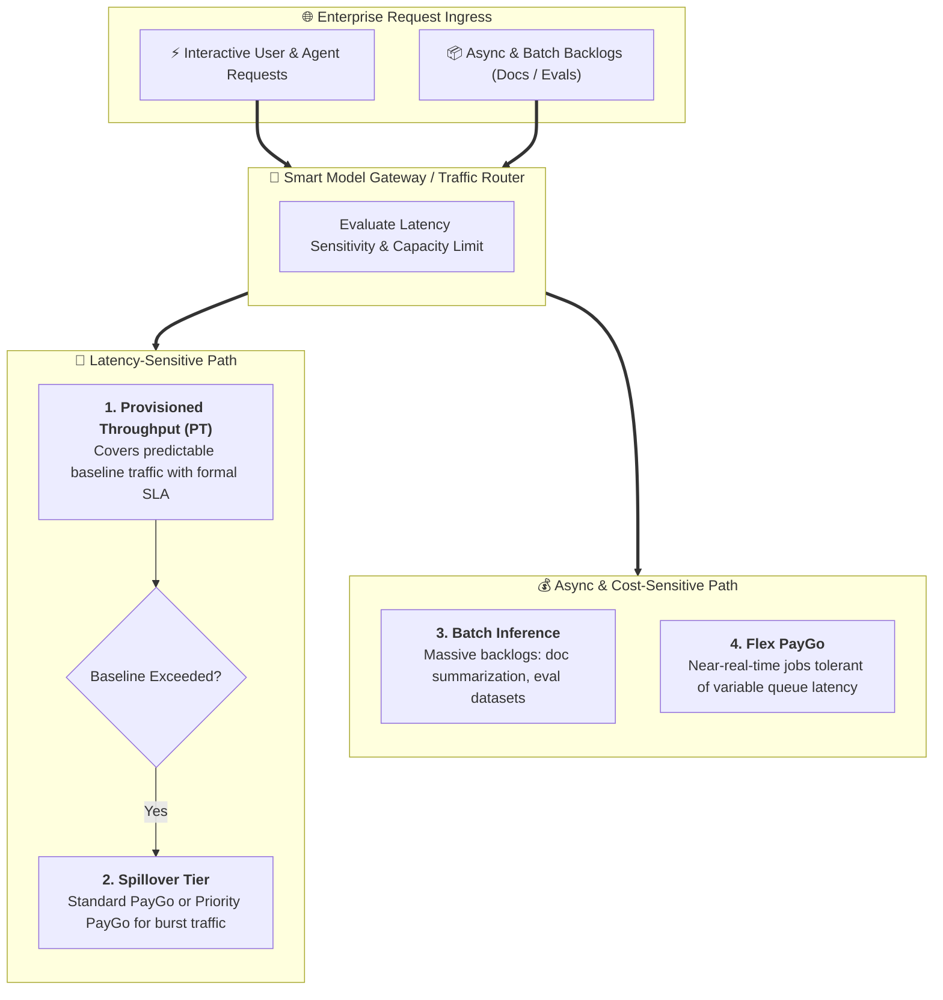

# Choosing the Right Consumption Option: Workload Matching & Hybrid Routing

## Overview

Enterprise architectures rarely fit into a single pricing model. High-performing engineering teams adopt a **Hybrid Consumption Strategy**, segmenting traffic between **Latency-Sensitive** user interactions and **Async & Cost-Sensitive** background pipelines.

> **Core Sizing Philosophy:**
> *"Match your workload profile to the right consumption tier for optimal cost and reliability."*

---

## Hybrid Traffic Routing & Spillover Architecture

---

## Architectural Deep Dive: Workload Profiles

### 1. Latency-Sensitive Workloads (Interactive Agents & APIs)

For real-time customer-facing agents, checkout flows, and sub-second tool-calling loops:

1. **Cover Baseline Demand with Provisioned Throughput**:
   * Deploy **Provisioned Throughput (PT)** to reserve dedicated compute units (PTUs) for steady-state traffic, guaranteeing strict latency SLAs and zero noisy-neighbor degradation.
2. **Right-Size via Minute-Level Telemetry**:
   * Analyze minute-by-minute Prometheus / Cloud Monitoring token traffic metrics. Target $80–85\%$ baseline PTU utilization to prevent over-provisioning costs.
3. **Handle Peak Spikes via Spillover Routing**:
   * Configure intelligent gateway routing: when incoming volume exceeds reserved PT capacity, immediately spill over to **Standard PayGo** or **Priority PayGo** to absorb traffic spikes seamlessly without throttling.

---

### 2. Async & Cost-Sensitive Workloads (Background Jobs & Evals)

For non-blocking operations, asynchronous queues, and evaluation flywheels:

1. **Leverage Batch Inference for Heavy Backlogs**:
   * Use asynchronous **Batch Inference** for large-scale document summarization, entity extraction, historical dataset migration, and synthetic data generation.
2. **Utilize Flex PayGo for Near-Real-Time Tasks**:
   * Route internal automated PR review agents, test-generation pipelines, and non-blocking background summarizations to **Flex PayGo**, trading slight queue variability for deep per-token discounts.
3. **Compound Cost Reductions**:
   * Both Batch and Flex tiers reduce per-token expenditure by $\ge 50\%$ compared to standard on-demand pricing, slashing overall organizational AI infrastructure budgets.

---

## Consumption Sizing & Decision Matrix

| Workload Category | Typical Tasks | Primary Tier | Burst / Spillover Strategy | Cost Impact |
| :--- | :--- | :--- | :--- | :---: |
| **Core Interactive Agents** | Customer chat, live tool-calling loops | **Provisioned Throughput** | Spillover to Standard / Priority PayGo | Predictable Baseline |
| **Spiky Production APIs** | Seasonal campaigns, flash sales | **Priority PayGo** | Autoscales dynamically with priority queue | Premium Per-Token |
| **Developer Sandboxes** | CI testing, staging environment runs | **Standard PayGo** | Standard regional quota autoscaling | Standard Metering |
| **Internal Dev Tools** | PR summarization, code lint assistants | **Flex PayGo** | Queued during peak hours | **~50% Discount** |
| **Bulk Data Processing** | Million-document parsing, eval suites | **Batch Inference** | Asynchronous Cloud Storage / BigQuery jobs | **Lowest Cost Tier** |
