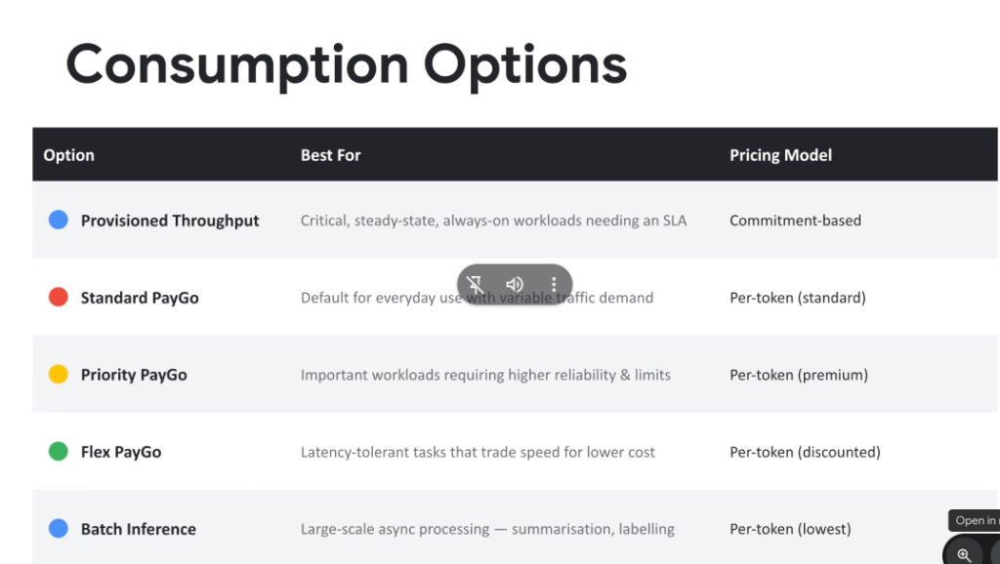
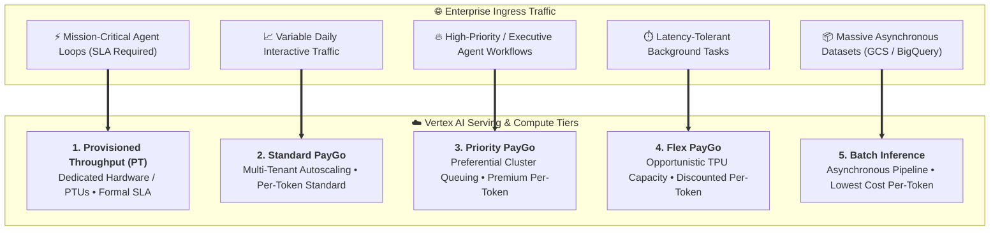

# Enterprise Foundation Model Consumption Options

## Overview

Deploying enterprise generative AI and agentic systems requires matching the right **Consumption Option** to the workload's latency profile, traffic volatility, and cost budget.

Google Cloud Vertex AI provides **Five Primary Consumption Tiers** ranging from dedicated hardware commitments to opportunistic, deeply discounted batch processing.

---

## Consumption Tiers Architecture & Traffic Routing

---

## Detailed Breakdown of the 5 Consumption Options

### 1. Provisioned Throughput (PT)
* **Best For**: Mission-critical, steady-state, always-on enterprise agents requiring deterministic sub-second latency and contractually backed SLAs.
* **Pricing Model**: **Commitment-based** (hourly/monthly reserved Provisioned Throughput Units / PTUs).
* **Key Characteristics**:
  * Dedicated accelerator allocation (TPUs/GPUs) reserved exclusively for your project.
  * Zero risk of rate-limit throttling during global peak hours.

---

### 2. Standard PayGo (Default)
* **Best For**: General everyday agent development, prototyping, and production services with variable, spiky traffic patterns.
* **Pricing Model**: **Per-token (Standard)** metering (input, output, and cached tokens).
* **Key Characteristics**:
  * Fully serverless with zero upfront commitments or idle infrastructure costs.
  * Scales from zero to regional Quota limits automatically.

---

### 3. Priority PayGo
* **Best For**: Important production workloads requiring higher availability, elevated rate limits (TPM/RPM), and preferential queuing over standard shared traffic without full PT commitment.
* **Pricing Model**: **Per-token (Premium)** metering.
* **Key Characteristics**:
  * Preferred routing during shared cluster congestion.
  * Higher default burst thresholds.

---

### 4. Flex PayGo
* **Best For**: Latency-tolerant tasks that can trade immediate turnaround speed for substantial cost savings (e.g., automated overnight code refactoring, background vector re-indexing).
* **Pricing Model**: **Per-token (Discounted)** metering.
* **Key Characteristics**:
  * Executes opportunistically against spare Google Cloud AI cluster capacity.
  * Requests may experience variable queuing latency during high-demand periods.

---

### 5. Batch Inference
* **Best For**: Massive-scale asynchronous processing (e.g., processing millions of customer support tickets, enterprise document extraction, large synthetic eval dataset generation).
* **Pricing Model**: **Per-token (Lowest)** tier (typically $\ge 50\%$ lower than Standard PayGo).
* **Key Characteristics**:
  * Reads source files directly from **Cloud Storage (GCS)** or **BigQuery** and writes structured JSONL outputs back asynchronously.
  * Operates without HTTP timeout limits.

---

## Consumption Option Comparison Matrix

| Option | Ideal Workload &amp; Use Case | Latency Profile | SLA Guarantee | Billing Model |
| :--- | :--- | :---: | :---: | :--- |
| **Provisioned Throughput** | Critical, always-on agents &amp; core APIs | **Deterministic Sub-Second** | **Yes (Full SLA)** | Commitment-based (PTUs) |
| **Standard PayGo** | Everyday production &amp; variable traffic | Fast (Interactive) | Shared Region SLA | Per-token (Standard) |
| **Priority PayGo** | High-importance workflows &amp; VIP agents | Fast (Priority Queue) | Elevated Priority | Per-token (Premium) |
| **Flex PayGo** | Latency-tolerant tasks &amp; internal jobs | Variable (Queued) | Best Effort | Per-token (Discounted) |
| **Batch Inference** | Massive offline summarization &amp; eval | Asynchronous (Hours) | Job Completion | Per-token (Lowest) |
