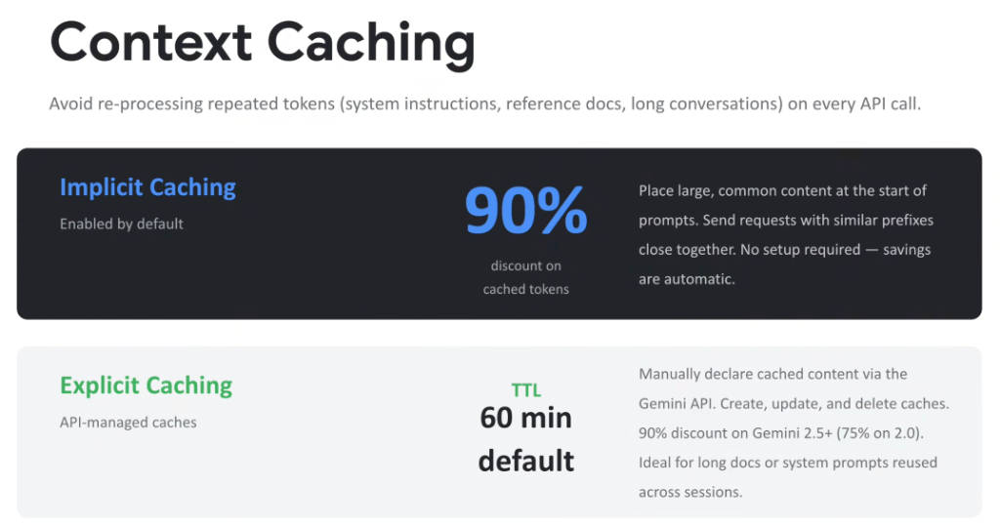

# Gemini Context Caching: Implicit vs. Explicit Caching



## Overview

In multi-turn agent systems and knowledge retrieval architectures, resending massive reference documents, SDK manuals, system prompts, or multi-turn conversational transcripts on every turn is costly and creates severe latency penalties.

**Gemini Context Caching** eliminates repetitive token computation, delivering up to a **90% cost reduction** and dramatic latency improvements.

---

## Implicit vs. Explicit Context Caching Architecture

```mermaid
flowchart TD
    subgraph Prompts["📄 Ingress Prompt Payload"]
        Static["🔒 Invariant Static Prefix<br/>(System Prompts, Codebase Docs, 100k+ tokens)"]
        Dynamic["⚡ Dynamic Query / Turn Payload<br/>(User question, latest tool response)"]
        Static --> Dynamic
    end

    subgraph Implicit["⚡ 1. Implicit Caching (Enabled by Default)"]
        direction TB
        ImpDetect["Automatic Prefix Matcher"]
        ImpSave["<b>90% Token Discount</b><br/>Zero setup • Temporal rolling window"]
        ImpDetect --> ImpSave
    end

    subgraph Explicit["📦 2. Explicit Caching (API-Managed)"]
        direction TB
        ExpObj["`CachedContent` Object Created<br/>(Default TTL: 60 Minutes)"]
        ExpSave["<b>90% Discount (Gemini 2.5+)</b><br/>Deterministic reuse across 1,000s of sessions"]
        ExpObj --> ExpSave
    end

    Prompts ==>|"Ad-hoc prefix sharing"| Implicit
    Prompts ==>|"Persistent object pointer"| Explicit
```

---

## Detailed Analysis of Caching Modes

### 1. Implicit Caching (Automatic Zero-Setup Savings)
* **Status**: **Enabled by default** across Gemini API and Vertex AI endpoints.
* **Cost Discount**: **90% discount** on all cached prefix tokens.
* **How It Works**:
  * The serving infrastructure detects identical token prefixes sent in close temporal proximity.
  * When requests share an identical starting sequence (e.g. system prompts, shared tool schemas), the pre-computed KV-cache activations are reused automatically.
* **Engineering Best Practices**:
  * **Static-First Ordering**: Always place large, invariant content (system rules, tool schemas, foundational context) at the very beginning of the prompt.
  * **Temporal Clustering**: Group batch calls or related agent requests close together in time to maximize cache hit rates.

---

### 2. Explicit Caching (API-Managed Deterministic Caches)
* **Status**: Declaratively managed via the `CachedContent` API.
* **Default TTL**: **60 Minutes** (can be updated, extended, or deleted programmatically).
* **Cost Discount**: **90% discount on Gemini 2.5+** (75% on Gemini 2.0).
* **How It Works**:
  * The developer creates a persistent cache resource containing multi-megabyte reference documents, entire legal contracts, or full codebase repositories.
  * Subsequent agent turns simply pass the `cached_content` resource name, avoiding resending the raw tokens over the wire.
* **Ideal Use Cases**:
  * Multi-tenant enterprise portals where thousands of employees query the same static 500-page policy manual or product documentation.
  * Long-lived coding agent sessions operating against a static repository baseline.

---

## Explicit Context Caching Code Implementation (Python SDK)

```python
from google import genai
from google.genai import types

client = genai.Client()

# 1. Create a persistent explicit cache with a 60-minute TTL
cache = client.cached_contents.create(
    model="gemini-2.5-pro",
    config=types.CreateCachedContentConfig(
        contents=[
            types.Content(
                role="user",
                parts=[types.Part.from_text("... 500-page Enterprise Architecture Specification ...")]
            )
        ],
        system_instruction="You are an expert enterprise systems architect answering queries strictly from the cached specification.",
        ttl="3600s", # 60 minute TTL
    )
)

# 2. Query the cached model with 90% discount on cached tokens
response = client.models.generate_content(
    model="gemini-2.5-pro",
    contents="Explain the multi-region failover policy described in Section 4.",
    config=types.GenerateContentConfig(
        cached_content=cache.name
    )
)

print(response.text)
```

---

## Implicit vs. Explicit Caching Comparison Matrix

| Dimension | Implicit Caching | Explicit Caching |
| :--- | :--- | :--- |
| **Setup Required** | **Zero Setup (Enabled by default)** | Programmatic (`CachedContent` API) |
| **Cost Savings** | **90% Discount** on cached tokens | **90% Discount** (2.5+) / 75% (2.0) |
| **Lifecycle Management**| Managed automatically by Google serving infra | Explicit TTL (Default: **60 min**, refreshable) |
| **Minimum Token Threshold**| Model-specific: `2,048` (Gemini 2.5) / `4,096` (Gemini 3.x) on the Gemini API; up to `6,144` for some 3.x Flash models on Agent Platform | Model-specific: `2,048` (Gemini 2.x) / `4,096` (Gemini 3.x) |
| **Persistence Guarantee** | Best-effort temporal cache | **Guaranteed SLA** for duration of TTL |
| **Best Used When...** | Sequential agent turns with static prefixes | High-concurrency multi-user shared docs |
