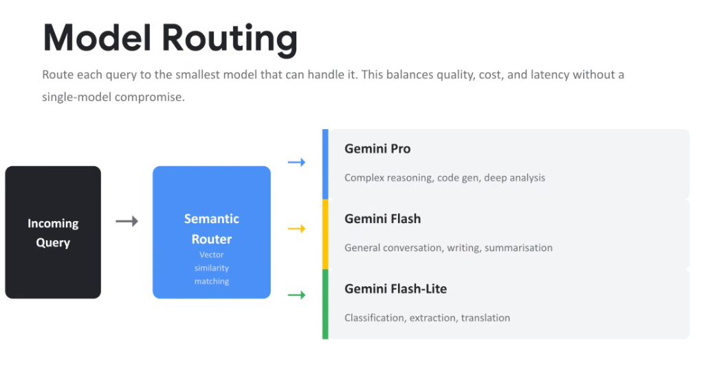
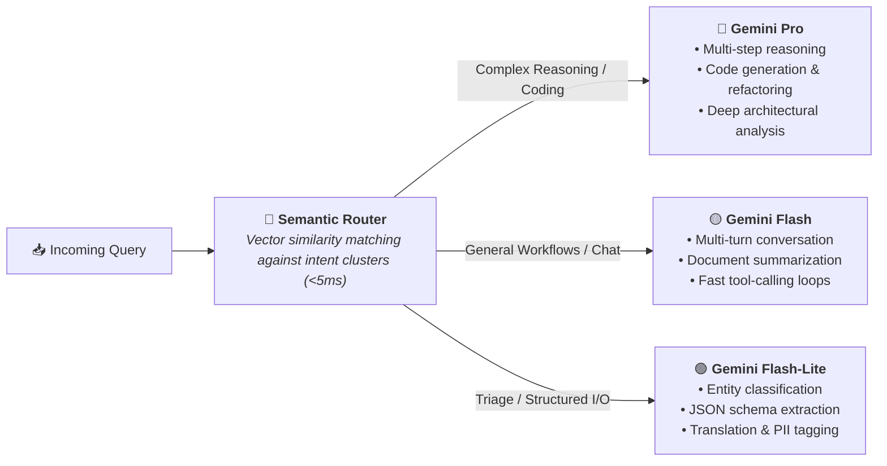

# Model Routing: Multi-Tier Semantic Triage (Pro, Flash & Flash-Lite)

## Overview

In enterprise agent architectures, invoking a frontier flagship model for every single turn is economically unsustainable and introduces unnecessary latency.

> **The Smallest-Model-First Routing Principle:**
> *"Route each query to the smallest model that can handle it. This balances quality, cost, and latency without a single-model compromise."*

By placing an intelligent **Semantic Router** at the ingress layer, incoming queries are automatically evaluated and routed across **Gemini Pro**, **Gemini Flash**, and **Gemini Flash-Lite** based on task complexity.

---

## Semantic Router & Multi-Tier Topology

---

## The 3-Tier Gemini Model Spectrum

### 1. Gemini Pro (Frontier Reasoning & Complex Coding)
* **Target Workloads**:
  * Multi-file codebase refactoring and autonomous debugging.
  * Complex architectural reasoning and edge-case formal verification.
  * Ambiguous user intent disambiguation and strategy generation.
* **Economic Trade-off**: Highest cost and deliberate latency profile for maximum cognitive depth.

---

### 2. Gemini Flash (High-Throughput Production Workhorse)
* **Target Workloads**:
  * Standard conversational dialog and interactive agent interfaces.
  * Enterprise document synthesis and knowledge retrieval (RAG).
  * High-frequency tool-calling loops (e.g. database lookups, API invocations).
* **Economic Trade-off**: Optimal balance between sub-second latency, low cost, and strong general capabilities.

---

### 3. Gemini Flash-Lite (Ultra-Fast Extraction & Triage)
* **Target Workloads**:
  * Deterministic text classification (e.g. support ticket routing).
  * Structured data and JSON entity extraction.
  * Multi-language translation and PII scrubbing.
* **Economic Trade-off**: Ultra-low cost per token and fastest Time-to-First-Token (TTFT).

---

## Semantic Router Mechanics

1. **Intent Embedding**: The user's query is converted into a vector embedding in real-time.
2. **Exemplar Similarity Matching**: The vector is compared against a pre-indexed library of exemplar prompts categorized by complexity score (1 to 5).
3. **Dynamic Fallback Escalation**: If a smaller model (e.g. Flash-Lite) returns an error, low confidence score, or fails validation checks, the router automatically re-routes the query to **Gemini Pro** for self-repair.

---

## Multi-Tier Model Selection & Routing Matrix

| Tier | Primary Capabilities | Typical Latency (TTFT) | Relative Cost | Primary Workload Examples |
| :--- | :--- | :---: | :---: | :--- |
| **Gemini Pro** | Deep multi-step reasoning, coding, analysis | ~800ms – 1.5s | $$$$ | Code generation, complex debugging, math reasoning |
| **Gemini Flash** | Conversational flow, writing, RAG summarization | ~200ms – 400ms | $$ | Customer support chat, multi-agent loops, search RAG |
| **Gemini Flash-Lite** | Classification, JSON extraction, translation | ~100ms – 200ms | $ | Intent classification, sentiment tagging, PII detection |
