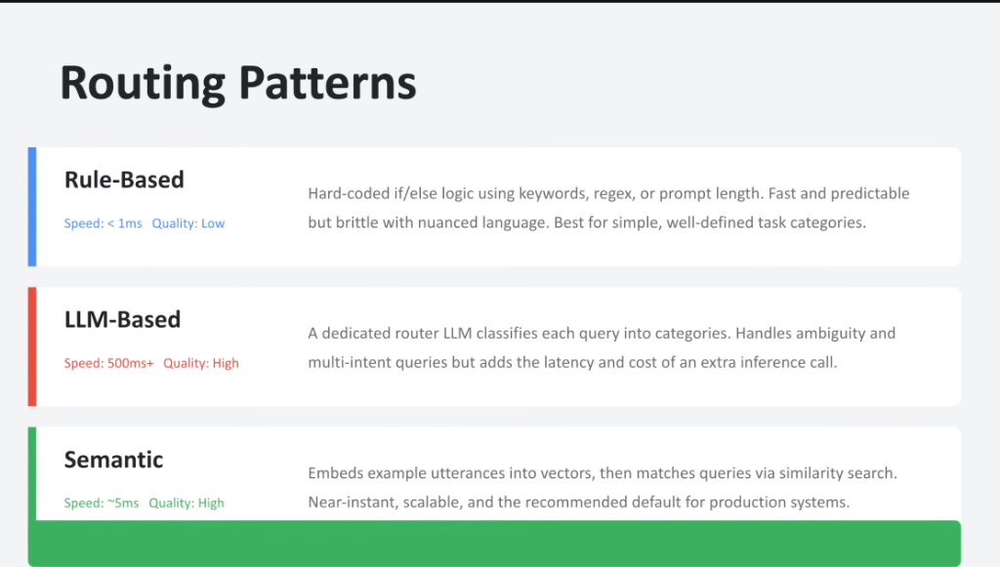
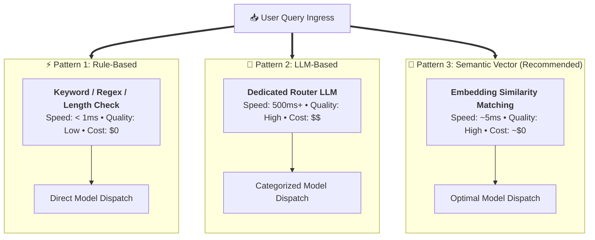

# Model Routing Patterns: Rule-Based vs. LLM-Based vs. Semantic



## Overview

When implementing the **Smallest-Model-First Principle**, the design of the routing mechanism itself is critical. If the router introduces a 1-second latency overhead, the speed benefits of invoking a faster model are erased.

Enterprise AI gateways implement one of three core routing patterns: **Rule-Based**, **LLM-Based**, or **Semantic (Vector-Based)**.

---

## Routing Paradigms Comparison Architecture



---

## Detailed Examination of the 3 Routing Patterns

### 1. Rule-Based Routing
* **Mechanics**: Hardcoded `if/else` conditions inspecting string keywords, regex patterns, input character length, or structured API metadata.
* **Performance Profile**: **Speed: $< 1\text{ms}$** | **Quality: Low**
* **Pros**:
  * Near-zero latency overhead; zero token billing.
  * 100% deterministic and easy to debug.
* **Cons**:
  * Extremely brittle with natural human language and synonyms.
  * Fails completely on ambiguous, multi-turn, or conversational inputs.
* **Best For**: Hardcoded commands, slash shortcuts (e.g. `/plan`, `/eval`), or explicit API endpoint flags.

---

### 2. LLM-Based Routing
* **Mechanics**: Sends the prompt to a small, dedicated classifier model (e.g. **Gemini Flash-Lite**) with a strict JSON schema prompt to classify task difficulty.
* **Performance Profile**: **Speed: $500\text{ms}+$** | **Quality: High**
* **Pros**:
  * Sophisticated reasoning over subtle phrasing, implicit instructions, and multi-intent queries.
* **Cons**:
  * Adds an entire extra model inference round-trip, significantly degrading end-to-end responsiveness.
  * Doubles token count and per-query operational costs.
* **Best For**: High-stakes, complex enterprise workflows where semantic ambiguity must be resolved before executing dangerous tools.

---

### 3. Semantic Vector Routing (The Production Standard)
* **Mechanics**: Converts the user's prompt into an embedding vector and performs an approximate nearest neighbor (ANN) similarity match against pre-indexed utterance centroids representing each model tier.
* **Performance Profile**: **Speed: $\sim 5\text{ms}$** | **Quality: High**
* **Pros**:
  * Near-instant classification speed with high semantic comprehension.
  * Scalable, robust against typos/synonyms, and costs virtually nothing.
* **Cons**:
  * Requires curating and maintaining a representative seed dataset of prompt examples for each intent cluster.
* **Recommendation**: **The default architectural choice for production enterprise systems.**

---

## The Production Hybrid Cascading Architecture

Production systems combine all three patterns into a **3-tier cascading router**:

```mermaid
flowchart LR
    Q["📥 Ingress Query"] --> FastRule{"1. Slash Command / Explicit Flag?"}
    FastRule -->|Yes (&lt;1ms)| Direct["⚡ Instant Dispatch"]
    
    FastRule -->|No| VectorMatch{"2. Semantic Vector Similarity &ge; 0.82?"}
    VectorMatch -->|Yes (~5ms)| Tier["🚀 Dispatch (Pro / Flash / Lite)"]
    
    VectorMatch -->|No (Ambiguous)| LLMRouter["3. LLM-Based Disambiguation<br/>(Gemini Flash-Lite Fallback)"]
    LLMRouter --> Tier
```

---

## Routing Pattern Trade-off Matrix

| Metric | Rule-Based | LLM-Based | Semantic Vector (Golden Standard) |
| :--- | :---: | :---: | :---: |
| **Classification Latency** | **$< 1\text{ms}$** ⚡ | $500\text{ms} - 1.2\text{s}$ 🐢 | **$\sim 5\text{ms}$** ⚡ |
| **Classification Quality** | Low (Brittle) | **Very High** | **High (Robust)** |
| **Incremental Cost** | **$0.00** | Full Token Call ($$) | Negligible Embedding Cost ($) |
| **Handling Synonyms / Typos** | Fails | **Excellent** | **Excellent** |
| **Maintenance Overhead** | High (Regex Sprawl) | Low (Prompt Tuning) | Medium (Vector Library Curation) |
| **Recommended Production Role** | Hardcoded Command Filter | Ambiguity Fallback Escalation | **Primary Production Ingress Gateway** |
